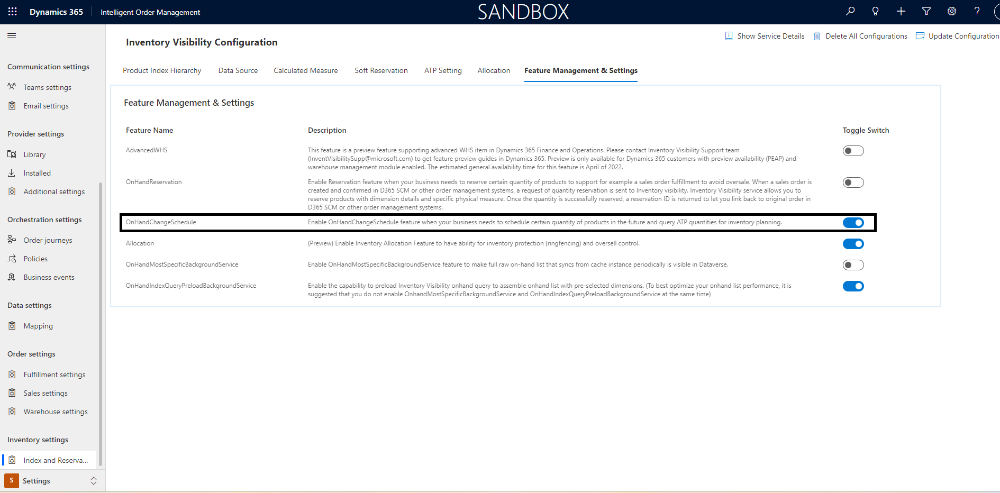
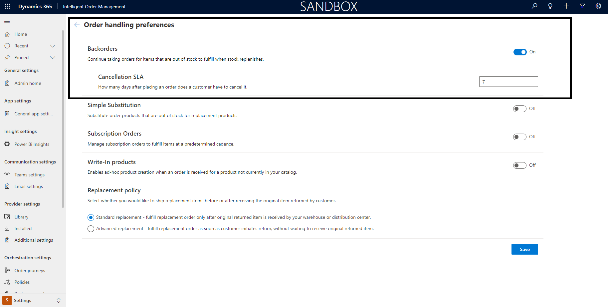
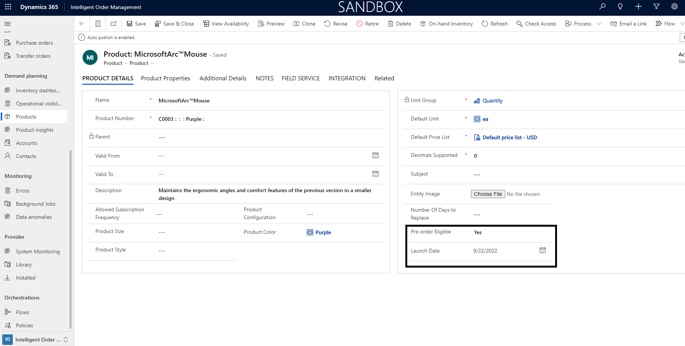
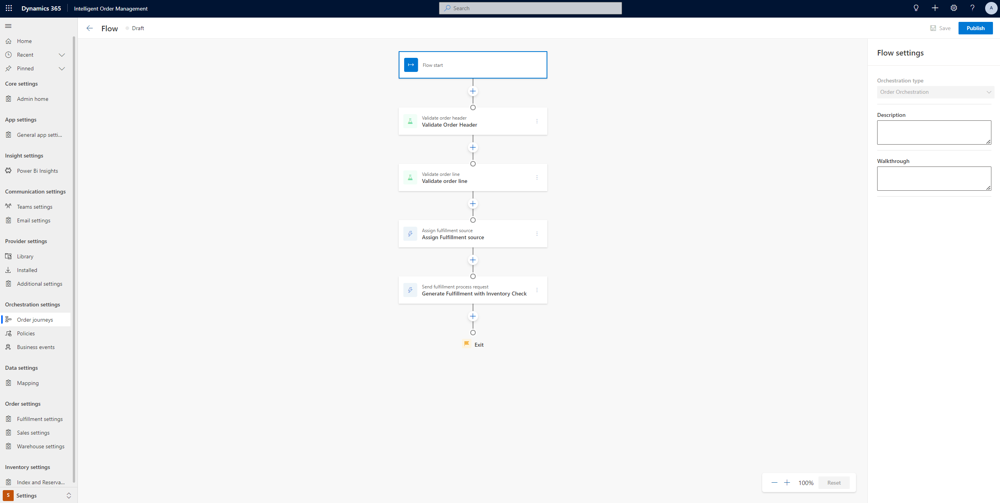
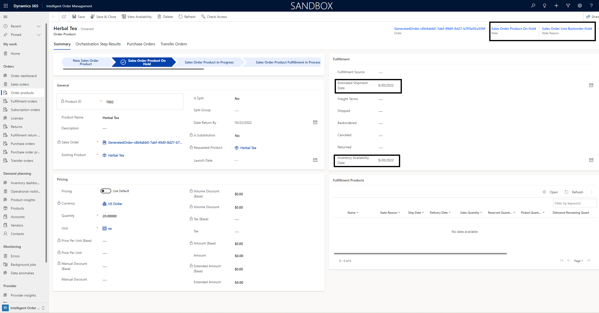
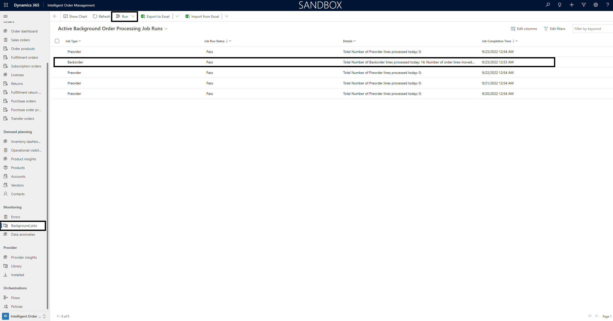
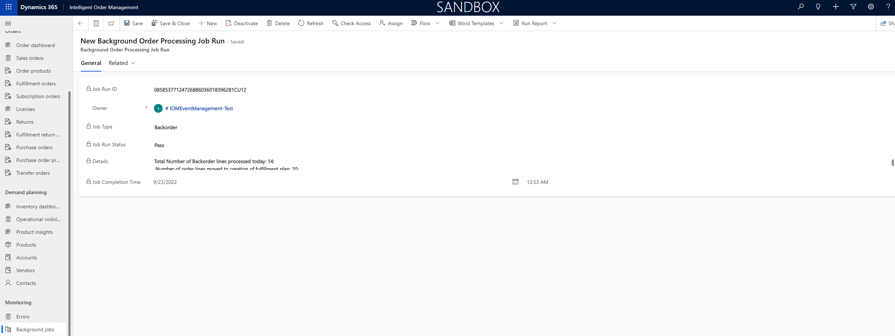
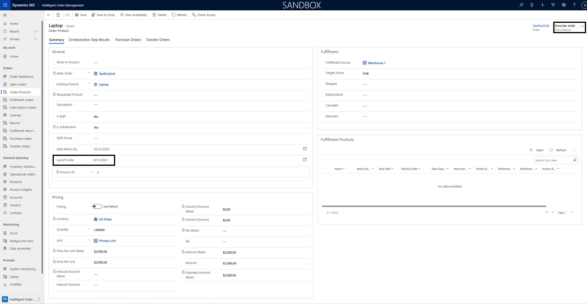
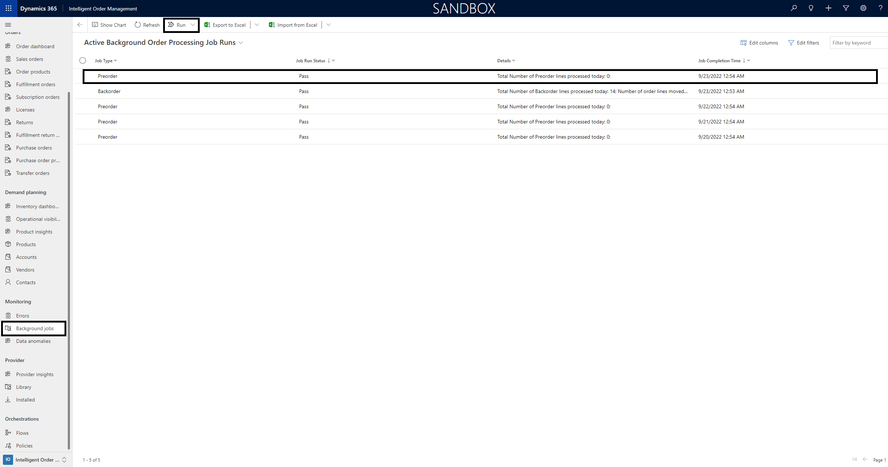
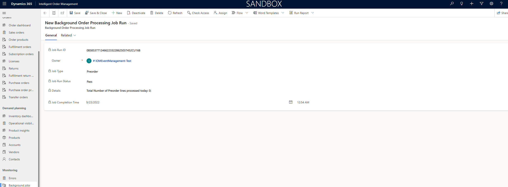

# Backorder and Preorder management with Dynamics 365 Intelligent Order Management

[!include [banner](includes/banner.md)]

This article describes backorder and preorder management in Microsoft Dynamics 365 Intelligent Order Management. Managing backorders and preorders gives you the flexibility to optimize the handling of your inventory.

## Backorders

A backorder is an order placed for a product or service that can't immediately be fulfilled due to a lack of available supply. When a customer places an order for an item that is not currently in stock, the customer may be informed the product is on backorder and that they can still make payment with the promise of future delivery. Items available on backorder may indicate a date when they will be back in stock.

Effective backorder management can provide you with the following benefits:

- Optimized use of inventory.
- Regular inventory checks to fulfill backorders.

## Preorders

A preorder is an order placed for a product before that product is released. The ability to handle preorders provides greater flexibility to handle inventory effectively.

Preorders allow customers to guarantee immediate delivery on release, manufacturers to gauge how much demand there will be (and how large initial production runs should be), and sellers to be assured of minimum sales. High preorder rates can also be used to further increase sales.

## Prerequisites

### Enable available to promise (ATP) settings

First, you should enable available to promise (ATP) settings. For this follow the below steps:

To enable available to promise (ATP) settings, follow these steps.

1. Go to **Settings**. 
1. Select **Index and Reservation**.
1. Select the **Feature Management and Settings** tab.
1. Turn on the **OnHandChangeSchedule** option.

### Upload on-hand schedule changes

Next, on-hand schedule changes should be uploaded in case you want to provide your customers with an expected ship date. For instructions, see [Inventory Visibility on-hand change schedules and available to promise](/dynamics365/supply-chain/inventory/inventory-visibility-available-to-promise).

### Enable general app settings

Next, you must enable some general app settings.

To enable general app settings, follow these steps.

1. Go to **Settings**. 
1. Select **General app settings**.
1. Go to **Order handling preferences**, and then select **Manage**.
1. Set the **Backorders** option to **On**.
1. After enabling backorders, a **Cancellation SLA** section appears. Optionally, here you can enter the number of days up to which you want to try fulfilling the backorder. After that number of days, the order will automatically be canceled.
        

   
### Enable preorder eligibility for products

Next, you must enable preorder eligibility for products. 

To enable preorder eligibility for a product, follow these steps.
  
1. In the sitemap, go to **Demand Planning**, and then select **Products**.
1. Select a product.
1. If the product is preorder eligible, then for **Pre-order Eligible**, select **Yes**.
1. For **Launch Date**, enter the date when the product will be released.
1. Select **Save**, or select **Save & Close**.

## How backorder works

When an order is created in Dynamics 365 Intelligent Order Management, an inventory check can be initiated as part of either the policy assignment or fulfillment and returns optimization processes. In either of these two processes, inventory may not be found for the ordered product. In such cases the order line is then updated with a **Status Reason** of **Backorder Hold**.

When **ATP Settings** is enabled, the backordered lines will also be updated with the **Inventory Availability Date** and an **Estimated Shipment Date** values for the product.

The following image shows an example order orchestration journey with a policy-based fulfillment assignment.

The following example image highlights key updates that happen to a sales order lines when the order lines are backordered.

Once this happens, based on the initial **pre-requisite settings**, a background job will run automatically that will trigger inventory check everyday once to check if inventory is found and the order lines can be moved to subsequent fulfillment.
It will be intelligent enough to determine from the orchestation if inventory check would be triggered independently or triggered through **Fulfillment and Returns optimization**.

A job log will be now available to show the list of job runs and their statuses. This can be located on the **Home Page** left menu under **Monitoring** as **Background Jobs**. It will show you the list of job runs, their statuses and the number of records it has successfully processed and moved to fulfillment.

If a background job fails, you will also be able to manually run it using the **Run** option in the upper menu bar. Select the **Back-Order Job** and this will start a new instance of the background job.

On clicking the Job line, you will be able to see the details of the background job run.

## How preorder works

When an order is created in Dynamics 365 Intelligent Order Management, if the order contains products that are marked as **Preorder eligible** and has a **Launch date**, then those lines in sales order are moved to **Status Reason** as **Preorder Hold**.

The sales order line gets updated with the **Launch Date** from the **Products** defined as part of the **Pre-requisite Settings**.

Once this happens, a background job will run automatically trigger inventory check on the **Lauch Date** and the order lines can be moved to subsequent fulfillment.
It will be intelligent enough to determine from the orchestation if inventory check would be triggered independently or triggered through **Fulfillment and Returns optimization**.

If inventory check fails and no inventory found, then the order lines will move to **Backorder Hold** status.

A job log will be now available to show the list of job runs and their statuses. This can be located on the **Home Page** left menu under **Monitoring** as **Background Jobs**. It will show you the list of job runs, their statuses and the number of records it has successfully processed and moved to fulfillment.

If a background job fails, you will also be able to manually run it using the **Run** option in the upper menu bar. Select the **Pre-Order Job** and this will start a new instance of the background job.

On clicking the Job line, you will be able to see the details of the background job run.

