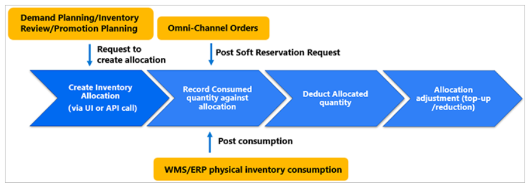
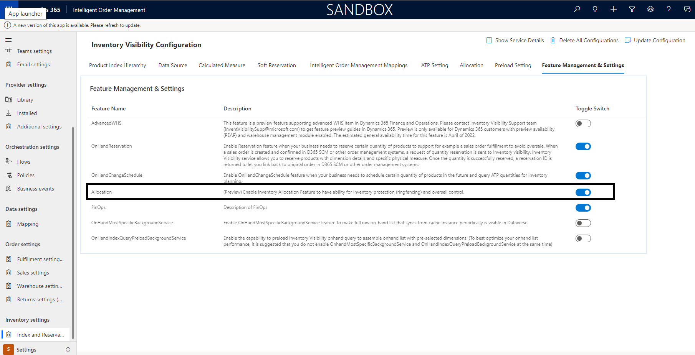
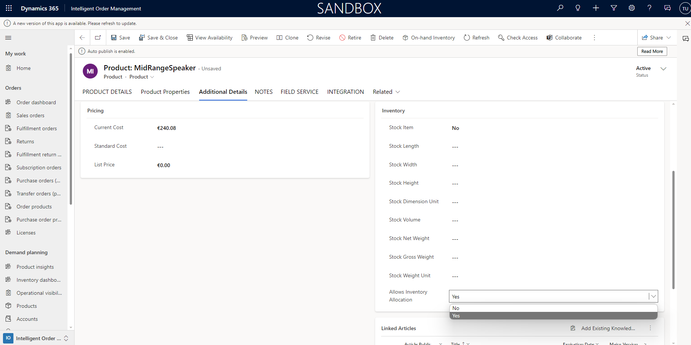
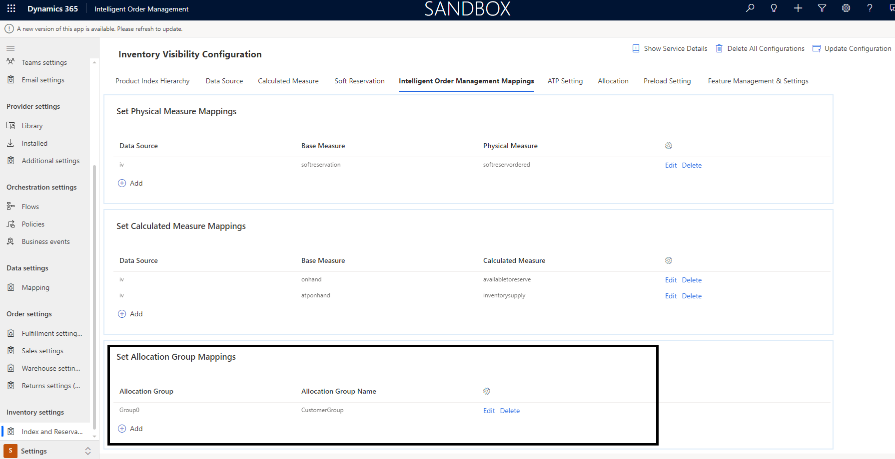

# Set up inventory allocation

This article describes how to set up inventory allocation in Microsoft Dynamics 365 Intelligent Order Management.

## Business background and purpose

In many cases, manufacturers, retailers, and other supply chain business holders must pre-allocate stock for important sales channels, locations, or customers, or for specific sales events. Inventory allocation is a typical practice in the sales operational planning process, and is done before the actual sales activities occur and a sales order is created.

For example, a bicycle company has limited stock available for a very popular bike. This company does both online and in-store sales. In each sales channel, the company has a few important corporate partners (marketplaces and large retailers) that demand that a specific portion of the bike's available inventory be saved for them. Therefore, the bicycle company must be able to balance stock distribution across channels and also manage the expectations of its VIP partners. The best way to achieve both goals is to use inventory allocation, so that each channel and retailer can receive specific allocated quantities that can be sold to consumers later.

**Inventory allocation has two basic business purposes:**

**Inventory protection (ringfencing)** – Organizations want to pre-allocate restricted or limited stock to prioritized channels, regions, VIP customers, and subsidiary companies. The Inventory Visibility allocation feature aims to protect the allocated inventory, so that the other allocations, reservations, or other sales demands won't affect the previously allocated inventory.

**Oversell control** – The Inventory Visibility allocation feature aims to put a restriction on the previously allocated quantities, so that the receiving party (for example, a channel or customer group) won't over-consume them when the actual sales transaction that is based on a soft reservation goes into effect.

## Allocation definition in Inventory Visibility Service

Although the allocation feature in Inventory Visibility service doesn't set aside physical inventory quantities, it does refer to available physical inventory quantity to define its initial available to allocate virtual pool quantity. Inventory allocation in Inventory Visibility is a soft allocation. It's done before actual sales transactions occur and doesn't depend on sales orders. For example, you can allocate stock to your most important sales channels or large corporate retailers before any end customers visit the sales channel or retail store to purchase it.

The difference between inventory allocation and inventory soft reservation is that soft reservation is usually linked to actual sales transactions (sales order lines). Therefore, if you want to use the allocation and soft reservation features together, we recommend that you do inventory allocation first and then soft reserve against the allocated quantities. For more information, see Consume as a soft reservation.

The inventory allocation feature lets sales planners or key account managers manage and pre-allocate important stock across allocation groups (such as channels, regions, and customer groups). It also supports real-time tracking, adjustment, and analytics of consumption against allocated quantities, so that replenishment or reallocation can be done on time. This ability to have real-time visibility into allocation, consumption, and allocation balance is especially important at fast-sale or promotion events.

## Terminology

The following terms and concepts are useful in discussions of inventory allocation:

-**Allocation group** – The group that owns the allocation, such as a sales channel, customer group, or order type.
- **Allocation group value** – The value of each allocation group. For example, web or store might be the value of the sales channel allocation group, whereas VIP or normal might be the value of the customer allocation group.
- **Allocation hierarchy** – A means to combine allocation groups in a hierarchical manner. For example, you can define channel as hierarchy level 1, region as level 2, and customer group as level 3. During inventory allocation, you must follow the allocation hierarchy sequence when you specify the value of the allocation group. For example, you might allocate 200 red bikes to the Web channel, the London region, and the VIP customer group.
- **Available to allocate** – The virtual common pool that indicates the quantity that is available for further allocation. It's a calculated measure that you can freely define by using your own formula. If you're also using the soft reservation feature, we recommend that you use the same formula to calculate available-to-allocate and available-to-reserve.
- **Allocated** – A physical measure that shows the allocated quota that can be consumed by the allocation groups.
- **Consumed** – A physical measure that indicates that quantities that have been consumed against the original allocated quantity. As numbers are added to this physical measure, the Allocated physical measure is automatically reduced.
The following illustration shows the business workflow for inventory allocation.

## Set up inventory allocation

As a prerequisite to using Allocation feature in Intellligent Order Management, below should be done:

  a. **Turn on the Allocation Feature:**

- **Goto **Settings**.
- Click on **Index and Reservarion**.
- Click on the tab **Feature Management & Settings**
- For **Allocation** turn on the **Toggle Switch**.
    

  b. **Enable the product for allocation:**

- Goto **Products**.
- Open the Product and click on **Additional Details** tab.
- Under the **Inventory** section, select **Yes** for **Allows Inventory Allocation**.

The inventory allocation feature consists of the following components:

- The predefined, allocation-related data source, physical measures, and calculated measures.
- Customizable allocation groups that have a maximum of eight levels.
- A set of allocation application programming interfaces (APIs):
  allocate
  reallocate
  unallocate
  consume
  query

**The process of configuring the allocation feature has two steps:**

- Set up the data source and its measures.
- Set up the allocation group name and hierarchy.
- Map Allocation groups to Intelligent Order Management mappings

## Predefined data source

When you enable the allocation feature and call the configuration update API, Inventory Visibility creates one predefined data source and several initial measures.

The data source is named @iv.

### Initial physical measures

1. @iv
1. @allocated
1. @cumulative_allocated
1. @consumed
1. @cumulative_consumed

### Initial calculated measures

@iv
@iv.@available_to_allocate = ?? – ?? – @iv.@allocated

## Add other physical measures to the available-to-allocate calculated measure

To use allocation, you must set up the available-to-allocate calculated measure (@iv.@available_to_allocate). For example, you have fno data source and the onordered measure, the pos data source and the inbound measure, and you want to do allocation on the on hand for the sum of fno.onordered and pos.inbound. In this case, @iv.@available_to_allocate should contain pos.inbound and fno.onordered in the formula. Here's an example:

@iv.@available_to_allocate = fno.onordered + pos.inbound – @iv.@allocated

    [!Note]

    Data source @iv is a predefined data source and the physical measures defined in @iv with prefix @ are predefined measures. 
    These measures are a predefined configuration for the allocation feature, so don't change or delete them or you're likely to 
    encounter unexpected errors when using the allocation feature.

    You can add new physical measures to the predefined calculated measure @iv.@available_to_allocate, but you must not change its 
    name.
    
## Change the allocation group name

A maximum of two allocation group names can be set for the cuurent release and will be extended to allocation groups. The groups have a hierarchy.

To setup the Allocation groups follow the below steps:
- Goto **Settings**
- Click on **Index and Reservation**.
- Click on the **Allocation** tab.

For example, if you use two group names and set them to [channel, customerGroup], these names will be valid for allocation-related requests when you call the configuration update API.

## Map allocation groups to Intelligent Order Mnaagement

In order to be able to call these groups form Intelligent Order management order orchestration flows, you will need to map these allocation groups to a predefined
list of allocation groups from Intelligent Order Management.

Follow the below steps to make the assignments:
- Goto **Settings**.
- Goto **Index and Reservations**.
- Click on **Intelligent Order Management Mappings**.
- Goto the section **Set Allocation Group Mappings**
- Chhose the predefined **Allocation Group Name** from Intelligent Order Management to map the Inventory Visibility **Allocation Group**.

## Use the allocation API

As part of Dynamics 365 Intelligent Order Management, you will now also have a set of APIs to perform allocation relevant operations.
As part of order orchestration, IOM will be bale to automatically determine if it needs to call Dynamcs 365 Supply Chain Management APIs 
or Intelligent Order Management APIs.
For more details on Supply Chain Management APIs, please visit [here.](/dynamics365/supply-chain/inventory/inventory-visibility-allocation#using-allocation-api)
Below APIs are available for allocation as part of Intelligent Order Management:

The request and response for these payloads resemble what is available from Supply Chain Management. The following table shows the mapping between the Intelligent Order Management APIs and Dynamics 365 Inventory Visibility APIs. It also provides links to the appropriate documentation.

| Intelligent Order Management API name | Dynamics 365 Inventory Visibility API | Method | Description | Documentation |
|---|---|---|---|---|
| OnHandAllocate | POST /api/environment/{environmentId}/allocation/allocate | POST | Allocate Inventory across allocated groups. | [Allocate Inventory](/dynamics365/supply-chain/inventory/inventory-visibility-allocation#allocate) |
| OnHandReallocate | POST /api/environment/{environmentId}/allocation/reallocate | POST | Reallocate Inventory. | [Reallocate inventory](/dynamics365/supply-chain/inventory/inventory-visibility-allocation#reallocate) |
| OnHandUnallocate | POST /api/environment/{environmentId}/allocation/unallocate | POST | Unallocate Inventory. | [Unallocate Inventory](/dynamics365/supply-chain/inventory/inventory-visibility-allocation#unallocate) |
| OnHandConsume | POST /api/environment/{environmentId}/allocation/consume | POST | Consume allocated inventory. | [Consume allocated inventory](/dynamics365/supply-chain/inventory/inventory-visibility-allocation#consume) |
| OnHandAllocationQuery | /POST /api/environment/{environmentId}/allocation/query | POST | Query from allocated inventory. | [Allocation Query](/dynamics365/supply-chain/inventory/inventory-visibility-allocation#query) |
