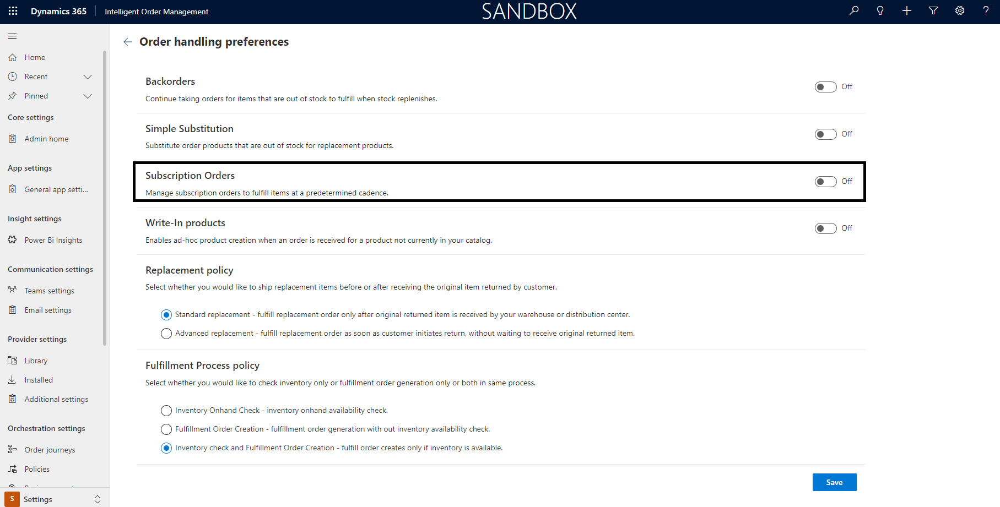

# Subscription order management with Dynamics 365 Intelligent Order Management

This topic describes how Intelligent Order Management can handle subscription order giving customers the flexibility to have their orders fulfilled in a regular recurrence.

## Subscription order
A Subscription order allows customers to place their orders as goods or services which will be fulfilled in a regular cadence. This cadence could be determined at product level.
With appropiate subscription order management customers can get the below benefits:

a. Increased customer loyalty with strong customer base.

b. Predictable recurring revenue.

c. Better cash flow management

## Pre-requisite Settings

a. Appropriate **Settings** described below should be enabled.

   i.  Goto **Settings**. Click on **General app settings**.
   
   ii. Goto **Order handling preferences**  and click on **Manage**.
   
   iii.Goto **Subscription Orders** and turn **On** the capability.
        
   
   
b. Define **Subscription frequency** for **Products**. 
  
   i.  Goto **Demand Planning** in sitemap and select **Products**.
   
   ii. Select the **Product** by clicking on the item.
   
   iii.If the product is to be used for subscription select **Allowed Subscription Frequency**. YOu can select either **Monthly**, **Quarterly** or **Yearly** or **Select All**.
   
   iv. Once you select it, your subscription order products would be validated for the eligible fulfillment frequency.
   
   v.  Click on **Save** or **Save & Close**.

## How does Subscription work?

A subscription order could be created in an ecommerce application or though a customer service representative in D365 Intelligent Order Management. In either case this would create
a **Subscription Order** and can be fould under **Orders**.
A **Subscription order** is like a contract which defines the product that the customer has opted to be fulfilled as **subscriptions**.
It includes few specific fields that signify this contract as below:

|Field name|Description|
|----|-----------|
|Fulfillment Frequency| This field captures the product frequency that was setup in **Products** and is the driver for subscription fulfillment jobs.|
|Current Subscription| This field capturs the current recurrence of the subscription. It is an integer that reflects the current subscription number.|
|Subscription Start Date | The start date for the subscription. |
|Subscription End Date | The end date for the subscription in case there is one requested by customer. |
|Last Ordered Date | This is an auto populated field that will hold the last order created date. |

[!NOTE]
  >- At this point one product per subscription is supported. Multiple products support will be available in later releases.

Once a subscription order is created in D365 Intelligent Order Management, based on the product frequency opted by customer, a **background job** would automatically pick up these orders and generate **Sales orders** from the **subscription**.
The sales order would then follow the **order orchestration** and genrate fulfillments accordingly.

A job log will be now available to show the list of job runs and their statuses. This can be located on the **Home Page** left menu under **Monitoring** as **Background Jobs**. It will show you the list of job runs, their statuses and the number of records it has successfully processed and moved to fulfillment.

If a background job fails, you will also be able to manually run it using the **Run** option in the upper menu bar. Select the **Subscription-Order Job** and this will start a new instance of the background job.

On clicking the Job line, you will be able to see the details of the background job run.

