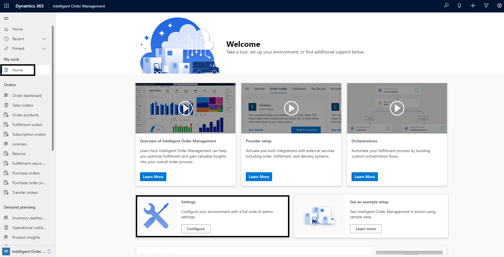
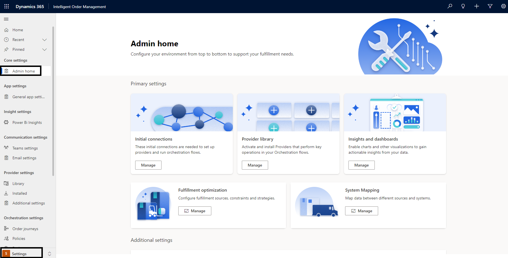

# Admin home workspace

[!include [banner](includes/banner.md)]

This article describes the **Admin home** workspace in Microsoft Dynamics 365 Intelligent Order Management.

The **Admin home** administrator workspace in Intelligent Order Management makes all levels of Intelligent Order Management–related setups and settings easily accessible and available to administrators. Access to the **Admin home** workspace can be role-based, according to customer needs.

To access the **Admin home** workspace, on the Intelligent Order Management **Home** page, select **Settings**, and then, in the left navigation pane, select **Admin home**. 

Alternatively, at the bottom of the left navigation pane, select **Intelligent Order Management \> Settings** to change the workspace area, and then select **Admin home**.

The **Admin home** workspace contains shortcuts to settings for key areas of Intelligent Order Management. All detailed settings areas and their subareas can be accessed in the left navigation pane.

## Key settings areas in the left navigation pane

The left navigation pane in the **Admin home** workspace groups all the different admin settings. The following table describes the key settings areas.

| Area | Description |
|------|-------------|
| App settings | This area is focused primarily on enabling or disabling feature controls. |
| Insight settings | This area lets you switch Power BI Insights on or off. |
| Communication settings | This area lets you configure settings that are associated with Teams or email communications. |
| Provider settings | This area lets you set up your provider connections and integrate with your partner systems. |
| Orchestration settings | This area lets you define order journeys for your customer orders. |
| Data settings | This area lets you configure any form of data mappings that enable smooth integration with your providers. |
| Order settings | This area lets you configure settings that are related to orders, fulfillments, warehouses, and carriers. |
| Inventory settings | This area lets you define your inventory measures and use them for inventory transaction updates. |

### Settings subareas

Each settings area in the left navigation pane is divided into settings subareas. The following table describes the settings subareas and their related components.

| Area | Subarea | Components |
|------|---------|------------|
| App settings | General app settings | 
This subarea includes the following components:
<ul><li>**Order Handling Preferences** – This setting lets you turn on or off key order management capabilities, such as backorders, subscriptions, substitutions, write-in products, and replacements.</li><li>**Feature version control** – This setting lets you switch back to an older version of some app pages, based on your preferences. Options include **Enhanced Email** and **Enhanced pages**.</li><li>**Integration keys** – This setting lets you maintain any keys that are associated with your app.</li></ul> |
| Insight settings | Power BI Insights | This subarea lets you turn on or off your **Insights** dashboards. |
| Communication settings | Teams settings | 
This subarea lets you turn on or off collaboration, chat, and email functionality. It includes the following component:

<ul><li>**Microsoft Teams collaboration and chat** – You can enable enhanced Teams integrations, linking of records to Teams channels, and confidential labels in this subarea.</li></ul> |
| | Email settings | You can use this subarea to manage different email templates that are provided out of the box. You can also use it to define your own templates. |
| Provider settings | Library | This subarea contains a gallery of providers. From the gallery, you can install providers and add their connections. |
| | Installed | This subarea shows the providers that you've successfully installed and activated. It also shows the list of providers that are inactive and awaiting completion. |
| | Additional settings | 
This subarea provides additional setting that are required to make a provider work end to end. It includes the following components:
<ul><li> **Transformations** – This setting lets you add power queries to enable communication between external system data in the app.</li><li>**Mapping groups** – This setting lets you support data that is shared across multiple providers.</li><li>**Actions** – This setting lets you manage the provider functions in the form of actions in the orchestration flows.</li><li>**Action types** – This setting lets you manage your provider actions in the form of associated functions.</li></ul> |
| Orchestration settings | Order journeys | This subarea lets you set up your order orchestration flows. These orchestration flows can be **order**, **returns**, and **inventory** orchestrations. |
| | Policies | This subarea lets you set up different business rules that can be used in the orchestration flows. |
| | Business events | This subarea enables different **input** and **output** business events that trigger subsequent actions in the orchestration flow. |
| Data settings | Mapping | This subarea lets you add value maps and value map types across account, contacts, products, price lists, warehouses, currencies, unit groups, and units, so that data can be mapped across multiple providers. |
| Order settings | Fulfillment settings | 
This subarea lets you set up all configurations that are associated with an order fulfillment. It includes the following components:
<ul><li>**Strategies** – This setting lets you define different order fulfillment strategies and use them differently across your order fulfillments.</li><li>**Constraints** – This setting lets you define constraints or rules to optimize fulfillment and inventory latency.</li><li>**Source lists** – This setting lets you group multiple sources into groups, and use those groups to run strategies and constraints across a source list.</li><li>**Sources** – This setting lets you manage multiple sources to enable multi-modal fulfillment strategies.</li><li>**Fulfillment plan** – This setting lets you visualize the record for the optimized plan across a specific strategy and set of constraints that was generated.</li><li>**Ship via** – This setting lets you define the mode of delivery for a product.</li><li>**Terms of delivery** – This setting lets you define delivery terms as negotiated across a carrier and a vendor.</li></ul> |
| | Sales settings | 
This subarea is focused on setups that enhance order-related orchestrations. It includes the following components:
<ul><li>**Split groups** – This setting lets you define split groups that can be used to split orders across any order entities.</li><li>**Shipping carriers** – This setting lets you define the master list of supported carriers in your order orchestration for fulfillments.</li><li>**Customer groups** – This setting lets you define the master list of your customer groups that can be used to allocate inventory.</li></ul> |
| | Warehouse settings | 
This subarea is focused on setups that are related to your stores or distribution centers that are required to complete transactions effectively. It includes the following components:
<ul><li>**Document types** – This setting lets you set up your document type masters, such as shipping labels and return labels.</li><li>**Document specifications** – This setting lets you set up detailed specifications, such as document print formats.</li><li>**Fulfillment source print specifications** – This setting lets you set up fulfillment source print specifications, such as supported label types and size formats.</li><li>**Disposition codes** – This setting lets you manage the master list of your disposition codes for returned items.</li><li>**Inspection codes** – This setting lets you set up the master list of your inspection codes for returned items.</li><li>**Return warehouses** – This setting lets you set up the master list of your return warehouses across a specific city, state or province, and country or region, based on the customer's delivery address.</li></ul> |
| Inventory settings | Index and Reservation | This subarea is focused on setups that are associated with inventory management in Intelligent Order management. Here, you can set up the physical measures, data sources, allocations, and calculated measure for inventory. For more information about these setups, see [Inventory setup](set-up-inventory-visibility-provider.md). |
