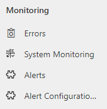
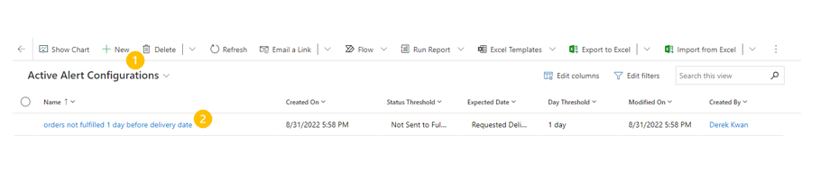
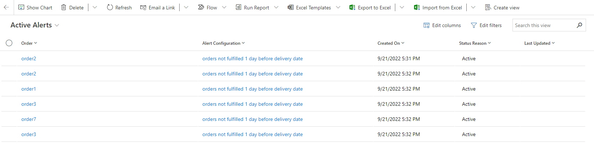
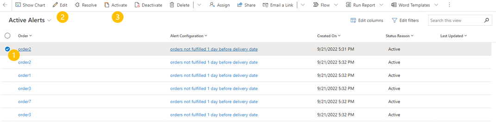

# Intelligent Order Management alerts

[!include [banner](includes/banner.md)]
[!include [banner](includes/preview-banner.md)]

Time-sensitive and high-impact issues can become buried in a sea of business events. If there's no way to surface those issues in a structured and timely manner, they'll be lost, and might lead to customer dissatisfaction and business disruption. Microsoft Dynamics 365 Intelligent Order Management provides alerts about business-critical events, so that you can act quickly when issues arise. 

In this release, Intelligent Order Management has alerts for order statuses. For example, an order can trigger an alert if the current date is three days before the requested delivery date of an order, but the order hasn't yet been sent to fulfillment.

This feature is still in private preview, and your administrator will have to enable alerts in the **Administration settings** area. After alerts are enabled, you can find them in the **Monitoring** section on the left menu.

## Create an alert

> [!NOTE]
> For the private preview, no pre-built alerts are available out of the box. You must create alert configurations for alerts that you want to start to trigger.

1. On the left menu, in the **Monitoring** section, select **Alert Configuration** to open the **Active Alert Configurations** page.

    On the **Active Alert Configurations** page, the top menu bar (labeled "1" in the illustration) contains several buttons, including **New**. The grid (labeled "2") contains a list of current alert configurations. Double-tap (or double-click) any configuration in the list to open the configuration settings and make changes to the configuration.

    

2. Select **New** on the menu bar to open the **New Alert Configuration** page.
3. Set the following fields:

    - **Name** – Give your configuration a descriptive name, so that you can easily identify it among the different configurations. For example, enter **Not delivered one day past requested date**.
    - **Owner** – By default, this field specifies your name as the creator of the configuration. However, you can update the value as needed.
    - **Alert action** – Select one of the following values to specify the issue that will trigger the alert:

        - Not sent to fulfillment
        - Not shipped

    - **Expected date** – This field is used in combination with the **Alert action** field. Specify the date on an order that will trigger an alert. For this private preview release, the only available option is **Requested delivery date**. More options will be added in upcoming releases.
    - **Time before expected** – Specify the number of days, hours, or minutes between the alert action and the expected date that will cause an alert to be triggered.

### Example

For example, the following alert settings are configured:

- **Alert action:** Not sent to fulfillment
- **Expected date:** Requested delivery date
- **Time before expected:** 3 days

In this case, any order that has a requested delivery date three days from now, but that hasn't yet been sent to fulfillment, will trigger an alert.

On the **Active Alerts** page, you can view all the alert configurations that have been created. You can also select any existing configuration and edit the settings as needed.

## View alerts

- On the left menu, in the **Monitoring** section, select **Alerts** to open the **Active Alerts** list page.

The **Active Alerts** page provides a list of current orders that match the criteria for your alert configurations. On this page, you can view any specific order that's under alert, change the status of the alert, and access the configuration that's triggering the alert.

> [!NOTE]
> Alerts are a list of orders that are under alert. Alert configurations are a list of the configurations that you created to generate alerts.

Each row in the grid represents an order that's currently under alert. Here's an explanation of the grid columns:

- **Order** – This column contains a link to the order in Intelligent Order Management that's currently under alert.
- **Alert Configuration** – This column contains a link to the configuration that's triggering the alert.
- **Status Reason** – This column contains the status of the alert. The following alert statuses are used:

    - Active
    - In progress
    - On hold
    - Inactive
    - Resolved

    A status of **Active** indicates that the alert is active. The order itself might have a status of **In fulfillment** or **Sent for delivery**. The purpose of the alert status is to enable you to update the status of an alert if you've already taken action on the order. For example, if an alert is triggered because an order is delayed, and you expedited the order for delivery, you can change the alert status to **Resolved**. Therefore, you can use the list of alerts in the grid as a to-do list. You can view which orders are under alert, and then check them off as you take action on the orders to resolve the alerts.

## Update an alert

You can change the alert status of any row on the **Active Alerts** page. (The numbered steps correspond to the numbered callouts in the illustration.)

1. In the row for the alert that you want to update, hover over the area to the left of the **Order** column, and then select the checkbox to select the row. When a row is selected, the top menu bar changes.
2. To edit details of the alert, including the alert status, select **Edit** on the menu bar to open the **Alert edit** page. This page shows alert details such as the owner of the alert, the order that's under alert, and the configuration. You can make the following changes:

    - In the **Owner** field, select someone else in your organization as the owner of the alert.
    - In the **Alert status** field, select **Active**, **In Progress**, **On Hold**, or **Resolved** as the alert status.
    - Select **Deactivate** on the menu bar to deactivate the alert.

3. To quickly change the alert status, select **Resolve**, **Activate**, or **Deactivate** on the menu bar to update the **Status Reason** value for the row.

## Other notes

Future releases will include some out-of-box alerts, in-app notifications, and other alert types, such as inventory alerts and data anomalies.

During the private preview phase, there are some resource limitations. If an alert configuration triggers more than 5,000 orders at a time, the alert will fail. Although this situation should rarely occur, you can help safeguard against it by ensuring that the **Time before expected** value is lower than the **Days before expected date** value. For example, the number of orders that haven't been sent to delivery ten days before the expected delivery date will be much greater than the number two days before the expected delivery date. Therefore, the limit of 5,000 orders is much less likely to be reached two days before the expected delivery date.
