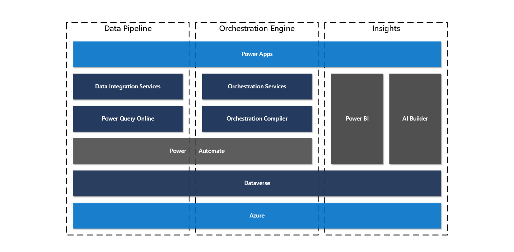

# Architecture overview

[!include [banner](includes/banner.md)]
[!include [banner](includes/preview-banner.md)]

Dynamics 365 Intelligent Order Management is built on the Microsoft Power Platform, leveraging the [Power Apps model-driven apps](https://docs.microsoft.com/powerapps/maker/model-driven-apps/) infrastructure. The architecture was designed to support the requirements of a complex order processing environment where there are many systems and apps in the overall order-to-fulfillment process.

Delivered as a cloud solution, Intelligent Order Management can be deployed quickly in the Microsoft Azure data centers. The app and platform are deployed in a data center region that customers choose for their business, and Microsoft manages the infrastructure. That way, customers can focus on configuring the app to suit business order and fulfillment requirements. To learn more about the data center regions that are supported, see [Globalization](globalization.md).

The app and platform were designed following these basic principles.

-   Extensibility: Understanding that every organization has a unique combination of apps and systems they work with. Enabling the configuration of the business process to match the requirements of the organization. Flexibility in extending the platform and app.

-   Scale: Understanding that the need to scale to support high transaction volume isn't just for enterprise organizations. Organizations of all types need an app and platform that can scale up and down as needed.

-   Leverage the Power Platform: Understanding that customers are looking to technology vendors that can support them in their long-term plans. Leveraging an organization's in-house skills or skills of consulting partners.

The platform was built with the following three architecture concepts.

-   Data pipeline: The data integration pipeline moves data in and out of Intelligent Order Management. It connects to upstream and downstream systems to receive and push changes as orders move through the order flow.

-   Orchestration engine: The orchestration engine provides the visualization of the business process and compiles the designed process into Power Automate flows for the business user.

-   Insights: The Insights components enable the flow of data to support the visualization of data in Power BI and allow data to be analyzed in machine learning models with AI Builder.

## Data pipeline 

The data pipeline in Intelligent Order Management provides the foundation for the providers to move data in and out of the app. Transformation of business documents moving through the data pipeline is executed by Microsoft Power Query Online.

The following is terminology to describe components in the data pipeline.

-   Provider: In Intelligent Order Management, a provider is used to configure the data movement in the data pipeline. Microsoft ships providers out-of-the-box, but customers and partners are encouraged to build their own providers. To learn more, see [work with providers](work-providers.md).

-   Connectors: Connectors are built using Power Automate. Connectors wrap the external service API that will be used by the provider. Customers can use the available catalog of connectors to build their own provider. To learn more about connectors, see the [Connectors documentation](https://docs.microsoft.com/connectors/).

-   Connection: A connection is the specific configuration required to enable the connection used by the provider. The administrator will supply the sign-in or API tokens to communicate with the external service when the provider is enabled in the application.

-   Data transformations: Services have their own business document and entity concepts. As data moves between those systems, data needs to be transformed for the systems to communicate with each other. When Microsoft builds a provider, it includes transformations to common business documents for the external service. If required, the transformation can be changed or extended to support new providers or APIs for a service.

-   Business events: Business events are notifications from the processing pipeline to execute a provider action.

-   Provider action: A provider action is a single task of unit of operation for a provider, as represented by a Power Automate.

## Orchestration Engine

Order-to-fulfillment flow is complex in a single business app, but when combined with other cloud services and supply chain partner systems, the complexity grows. To help business users in the organization to visualize and manage this complexity, Intelligent Order Management ships with a business orchestration designer. Business process flows designed with the orchestration designer are compiled into Power Automate flows when the flow is published.

The following is terminology to describe components in the orchestration engine.

-   Designer: The tool used by the business user to build orchestration flows.

-   Orchestration flow types: The preview release of Intelligent Order Management provides two flow types:

    -   Order flow –represents the progression of an order to fulfillment.

    -   Inventory flow – represents the flow of inventory from a master system to the inventory service or to an external system.

-   Policies: Rules and configurations the business user can provide to control an orchestration flow.

-   Step: A step in the orchestration is a specific tile in the orchestration flow. Each tile type provides the configuration parameters to perform that function in the orchestration flow.

## Insights

The platform manages data through the application lifecycle and is visualized using Power BI. The preview release of Intelligent Order Management provides several dashboards to help the business user understand key order and fulfillment metrics. Customers can use the same technology to present and combine data from other apps as needed.

Machine learning is used to analyze data using models and uses advanced algorithms to find or predict patterns in data. Customers can build models using AI builder that use data from Intelligent Order Management, so that results are updated on entities used during the order and fulfillments flows. This will help decision making in orchestration flows. Future releases of Intelligent Order Management will provide models out of the box.

## Related technology

Intelligent Order Management makes use of the following Microsoft platform technologies.

-   Dataverse: Data in Intelligent Order Management is provided through the Dataverse platform. For more information, see [Microsoft Dataverse developer guide](https://docs.microsoft.com/powerapps/developer/data-platform/overview).

-   Power Automate: For business users, Intelligent Order Management compiles organization flows into Power Automate. Developers can further extend the solution. To learn more about the capabilities of Power Automate, see [Getting started with Power Automate](https://docs.microsoft.com/power-automate/getting-started).

-   Power Query Online: Intelligent Order Management leverages the capabilities of Power Query and the M query language to support transformation in the data pipeline for providers. To learn more, see the [Power Query documentation](https://docs.microsoft.com/power-query/power-query-what-is-power-query).

-   Power BI: The dashboards provided in Intelligent Order Management are built using Power BI tools. Customers can extend the solutions or build their own using Power BI. To learn more about Power BI, see the [Power BI overview](https://microsoft.sharepoint.com/teams/D365OperationsRedmond/Shared%20Documents/OMS/Documentation/•%09https:/docs.microsoft.com/power-bi/fundamentals/power-bi-overview).

-   AI Builder: Machine learning models will be available in later releases of Intelligent Order Management. Customers and partners can use the same technology to build their own models using AI Builder capabilities. To learn more, see the [AI Builder documentation](https://docs.microsoft.com/ai-builder/).

## Additional resources

[Work with providers](work-providers.md)

[Create a new provider](create-new-provider.md)
