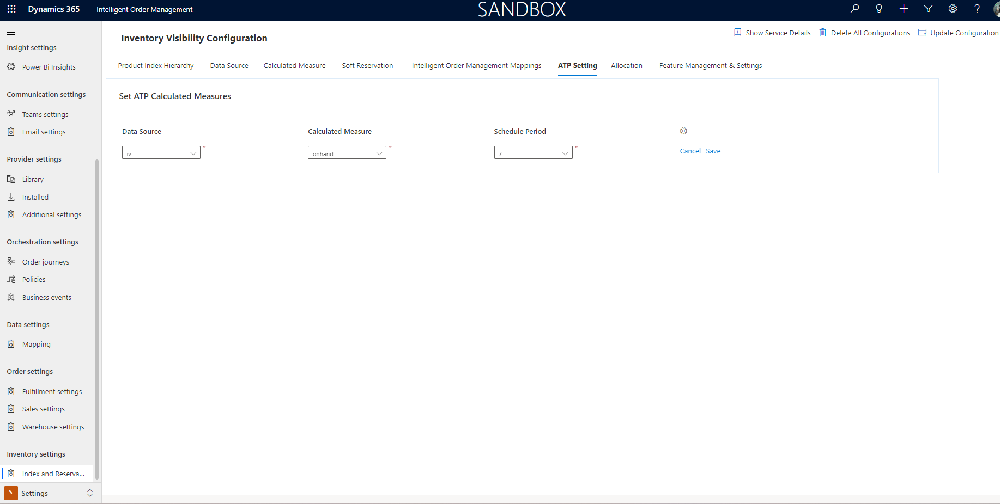

# Available to promise inventory capabilities

This article describes available to promise (ATP) capabilities in Microsoft Dynamics 365 Intelligent Order Management.

ATP is the projected amount of inventory that will be available in the incoming period to be able to promise customer orders. Use of this calculation can greatly increase your order fulfillment capability.

For many manufacturers, retailers, and sellers, it isn't enough to know what inventory is currently on hand. They must have full visibility into future availability. This future availability should consider future supply, future demand, and ATP.

## Prerequisites

The following prerequisites must be met to set up and use ATP capabilities in Intelligent Order Management.

- You must have the Dynamics 365 Inventory Visibility provider installed. For installation steps, see [Set up Inventory Visibility provider](set-up-inventory-visibility-provider.md).
- Submit on-hand change schedule updates to the Dynamics 365 Inventory Visibility provider that the dates are within the period that is defined by the **Schedule period** setting.

The following table lists the API details to submit a on-hand schedule change request. These APIs are available from the Microsoft Dynamics 365 Supply Chain Management Inventory visibility add-in, as well as Intelligent Order Management. For more information, see [Dynamics 365 Inventory Services](/dynamics365/supply-chain/inventory/inventory-visibility-available-to-promise).

|Path|Method|Description|
|----|------|-----------|
|/api/environment/{environmentId}/onhand/changeschedule|	POST	|Create one scheduled on-hand change.|
|/api/environment/{environmentId}/onhand/changeschedule/bulk|	POST	|Create multiple scheduled on-hand changes.|

## Enable and set up the features

Before you can use ATP, you must enable one or more key setups as below:

First, the **Available To Promise** settings should be enabled.

To enable the **Available To Promise** settings, follow these steps.

1. Go to **Settings**. Click on **Index and Reservation**.
1. Click on the tab **Feature Management and Settings**
1. Enable **OnHandChangeSchedule** option.
   
   
   
Next, you must define the calculated measure for **ATP Setting**.

The **ATP calculated measure** is a predefined calculated measure that is typically used to find the on-hand quantity that is currently available. The **supply quantity** is the sum of quantities for those physical measures that have a modifier type of addition, and the **demand quantity** is the sum of quantities for those physical measures that have a modifier type of subtraction.

You can add multiple calculated measures to calculate multiple ATP quantities. However, the total number of distinct physical measures across all ATP calculated measures should be less than nine.

> [!NOTE]
> A calculated measure is a composition of physical measures. Its formula can include only physical measures without duplicates, not calculated measures.

**For example**, you set up the following calculated measure:

**On-hand-available** = (PhysicalInvent + OnHand + Unrestricted + QualityInspection + Inbound) – (ReservPhysical + SoftReservePhysical + Outbound)

The sum (PhysicalInvent + OnHand + Unrestricted + QualityInspection + Inbound) represents supply, and the sum (ReservPhysical + SoftReservePhysical + Outbound) represents demand. Therefore, the calculated measure can be understood in the following way:

**On-hand-available** = Supply – Demand

You can add another calculated measure to calculate the On-hand-physical ATP quantity.

**On-hand-physical** = (PhysicalInvent + OnHand + Unrestricted + QualityInspection + Inbound) – (Outbound)

There are eight distinct physical measures across those two ATP calculated measures: PhysicalInvent, OnHand, Unrestricted, QualityInspection, Inbound, ReservPhysical, SoftReservePhysical, and Outbound.

For more information about calculated measures, see [Calculated measures](/dynamics365/supply-chain/inventory/inventory-visibility-configuration#calculated-measures).

To define the calculated measure for **ATP Setting**, follow these steps.
 
1. Go to **Settings**. Click on **Index and Reservation**.
1. Click on the tab **ATP Settings**
1. Select the **Data Source** from the dropdown.
1. Select the **Calculated Measure** for the selected **Data Source**.
1. Assign the **Schedule Period**. Currently this is supported to a max of 7 days.
   
  
  
Next, you must define the Intelligent Order Management calculated measure mapping.
 
To define the Intelligent Order Management calculated measure mapping, follow these steps.

1. Go to **Settings**. Click on **Index and Reservation**.
1. Click on the tab **Intelligent Order Management Mappings**.
1. Go to the section **Set Calculated Measure Mappings**. 
1. Select the **Data Source** defined in **ATP Setting**.  
1. Select **atponhand** as **Base Measure**. 

    > [!NOTE]
    > **Base Measure** is a predefined measure in Intelligent Order Management that will be called from the Inventory check actions in orchestration. This base measure mapping will be maintained with the **ATP Setting** calculated measure.
         
1. Select the **Calculated Measure** that you want to map from the defined **Calculated measures** in **ATP Setting**.
   
   
   
 ## Run a sample transaction with ATP check
 
Intelligent Order Management will now have the ability to perform Inventory checks as an independnet provider action. If the sales order lines are already assigned    a **Fulfillment Source** via a **policy** or **manual order creation**, one can orchestrate the order to perform independent inventory checks. If the above     **Settings** are enabled then this will also check on ATP dates and determine the **Material Availability Date** and **Estimated Shipment Date** on the sales order line.

> [!NOTE]
> The inventory checks will also happen as part of **Fulfillment and Returns optimization** and based on **ATP Settings**, the sales order lines will be updated      accordingly.
   
Here is a sample order journey with policy based fulfillment assignment.

   
   
Below are the provider actions that will be available as part of Dynamics 365 Intelligent Order Management and check on **Available to Promise** when **ATP        Settings** are enabled.
   
|**Provider action**|**Description**|
|-------------------|---------------|
|Send fulfillment process request|This provider action will check for inventory availability for the assigned fulfillment source on the sales order line and also  check for promide dates if **ATP Setting** is enabled. This action will also generate the Fulfillment order and update the **Inventory Availability Date** and **Estimated Ship Date** on the sales order line.
|Send to fulfillment optimization|This provider action will determine the best fulfillment location for a sales order line based on inventory check. This action     will also generate the Fulfillment order and update the **Inventory Availability Date** and **Estimated Ship Date** on the sales order line.
   
Below is a sample screen highlighting the **Inventory Availability Date** and **Estimated Ship Date** on the sales order line once the above order orchestration        runs. The inventory check found no inventory and has **backordered** the lines.
   
   
   
## Application programming interface (API) URLs
   
As a part of ATP feature capability, you will also have a set of Application programming interface (API) URLs available from Dynamics 365   Intelligent Order Management. These will also be available from Dynamics 365 Supply Chain Management, For more information, see [Submit change schedules, change events, and ATP queries through the API](/dynamics365/supply-chain/inventory/inventory-visibility-available-to-promise#api-urls). These URLs can be directly called by third party ERPs, commerce or supplier systems for inventory query with ATP capabilities.
   
Below is a sample payload for Inventory Query to call these services from Dynamics 365 Intelligent Order Management.

```JSON
{
    "API": "OnHandQuery",
    "Payload": "{\"filters\": {\"OrganizationId\": [\"{{orgid}}\"],\"ProductId\": [\"ACSC-SP\"],\"SiteId\": [\"default\",\"1\"],\"LocationId\":    [\"120\"]},\"groupByValues\": [],\"returnNegative\": true }"

      }
```

The associated sample Path would look like below:

`{{orgurl}}/api/data/v9.1/msdyn_IOMInventoryAPICall`
      
The Request and Response for these payloads are very much similar to what is available from Supply Chain Management. The following table highlights the mapping between the Intelligent Order Management APIs, Dynamics 365 Inventory Visibility APIs, and the corresponding documentation.
   
|Intelligent Order Management API Name|Dynamics 365 Inventory Visibility API|Method|Description|Documentation link|
|----|------|-----------|--------|--------|
|OnHandQuery|/api/environment/{environmentId}/onhand/indexquery| POST |Query by using the POST method.| [Query by using the post method](/dynamics365/supply-chain/inventory/inventory-visibility-api#query-with-post-method)|
|OnHandDelta|/api/environment/{environmentId}/onhand| GET |	Query by using the GET method.|[Create one on-hand change event](/dynamics365/supply-chain/inventory/inventory-visibility-api#create-one-onhand-change-event)|
|OnHandDelta_Bulk|/api/environment/{environmentId}/onhand/bulk| POST |Create multiple change events.|[Create multiple change events](/dynamics365/supply-chain/inventory/inventory-visibility-api#create-multiple-onhand-change-events)|
|OnHandChangeSchedule|/api/environment/{environmentId}/onhand/changeschedule| POST | Create on hand change schedule. |[Create one on-hand change schedule](/dynamics365/supply-chain/inventory/inventory-visibility-available-to-promise#create-one-on-hand-change-schedule)|
|OnHandChangeSchedule_Bulk|/api/environment/{environmentId}/onhand/changeschedule/bulk|	POST	|Create multiple scheduled on-hand changes.|[Create multiple on-hand change schedules](/dynamics365/supply-chain/inventory/inventory-visibility-available-to-promise#create-multiple-on-hand-change-schedules)|

   
