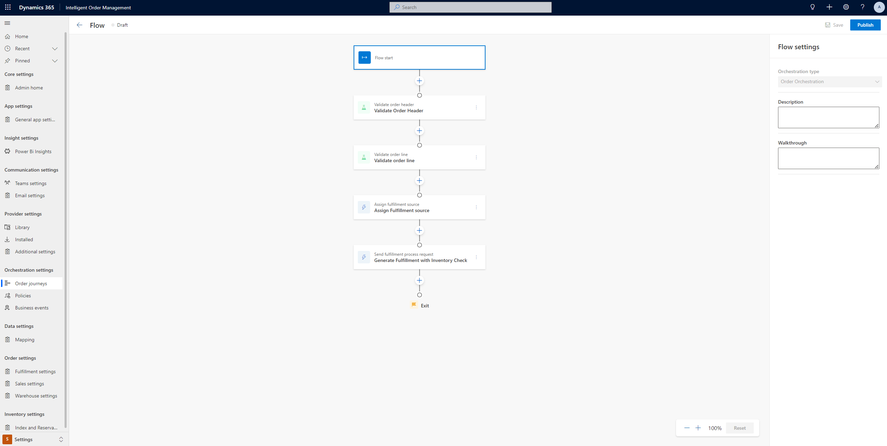

# Available to promise inventory capabilities

This article describes available to promise (ATP) capabilities in Microsoft Dynamics 365 Intelligent Order Management.

ATP is the projected amount of inventory that will be available in the incoming period to be able to promise customer orders. Use of this calculation can greatly increase your order fulfillment capability.

For many manufacturers, retailers, and sellers, it isn't enough to know what inventory is currently on hand. They must have full visibility into future availability. This future availability should consider future supply, future demand, and ATP.

## Prerequisites

The following prerequisites must be met to set up and use ATP capabilities in Intelligent Order Management.

- You must have the Dynamics 365 Inventory Visibility provider installed. For installation steps, see [Set up Inventory Visibility provider](set-up-inventory-visibility-provider.md).
- Submit on-hand change schedule updates to the Dynamics 365 Inventory Visibility provider to confirm that the dates are within the period that defined by the **Schedule period** setting.

The following table lists the API details to submit an on-hand schedule change request. These APIs are available from the Microsoft Dynamics 365 Supply Chain Management Inventory visibility add-in, and in Intelligent Order Management. For more information, see [Dynamics 365 Inventory Services](/dynamics365/supply-chain/inventory/inventory-visibility-available-to-promise).

|Path|Method|Description|
|----|------|-----------|
|/api/environment/{environmentId}/onhand/changeschedule|	POST	|Create one scheduled on-hand change.|
|/api/environment/{environmentId}/onhand/changeschedule/bulk|	POST	|Create multiple scheduled on-hand changes.|

## Set up and enable ATP features

Before you can use ATP, you must enable one or more key setups as below.

### Enable the ATP settings

First, the ATP settings should be enabled.

To enable the ATP settings in Intelligent Order Management, follow these steps.

1. Go to **Settings**. 
1. Select **Index and Reservation**.
1. Select the **Feature Management and Settings** tab.
1. Turn on the **OnHandChangeSchedule** option.
   

   
### Define the calculated measure for ATP settings

Next, you must define the calculated measure for **ATP Setting**.

The ATP calculated measure is a predefined calculated measure that is typically used to find the on-hand quantity that is currently available. The supply quantity is the sum of quantities for those physical measures that have an addition modifier type, and the demand quantity is the sum of quantities for those physical measures that have a subtraction modifier type.

You can add multiple calculated measures to calculate multiple ATP quantities. However, the total number of distinct physical measures across all ATP calculated measures should be less than nine (9).

> [!NOTE]
> A calculated measure is a composition of physical measures. A calculated measure formula can only include physical measures without duplicates, not calculated measures.

To define the calculated measure for **ATP Setting**, follow these steps.
 
1. Go to **Settings**.
1. Select **Index and Reservation**.
1. Select the **ATP Settings** tab.
1. In the **Data Source** drop-down list, select the data source.
1. In the **Calculated Measure** drop-down list, select the calculated measure for the data source.
1. In the **Schedule Period** drop-down list, enter a number for the schedule period. Currently, a maximum value of seven (7) days is supported.
1. Select **Save**.
 


#### Calculated measure examples

For example, you can first set up the **On-hand-available** calculated measure.

**On-hand-available** = (PhysicalInvent + OnHand + Unrestricted + QualityInspection + Inbound) – (ReservPhysical + SoftReservePhysical + Outbound)

The sum (PhysicalInvent + OnHand + Unrestricted + QualityInspection + Inbound) represents supply, and the sum (ReservPhysical + SoftReservePhysical + Outbound) represents demand. So the calculated measure can be understood in the following simplified way: **On-hand-available** = (Supply) – (Demand).

You can then add another calculated measure to calculate the on-hand physical ATP quantity.

**On-hand-physical** = (PhysicalInvent + OnHand + Unrestricted + QualityInspection + Inbound) – (Outbound)

There are eight distinct physical measures used between the two example ATP calculated measures above: PhysicalInvent, OnHand, Unrestricted, QualityInspection, Inbound, ReservPhysical, SoftReservePhysical, and Outbound.

For more information about calculated measures, see [Calculated measures](/dynamics365/supply-chain/inventory/inventory-visibility-configuration#calculated-measures).

### Define the calculated measure mapping
  
Next, you must define the Intelligent Order Management calculated measure mapping.
 
To define the Intelligent Order Management calculated measure mapping, follow these steps.

1. Go to **Settings**. 
1. Select **Index and Reservation**.
1. Select the **Intelligent Order Management Mappings** tab.
1. In the **Set Calculated Measure Mappings** section, select the **Data Source** you defined in **ATP Settings**.  
1. In the **Base Measure** column, select **atponhand**. 

    > [!NOTE]
    > The base measure is a predefined measure in Intelligent Order Management that is called from the inventory check actions in orchestration. This base measure mapping will be maintained with the **ATP Settings** calculated measure.
         
1. In the **Calculated Measure** column, select the calculated measure that you defined in **ATP Settings**..
   

   
 ## Run a sample transaction with ATP check
 
Intelligent Order Management has the ability to perform Inventory checks as an independent provider action. If the sales order lines are already assigned a fulfillment source via a policy or manual order creation, you can orchestrate the order to perform independent inventory checks. If the settings above are enabled, the system will also check on ATP dates and determine the **Material Availability Date** and **Estimated Shipment Date** values on the sales order line.

> [!NOTE]
> Inventory checks will also occur as part of fulfillment and returns optimization, and based on **ATP Settings**, the sales order lines will be updated      accordingly.
   
The following image shows an example of an orchestration journey with a policy-based fulfillment assignment.

   
   
The following provider actions are available as part of Intelligent Order Management and check on ATP when **ATP Settings** are enabled.
   
|**Provider action**|**Description**|
|-------------------|---------------|
|Send fulfillment process request|This provider action checks for inventory availability of the assigned fulfillment source on the sales order line, and also checks for promise dates if **ATP Settings** is enabled. This action also generates the fulfillment order and updates the **Inventory Availability Date** and **Estimated Ship Date** values on the sales order line.
|Send to fulfillment optimization|This provider action determines the best fulfillment location for a sales order line based on an inventory check. This action also generates the fulfillment order and updates the **Inventory Availability Date** and **Estimated Ship Date** values on the sales order line.
   
The following example image highlights the **Estimated Ship Date** and **Inventory Availability Date** values on the sales order line after the above order orchestration  runs. In this example, the inventory check found no inventory and has backordered the lines.
   
   
   
## Application programming interface (API) URLs
   
As a part of ATP feature capability, there is also a set of application programming interface (API) URLs that are available from Intelligent Order Management. These URLs will also be available from Supply Chain Management. These URLs can be directly called by third party ERPs, commerce or supplier systems for inventory query with ATP capabilities. For more information, see [Submit change schedules, change events, and ATP queries through the API](/dynamics365/supply-chain/inventory/inventory-visibility-available-to-promise#api-urls). 
   
The following example shows a sample payload for the inventory query to call various services from Intelligent Order Management.

```JSON
{
    "API": "OnHandQuery",
    "Payload": "{\"filters\": {\"OrganizationId\": [\"{{orgid}}\"],\"ProductId\": [\"ACSC-SP\"],\"SiteId\": [\"default\",\"1\"],\"LocationId\":    [\"120\"]},\"groupByValues\": [],\"returnNegative\": true }"

      }
```

The associated example path would look like the following:

`{{orgurl}}/api/data/v9.1/msdyn_IOMInventoryAPICall`
      
The request and response for these payloads are similar to what is available from Supply Chain Management. The following table highlights the mapping between the Intelligent Order Management APIs, Dynamics 365 Inventory Visibility APIs, and the corresponding documentation.
   
|Intelligent Order Management API Name|Dynamics 365 Inventory Visibility API|Method|Description|Documentation|
|----|------|-----------|--------|--------|
|OnHandQuery|/api/environment/{environmentId}/onhand/indexquery| POST |Query by using the POST method.| [Query by using the post method](/dynamics365/supply-chain/inventory/inventory-visibility-api#query-with-post-method)|
|OnHandDelta|/api/environment/{environmentId}/onhand| GET |	Query by using the GET method.|[Create one on-hand change event](/dynamics365/supply-chain/inventory/inventory-visibility-api#create-one-onhand-change-event)|
|OnHandDelta_Bulk|/api/environment/{environmentId}/onhand/bulk| POST |Create multiple change events.|[Create multiple change events](/dynamics365/supply-chain/inventory/inventory-visibility-api#create-multiple-onhand-change-events)|
|OnHandChangeSchedule|/api/environment/{environmentId}/onhand/changeschedule| POST | Create on-hand change schedule. |[Create one on-hand change schedule](/dynamics365/supply-chain/inventory/inventory-visibility-available-to-promise#create-one-on-hand-change-schedule)|
|OnHandChangeSchedule_Bulk|/api/environment/{environmentId}/onhand/changeschedule/bulk|	POST	|Create multiple on-hand change schedules.|[Create multiple on-hand change schedules](/dynamics365/supply-chain/inventory/inventory-visibility-available-to-promise#create-multiple-on-hand-change-schedules)|

   
