# Create a new provider

[!include [banner](includes/banner.md)]


To create a new provider, use the following steps. You can also use these steps to make additions to existing providers.

## Define provider architecture

Before you create a provider, it's important to understand what you want the provider to do and what you want to use it for. Providers have multiple components and you may not need all of the components.

Use the following table to determine which components you'll need.

| Condition | Component needed |
|-------------------------|-------------------------|
| The service you want to create a provider for doesn't have a connector in Power Automate.</br>For more information, see [List of all Power Automate connectors](/connectors/connector-reference/connector-reference-powerautomate-connectors). | Create a customer connector or use a generic connector. |
| Your provider will exchange data between an external service and Microsoft Dataverse. | Your provider will need a provider transformation. Add a provider transformation component for each transformation. |
| Your provider will execute logic from the orchestration designer. | Create a separate Power Automate flow to represent each of the actions. |
| Your provider needs to process messages from an external service. | Create a Power Automate Message Handler flow. |
| Your provider will pull messages from an external service at a regular interval. | Create a Power Automate Message Puller flow. |
| Your provider will raise business events that aren't currently defined in Intelligent Order Management. | Create a new business event definition and add existing events. |


When you have a good understanding of the solutions, you can proceed to implementing your provider.


## Create a provider solution

You need to complete the following tasks in this section to create a provider solution.

-   Set up a custom provider.

-   Add a provider definition.

-   Add the components to your solution.

### Set up a custom provider

Create a solution in Power Apps that will contain the components of your provider. To create a new solution in Power Apps, follow the steps in [Create a solution in Power Apps.](/powerapps/maker/data-platform/create-solution)

### Add a provider definition

A provider definition contains details about your provider. The definition determines how your provider will appear in the Provider Catalog.

1.  In the provider solution you created, select **New**.

2.  Select **IOM** **Provider Definition**.

3.  Add the following details:

    1. **Display name**: The name you want to give your provider, for example, "Test Provider".

    2. **Logical name**: The export key for your provider.

    3. **Description**: Text to describe what your provider does.

4.  Select **Save.**

5.  If you want to add a logo, upload the image.

6.  Validate that your provider definition appears in the solution. A record with the component type **IOM Provider Definition** should be displayed. If it isn't displayed, select **Add existing**, and then select the record you just created.

7.  Validate that your provider appears in the Provider Catalog. If you set the **Is Active** field to **Yes**, your provider definition will show up in the Provider Catalog. Open Intelligent Order Management. Go to **Providers > Catalog**. Verify that your provider definition is displayed.

### Add components to solution

After you create your provider definition, add the provider components to the solution.

1.  Go to your solution.

2.  Select **Add existing**.

3.  Select the Intelligent Order Management component type, then select the record you just created.

## Create a provider transformation 

If your provider requires a transformation, you need to add a provider transformation component to your solution. You may be required to create multiple transformations.

1.  In your provider solution, select **New.**

2.  Select **IOM Provider Definition Transformation**.

3.  Add the following details:

    1. **Display name**: The name of your provider transformation, for example, "Transform Sales Orders".

    2. **Logical name:** The unique identifier of your provider. This value will be the import and export key of the data. It should start with the publisher's prefix. For example, Microsoft uses the publisher prefix msdyn\_. Examples for logical name are: msdyn\_flexe\_fulfillmentorderproduct\_orderline, and msdyn\_flexe\_fulfillmentorder\_order.

    3. **Source type**: This field indicates what type of data is received. There are two options: **JsonDocument** or **Dataverse Entity**. If your data is already in Dataverse, select **Dataverse Entity**. If not, select **JsonDocument**. This information will be used in the Power Automate element you define to look up the transformation.

    4. **Source object name**: The name of the data you are transforming. If you are transforming a Dataverse record, make sure the **Source Object Name** is the same name as in the Dataverse table.

    5. **Destination object name**: The destination of the record you want to transform.

    6. **Transformation**: The Power Query Online MQuery that will be used to transform the input data. For information about Power Query and MQuery, see [What is Power Query?](/power-query/power-query-what-is-power-query) and [Power Query M formula language reference.](/powerquery-m/) The following is an example of a MQuery that transforms a sales order from an external order service to a sales order in Intelligent Order Management.

```powerquery-m
shared TransformSourceData =

let

orderItems = Source\[OrderItems\],

orderheader =

Record.FromTable

(

Table.SelectRows

(

Record.ToTable

(

\[

ordernumber = Record.FieldOrDefault(Source, "SellerOrderId", Text.From(Source\[OrderServiceOrderId\])),

name = ordernumber,

msdyn\_ExternalOrderId = Text.From(Source\[OrderServiceOrderId\]),

\#"customerid\_account@odata.bind" = "/accounts(" & Text.From(Source\[accountid\]) & ")",

\#"pricelevelid@odata.bind" = "/pricelevels(" & Text.From(Source\[pricelevelid\]) & ")",

totalamount = if Record.HasFields(Source, "OrderTotal") then Decimal.From(Record.FieldOrDefault(Source\[OrderTotal\], "Amount")) else null,

shipto\_name = if Record.HasFields(Source, "ShippingAddress") then Record.FieldOrDefault(Source\[ShippingAddress\], "Name") else null,

shipto\_contactname = shipto\_name,

shipto\_line1 = if Record.HasFields(Source, "ShippingAddress") then Record.FieldOrDefault(Source\[ShippingAddress\], "AddressLine1") else null,

shipto\_line2 = if Record.HasFields(Source, "ShippingAddress") then Record.FieldOrDefault(Source\[ShippingAddress\], "AddressLine2") else null,

shipto\_line3 = if Record.HasFields(Source, "ShippingAddress") then Record.FieldOrDefault(Source\[ShippingAddress\], "AddressLine3") else null,

shipto\_city = if Record.HasFields(Source, "ShippingAddress") then Record.FieldOrDefault(Source\[ShippingAddress\], "City") else null,

shipto\_stateorprovince = if Record.HasFields(Source, "ShippingAddress") then Record.FieldOrDefault(Source\[ShippingAddress\], "StateOrRegion") else null,

shipto\_country = if Record.HasFields(Source, "ShippingAddress") then Record.FieldOrDefault(Source\[ShippingAddress\], "CountryCode") else null,

shipto\_postalcode = if Record.HasFields(Source, "ShippingAddress") then Record.FieldOrDefault(Source\[ShippingAddress\], "PostalCode") else null,

shipto\_telephone = if Record.HasFields(Source, "ShippingAddress") then Record.FieldOrDefault(Source\[ShippingAddress\], "Phone") else null,

overriddencreatedon = Record.FieldOrDefault(Source, "PurchaseDate")

\]

), each \[Value\] \<\> null

)

),

orderlines = List.Transform(orderItems, each

Record.FromTable

(

Table.SelectRows

(

Record.ToTable

(

\[

isproductoverridden = true,

ispriceoverridden = true,

productdescription = \[OrderItemId\] & "-" & Record.FieldOrDefault(\_, "SellerSKU") & "-" & Record.FieldOrDefault(\_, "Title"),

quantity = \[QuantityOrdered\],

quantityshipped = Record.FieldOrDefault(\_, "QuantityShipped"),

priceperunit = if Record.HasFields(\_, "ItemPrice") then Decimal.From(Record.FieldOrDefault(\[ItemPrice\], "Amount")) else null,

manualdiscountamount = if Record.HasFields(\_, "PromotionDiscount") then Decimal.From(Record.FieldOrDefault(\[PromotionDiscount\], "Amount")) else null,

tax = if Record.HasFields(\_, "ItemTax") then Decimal.From(Record.FieldOrDefault(\[ItemTax\], "Amount")) else null,

shipto\_name = Record.FieldOrDefault(orderheader, "shipto\_name"),

shipto\_contactname = Record.FieldOrDefault(orderheader, "shipto\_contactname"),

shipto\_line1 = Record.FieldOrDefault(orderheader, "shipto\_line1"),

shipto\_line2 = Record.FieldOrDefault(orderheader, "shipto\_line2"),

shipto\_line3 = Record.FieldOrDefault(orderheader, "shipto\_line3"),

shipto\_city = Record.FieldOrDefault(orderheader, "shipto\_city"),

shipto\_stateorprovince = Record.FieldOrDefault(orderheader, "shipto\_stateorprovince"),

shipto\_country = Record.FieldOrDefault(orderheader, "shipto\_country"),

shipto\_postalcode = Record.FieldOrDefault(orderheader, "shipto\_postalcode"),

shipto\_telephone = Record.FieldOrDefault(orderheader, "shipto\_telephone"),

overriddencreatedon = Record.FieldOrDefault(orderheader, "overriddencreatedon")

\]

), each \[Value\] \<\> null

)

)

),

salesorder = Record.AddField(orderheader, "order\_details", orderlines)

in Text.FromBinary(Json.FromValue(salesorder));
```

4.  Select **Save.**

5.  Validate that your transformation component appears correctly. A component type of **IOM Provider Definition Transformation** with the transformation name should be displayed. If it isn't displayed, select **Add existing**, and then select the transformation you just created.

## Add business event definitions

If your provider will create or use new business events, you must add **IOM Provider Definition Business Event Definition** components to your solution. You only need to add business events that aren't already in Intelligent Order Management.

If the business event that you want to create isn't already in Intelligent Order Management, you can create your own.

1.  Select **New**.

2.  Select **IOM Provider Definition Business Event Definition**.

3.  Add the following details:

    1. **Name**: The name of your business event.

    2. **Provider**: The provider you're creating this business definition for.

    3. **Associated entity**: The Dataverse entity in Intelligent Order Management that is changed or affected when the event is created.

    4. **Associated state value**: If you want the state of your associated entity to be updated when the business event is raised, include a state value in this field.

    5. **Associated status value**: If you want the status of your associated entity to be updated when the business event is raised, include a status value in this field.

4.  Select **Save**.

5.  Check your solution to verify that the **IOM Provider Business Event Definition** record is displayed. If the record does not appear in the solution, select **Add existing**, and then select the record you just created.

## Add a connector

If your provider needs a connector that isn't available in Power Automate, you need to create your own connector. For more information, see [List of all Power Automate connectors](/connectors/connector-reference/connector-reference-powerautomate-connectors).

To create your own Power Automate connector, follow the steps in [Custom connectors overview](/connectors/custom-connectors/).

After you create your custom connector, add it to your provider solution as a component.

1.  Go to your provider solution.

2.  Select **Add existing.**

3.  Select the connector that you created.

## Types of Power Automate flows

Any action that is executed in the orchestration designer is represented by Power Automate flows. If you want Power Automate to retrieve specific information or execute specific actions, you'll need to create the flows for those actions. To learn more about Power Automate, see [Introduction to Power Automate](/training/modules/introduction-power-automate/).

Add your flows as **Provider Definition Logic Definition** components to your provider.

Before you begin the flow creation process, review the types of flows that are used in Intelligent Order Management.

### Provider message handler  
These flows receive and process messages from an external service and raise the appropriate business event to notify Intelligent Order Management orchestration. These flows are triggered by an external service.

The following is an example structure for creating a message handler type of Power Automate flow.

1.  Define a Power Automate trigger. This is typically an HTTP endpoint that is a webhook trigger (recommended), connector trigger, or a Dataverse insert trigger. The trigger is raised when an external service has data to send to Intelligent Order Management.
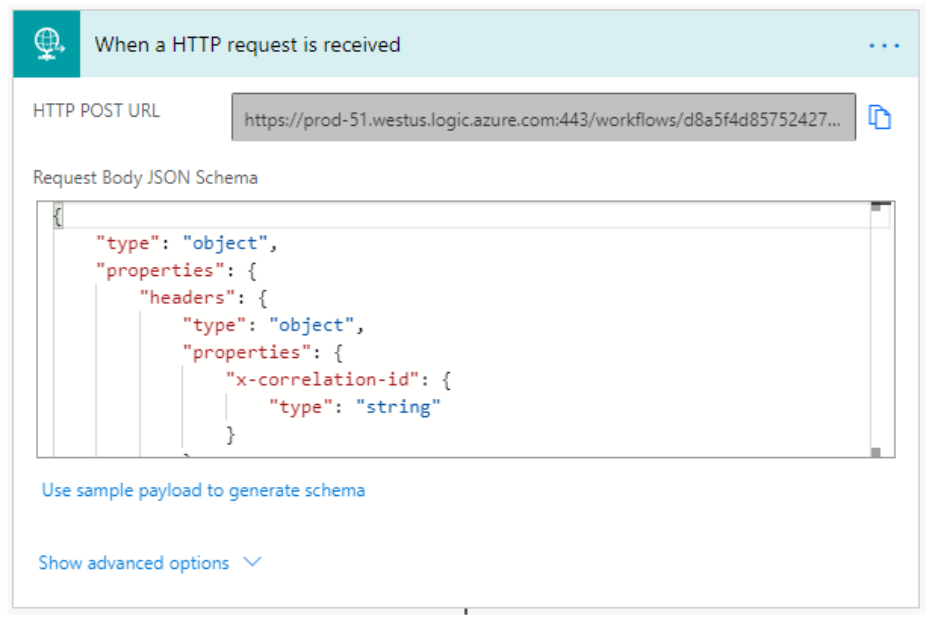

The JSON Schema to use in your HTTP trigger is defined below.

```json
{
    "type": "object",
    "properties": {
        "text": {
            "title": "ProviderActionExecutionEventId",
            "type": "string",
            "x-ms-dynamically-added": true,
            "description": "Please enter your input",
            "x-ms-content-hint": "TEXT"
        },
        "text_1": {
            "title": "EntityRecordId",
            "type": "string",
            "x-ms-dynamically-added": true,
            "description": "Please enter your input",
            "x-ms-content-hint": "TEXT"
        }
    },
    "required": [
        "text",
        "text_1"
    ]
}
```
2.  Initialize the message processing. There are two steps involved in this task.

    1.  Initialize the execution result that will be used to track the processing of the message.

    2.  Acknowledge the provider message in Intelligent Order Management so you can track, retry, and display the processing state. This is a Power Automate action that Intelligent Order Management introduces. This action is called **Acknowledge Provider message request in IOM**. This action has the following required parameters.

        1. **PowerAutomateWorkflowId**: WorkflowId on the message handler definition. You can retrieve this by having a compose function with workflow()\['tags'\].

        2. **PowerAutomateRunId**: The unique identifier for the Power Automate run that received the message and allows the pipeline to retry the processing and link the execution logs. You can retrieve this by having a compose function with workflow()\['run'\]?\['name'\].

        3. **ProviderMessageExternalRequestId**: An identifier for the message sent. If no identifier is present, a GUID can be generated. This identifier is used by the pipeline to help prevent the sender from sending duplicate messages. The identifier is dependent on the source payload. For example: concat(triggerOutputs()?\['body'\]?\['type'\]?\['name'\], '\_', triggerOutputs()?\['body'\]?\['id'\]).

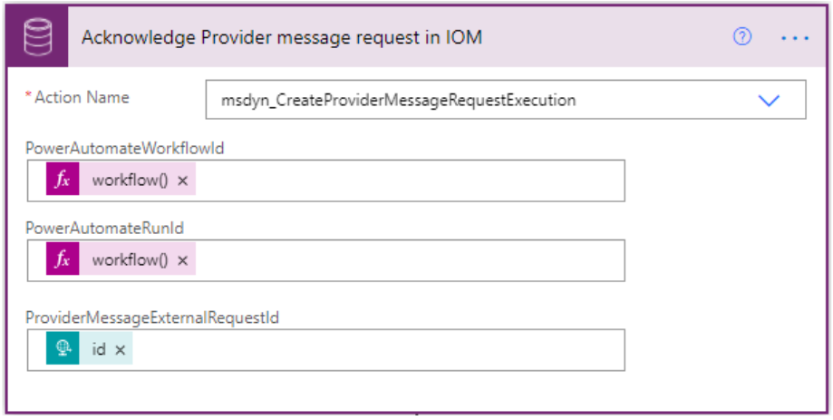

3.  The provider transformation you defined earlier will retrieve the input data and transform it. Intelligent Order Management provides an out-of-box child-flow called **IOM Provider Transformer** that will execute the transformation. Add the following details to process the event or message:

    1. **Provider name**: The name of the provider linked to the message handler. This value must be the same name as your provider transformation.

    2. **Source object name**: The source lookup key value for the transformation to perform. This value needs to be the same as the source object name defined in your provider transformation.

    3. **Destination object name:** The destination lookup key value for the transformation to perform. This value needs to be the same value defined in the provider transformation.

    4. **Payload**: Provided when transforming a JSON payload. Power Automate requires the parameters to be passed as a serialized string. Supply a **Payload** or a **Record ID** value, not both.

    5. **Record ID**: Provided when transforming a Dataverse record. Supply a **Payload** or a **Record ID** value, not both.  
        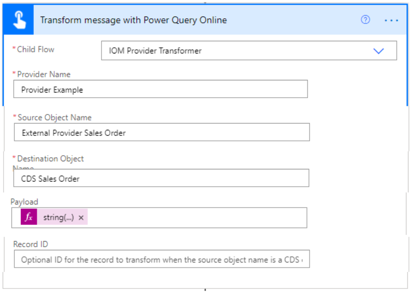

4.  You can insert data into Dataverse by using HTTP requests or the Dataverse connector **Insert** action. If you're doing more than one insert and want to improve performance, wrap the inserts into a change set so that the requests are in a transaction batch.  
    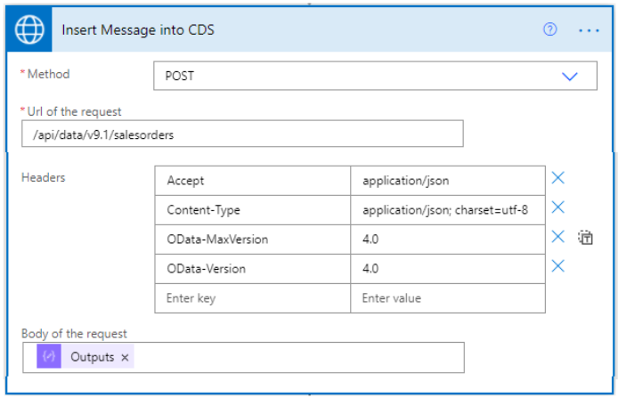

5.  If you want your flow to raise a business event, you can use the **Raise Business Event** child flow. Add the following details.

    1. **BusinessEventName**: Name of the event that you want raised.

    2. **EntityRecordId**: The ID of the record just created and associated to the event.

6.  Update the message processing state by using the **Update Provider Message Request Status** action to save the processing execution result. Add the following details.

    1. **ProviderMessageRequestExecutionId**: The output ID of the record created to track the progress of the message processing.

    2. **IsProviderMessageRequestExecutionSuccess:** Boolean value to indicate whether the processing was successful.

###  Provider message puller

Provider message pullers are Power Automate flows that pull messages at a regularly defined interval from an external service.

> [!NOTE]
> A message handler is a prerequisite for a message puller flow.

The following is an example structure for creating a message puller type of Power Automate flow.

1.  Use a recurrence workflow to schedule a trigger.

2.  Get a checkpoint from Dataverse. Checkpoints track which messages have successfully been pulled from the external provider. Add the following details.

    1. **Action name**: Name for the checkpoint.

    2. **WorkflowId**: Set the following compose function to retrieve this information: workflow()\['tags'\]\['xrmWorkflowId'\].  
        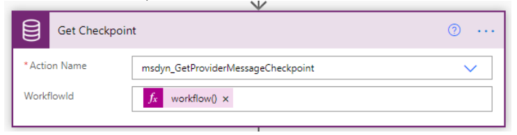

3.  Create an HTTP post request to an external provider to pull the messages. Add the following details.

    1. **Method**: Set this field to **POST.**

    2. **URL**: The external provider endpoint.

    3. **Body**: The JSON request should have the following formula: if(empty(outputs('Get\_Checkpoint')?\['body/Checkpoint'\]), 0, int(outputs('Get\_Checkpoint')?\['body/Checkpoint'\])).  
        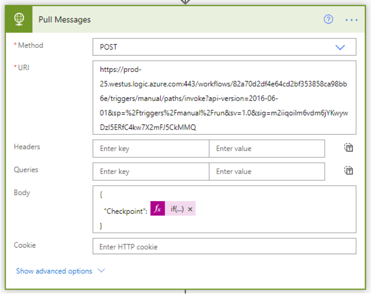

4.  Parse the messages pulled in step 3. Add the following details.

    1. **Content**: The body retrieved from step 3.

    2. **Schema**: The structure of the body retrieved in step 3.  
        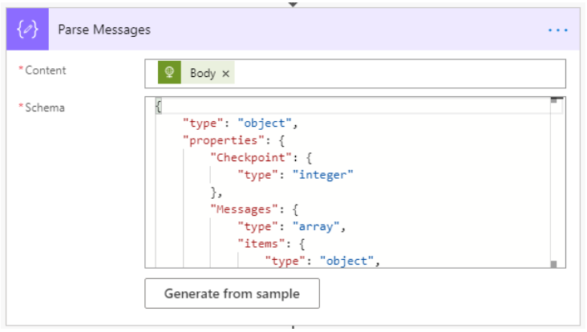

5.  Process messages to loop through each message from step 4.

6.  Parse each message from the previous steps. Add the following information.

    1. **Content**: Current item from **Process Messages**.

    2. **Schema**: A single message in JSON format.  
        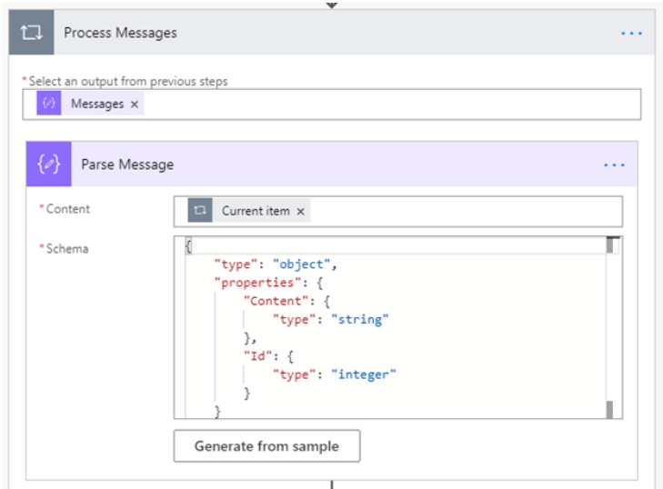

7.  Call the associated provider message handler that you set up in the prerequisites. Add the following information.

    1. **Child flow**: Select your provider message handler.

    2. **Message**: The message parsed from step 6.  
        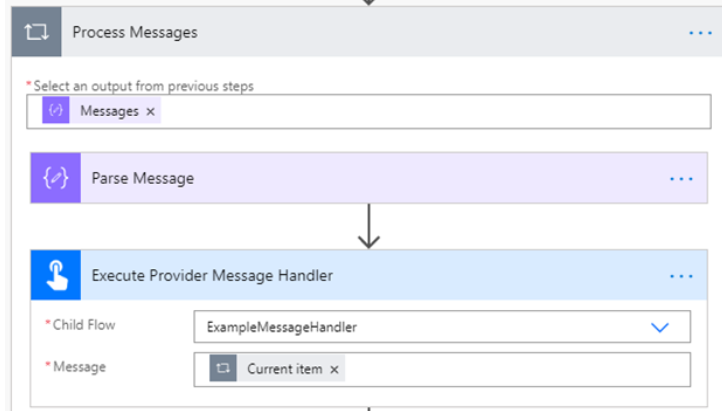

8.  Save the checkpoint to Dataverse. Add the following information.

    1. **Checkpoint**: This can be any string value (max 100). In this example, this is the ID of the last processed message.

    2. **WorkFlowId**: You can retrieve this ID by adding a compose function set to workflow()\['tags'\]\['xrmWorkflowId'\].  
        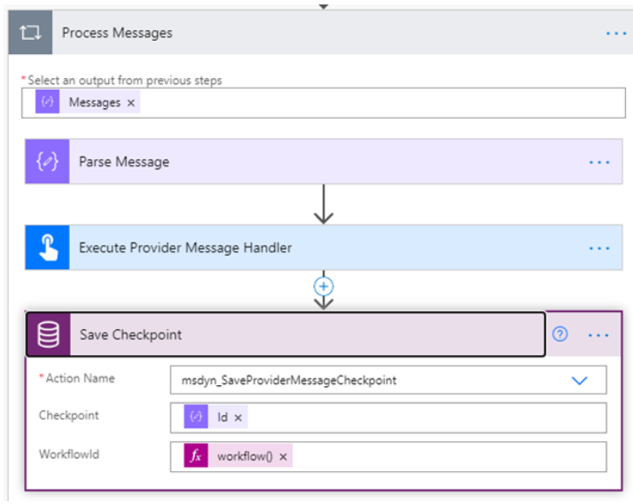

### Provider action  
Provider action flows are invoked from the orchestration designer. These flows typically make calls from Intelligent Order Management to external services.

The key difference between a provider message handler and a provider action is that while a message handler can notify the orchestration designer, it can't be triggered by an action tile in the orchestration designer, whereas a provider action can.

The following is an example structure for a provider action Power Automate flow.

1.  Start with an HTTP trigger. The following information will be passed at runtime by the orchestration service. The following JSON schema will be used for the body:
```json
{
    "type": "object",
    "properties": {
        "text": {
            "title": "ProviderActionExecutionEventId",
            "type": "string",
            "x-ms-dynamically-added": true,
            "description": "Please enter your input",
            "x-ms-content-hint": "TEXT"
        },
        "text_1": {
            "title": "EntityRecordId",
            "type": "string",
            "x-ms-dynamically-added": true,
            "description": "Please enter your input",
            "x-ms-content-hint": "TEXT"
        }
    },
    "required": [
        "text",
        "text_1"
    ]
}
```

2.  Initialize the action processing.

    1.  Initialize the execution result and any other processing variables.

    2.  Acknowledge the start of the action execution by using the **Start Provider Action Execution** Dataverse action. This will allow the pipeline to track, retry, and display the processing state within Intelligent Order Management. Add the following information.

        1. **ProviderActionExecutionEventId:** This value was passed into the action as an input parameter in step 1.

        2. **PowerAutomateRunID**: The unique run of the Power Automate action. This allows the pipeline to link the execution logs. Get this information by setting the field to a Power Automate expression worflow()\['run'\]?\['name'\].

3.  Perform the action.

    1.  If necessary, transform the records using the **Transform Message with Power Query Online** child flow.

        1. **Provider name**: The name of the provider to be linked to the action. The name must be the same name as your provider definition.

        2. **Source object name**: The source name of the transformation to perform. This name must be the same source object defined in your Power Automate transformation.

        3. **Destination object name**: The destination lookup key value for the transformation to perform. This name must be the same value defined in the provider transformation.

        4. **Payload**: Provided when transforming an inbound JSON payload. Power Automate requires the parameters to be passed as a serialized string. Add a **Payload** or a **Record ID** value, but not both.

        5. **Record ID**: Provided when transforming an outbound Dataverse record. Add a **Payload** or a **Record ID** value, but not both.  
            

    2.  Execute any custom actions you've defined. These are actions that are present on the Power Automate connector you're using.

    3.  Raise an action-specific business event. Use the **Raise Business Event** child flow. Add the following information.

        1. **BusinessEventName**: The name of the event you want to raise.

        2. **EntityRecordId**: The ID of the record associated to the event.

4.  Complete the action execution and save the results. The results will be processed by the orchestration designer. Add the following information.

    1. **ExecutionResult**: Boolean value to indicate whether the processing was successful.

    2. **ExecutionDetails**: Optional log details for testing and debugging purposes.

    3. **ProviderActionExecutionEventId**: This value was passed into the action as an input parameter that was defined in step 1.  
        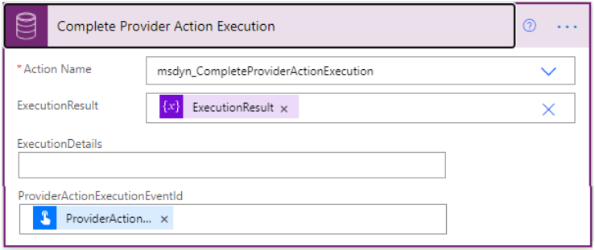

### Child flow  
A child flow is a sub-flow that is referenced in other Power Automate flows. It's helpful to define a child flow if there are some steps that you repeat across multiple areas. There isn't a specific template or recommended process for child flows, as they're primarily meant to be used for the convenience of consolidating similar steps.  
  
Provider child flows can't call other provider child flows.

## Create cloud flows

When you understand the types of flows that you want to create, you are ready to create cloud flows. To do this, follow these steps:

1.  Open the default solution in your Power Apps environment. 
> [!IMPORTANT]
> Don't add these solutions to your provider solution.

2.  Select **New**, then select **Cloud Flow**.

3.  Build your Power Automate flow. Use the templates in the previous section for reference.

4.  Refer to the following section to save your flows.

### Save Power Automate definition

After you create your flows, you need to save them as **Provider Definition Logic Definition** components. This component type provides Intelligent Order Management with the actions to deploy during provider activation.

You must have the following prerequisites before you can save your flows.

-   To save your Power Automate logic definitions, you will need to issue OData requests. To do so, you need an account with PostMan or a similar service.

-   You will need to generate an access token to your Dataverse environment to issue GET and POST requests. To do so, you need to complete the following.

    -   Set up an Azure account with an active subscription. If you don't have an active account, you need to set up an account on the [Azure website](https://azure.microsoft.com/free/?WT.mc_id=A261C142F).

    -   PowerShell must be installed. For more information, see [Installing PowerShell](/powershell/scripting/install/installing-powershell?view=powershell-7.1).

    -   Enter the following command in PowerShell to get an access token: az login --allow-no-subscriptions account get-access-token --resource=https://YourDataverseTenantURL.api.crm.dynamics.com/ --query=accessToken --output=tsv \| Set-Clipboard.

To save your Power Automate definition, do the following.

1.  Find the workflow ID of the Power Automate flow you want to save. Do one of the following.

    1.  Find the workflow ID by using a Power Automate action.

        1.  Create a compose action with the workflow() expression at the end of your Power Automate flow.  
            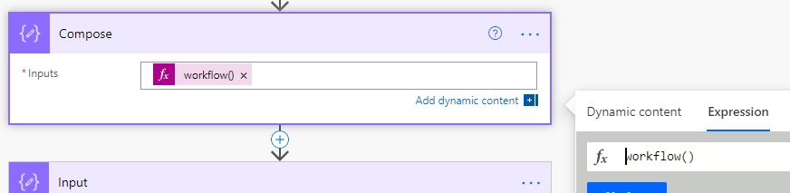

        2.  Run Power Automate.

        3.  The **xrmWorkflowId** property from the execution results will contain the workflow ID.  
            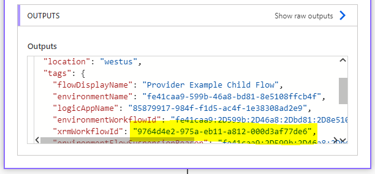

        4.  Delete this action from the flow so that it does not run again.

    2.  Optionally, you can issue a Get OData request.

        1.  Go to the flow that you want to save the workflow ID for. Find the unique identifier in the URL. This is the ID that appears after ../flows/ in the URL.  
            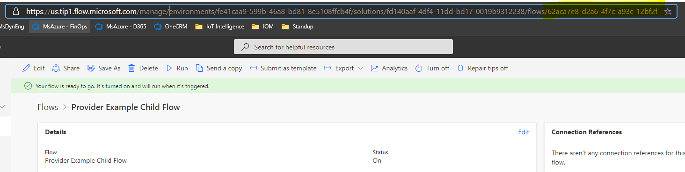

        2.  Issue an OData request to retrieve the workflow metadata. The following is an example GET request.  
            GET {Env url}/api/data/v9.1/workflows?$filter=workflowidunique eq '{Unique Workflow Id from the Power Automate U}'&$select=workflowid,workflowidunique

        3.  Save the returned **workflowid** property.

2.  Find the provider definition ID.

    1.  Select the provider definition that you want to save the flow to.

    2.  Copy the provider definition ID from the URL. This is the part of the URL ../id={example number}/.  
        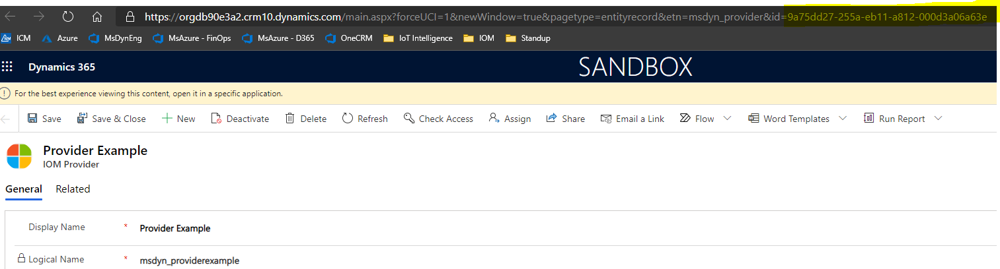

3.  Make a note of the option set value for the type of Power Automate that you are saving.

    1. **Child flow**: 192350002

    2. **Provider action**: 192350001

    3. **Provider message handler**: 192350000

    4. **Provider message puller**: 192350003

4.  Issue a POST request to save your Power Automate definition. The following is an example request. 
 
```HTTP
    POST: {Env url}/api/data/v9.1/msdyn\_SaveProviderDefinitionLogicDefinition  
    Body:  
    {

"ProviderDefinitionId": "{ProviderId previously found}",

"WorkflowId": "{Power Automate WorkflowId previously found}",

"LogicalName": "{Export prefix \_ Power Automate Export Name}",

"LogicType": {Logic Type},

"MaxRetryAttempts": {Max number of attempts},

"TimeoutMinutes": {Timeout number ex: 5}

}
```

5.  Validate that your Provider Definition Logic Definition component was added. To do this, follow these steps:

    1.  Go to your provider solution.

    2.  Verify that the Provider Definition Logic Definition you created was added. If it wasn't added, select **Add Existing**, and then add the component you created.

### Save connection references 

If your provider uses customer Power Automate connectors, you must complete the following steps to save connection references to your Power Automate solution.

1.  Issue a GET request to retrieve your connection reference ID. For example:  

```HTTP
GET {Env url}/api/data/v9.2/connectionreferences

```

If you want to filter it further, you can filter by connection reference name. For example:  
    
```HTTP
    {Env url}/api/data/v9.2/connectionreferences?$[connectionreferences?$filter=connectionreferencedisplayname](https://orgdb90e3a2.api.crm10.dynamics.com/api/data/v9.2/connectionreferences?$filter=connectionreferencedisplayname) eq 'Provider Example'&$select=connectionreferencelogicalname,connectionreferencedisplayname,connectionreferenceid,connectorid

```

2.  Validate that the correct connection reference ID was retrieved by searching your Power Automate Client Data.

    1.  Go to the Provider Definition Logic Definition component that you saved earlier.

    2.  Check the Client Data to verify that the **connectionReferenceLogicalName** appears.

3.  Find your Provider Definition ID. This is the same value that you used in Step 2 to save your Power Automate logic definitions.

4.  Issue a post request to save your connection reference. For example: 
 
```HTTP
POST {Env url}/api/data/v9.1/msdyn\_SaveProviderDefinitionConnectionReference  
    Body:  
    {

"ProviderDefinitionId": "{ProviderId previously found}",

"ConnectionReferenceId": "{Connection reference id previously found}"

}
```

5.  Validate that your Provider Definition Logic Definition component was added.

    1.  Go to your provider solution.

    2.  Verify that the Provider Definition Logic Definition reference component you created was added. If it wasn't added, select **Add Existing** and add the component you just created.

## Share your providers

If you want to use your provider definition on another environment or share your solution, you can export your provider solution. For more information, see [Export solutions](/powerapps/maker/data-platform/export-solutions).
