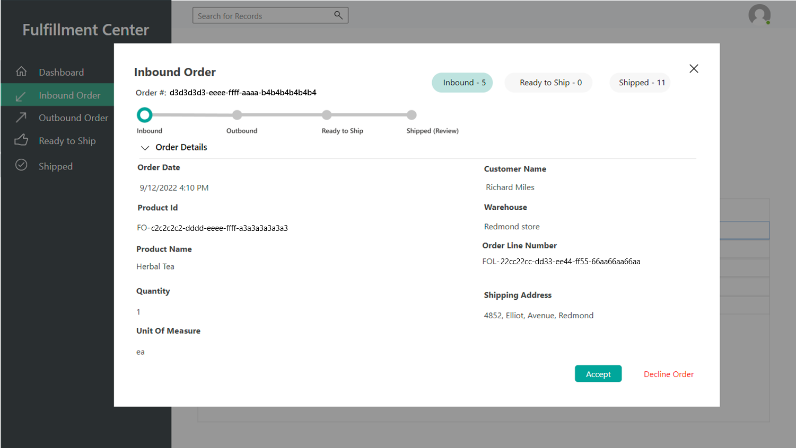

# Demo providers for Dynamics 365 Intelligent Order Management

[!include [banner](includes/banner.md)]

This article describes how to set up and use demo providers in Microsoft Dynamics 365 Intelligent Order Management.

Demo providers are designed to help you see how orders flow between Intelligent Order Management and its third party connections. After setting up demo providers, you'll be able to generate a test order and monitor its status in Intelligent Order Management as it moves through each step of an orchestration flow from order validation through to fulfillment. 

The simulated demo providers include the following:

- Demo instance of Microsoft Dynamics 365 Commerce (to generate an order)
- Demo fulfillment application (to process and fulfill an order)
- Demo inventory (to update inventory system after fulfillment)

## Set up demo providers

Before you can start using demo providers, you must set them up in four stages:

1. Activate connections.
1. Publish policies.
1. Add providers.
1. Activate demo order flow.

### Activate connections

To activate connections, follow these steps.

1. From the Intelligent Order Management home page, select **Settings**, then select **Initial Connections**.  
1.	Open each connection, wait for it to establish (confirmed by a green check mark), then select **Save and close**. 
1. After all the connections are established, on the top menu, select **Activate System**.

<!--

Home \> Configure \> Manage

-->

####	Change the fulfillment process policy

To change the fulfillment process policy, follow these steps.

1.	Go to **Settings \> General app settings \> Order handling preferences**. 
1.	In the **Fulfillment Process policy** section, select **Fulfillment Order Creation** (to change the policy from **Inventory Check and Fulfillment Order Creation**).

### Publish policies

To publish policies, follow these steps.
     
1. In the left navigation pane under **Orchestration**, select **Policies**.
1. Select and publish each policy in the list.

### Add providers

To add providers, follow these steps. 

1. In the left navigation pane under **Providers**, select **Library**.
1. Select and activate the **Internal Application Service**, **Demo Order Fulfillment**, **Demo Order Intake**, and **Demo Order Inventory** providers.
1. Select **Activate Providers**.
1. Complete the installation wizard for each provider as follows:
    1. Ensure that the connection is established (confirmed by a green check mark).
    1. Keep the default settings.
    1. For the **Internal Application Service** provider, select **No** when asked to **Create New Split Order Lines**. 
    1. Select **Activate**.

After you activate the providers, it takes approximately six minutes for changes to take effect. You can verify that all the providers are active by going to **Provider \> Installed** and viewing the status for each provider.

### Publish a demo orchestration flow

To publish a demo orchestration flow, follow these steps. 

1. Go to **Orchestrations \> Flows**.  
1. Select **Demo Order Journey** to open it.
1. Select **Save and Publish**.

> [!NOTE]
> If you experience issues while publishing the orchestration flow, reselect the provider action and policy, and then try again.

If the policy is not published, confirm that the execution policies for **Demo Order Validate Header**, **Demo Order Validate Lines**, and **Simple Fulfillment Determination** are set correctly. 

## Use the demo providers
     
Once the orchestration flow is published, the demo providers are ready to use. To get started, in the left navigation pane, select the area switcher on the bottom left, and then select **Demo Providers**.

### Step 1.1 Launch the e-commerce demo app
     
Launch the e-commerce demo app to play the part of a consumer as you place an order at a simulated e-commerce store. The order will then flow into Intelligent Order Management, where you can view its status and details in the sales and fulfillment order tables.

To launch the e-commerce demo app, follow these steps.

1. In the left navigation pane, select the area switcher on the bottom left, and then select **Demo Providers**.
1. On the **Demo Providers** page, under **Ecommerce Store - Demo**, select **Launch Demo**. The e-commerce demo site appears.
1. Select a product from the home screen or from a category page.
1. Enter or select a quantity.
1. Select **Add To Cart**.
1. On the cart page, select **Place Order**.
1. A prefilled checkout form with demo customer info appears. Optionally, you can change the customer information before creating the order.
1. Select **Create Order**.
1. Once the order is created successfully, you are redirected to a confirmation screen.

#### Verify the order in the Intelligent Order Management

Once the order is placed, it can be verified inside the Intelligent Order Management sales table. 

To verify the order, follow these steps.

1. In the left navigation pane, select the area switcher on the bottom left, and then select **Sales orders**.
1. The order you created appears at the top of the list. Select the order to open it and review the order details.

When Intelligent Order Management receives an order, it runs an orchestration flow, eventually sending the order to the appropriate warehouse. 

<!-- #### Step 1.2. Select A product from home screen or their respective category page.-->
     

<!-- #### Step 1.3. Select quantity and add it to your cart, then Place Order.-->
     

<!-- #### Step 1.4. You will see a prefilled checkout form with demo customer info. If you want, you can change the info and create an order.-->

<!-- #### Step 1.5. Once the order is created successfully, it will redirect to you to a confirmation screen.-->

### 2.1 Demo fulfillment application

Next, use the demo fulfillment provider to fulfill the order. Use the area switcher to navigate back to **Demo Providers**, and then select **Demo Fulfillment Provider**.

1. In the left navigation pane, select the area switcher on the bottom left, and then select **Demo Providers**.
1. On the **Demo Providers** page, under **Fulfillment Center - Demo**, select **Launch Demo**.
1. Select the order in question, then use the wizard to move it through fulfillment steps all the way to shipment. Once this is complete, you should be able to see the updated status reflected in the Intelligent Order Management sales order table.

Inbound Accept

Outbound Accept

Ready & ship

Order Complete

Return to the Intelligent Order Management Sales orders table and check the updated status of your order. 

### 3.1 Demo inventory application
     
Here is where you can see the information regarding different inventories and their respective products and warehouses. Once the order is shipped to the fulfillment center, the quantity of the product is decreased according to the sales order. 

Inventory System

Products
 
<!---->

Warehouses

