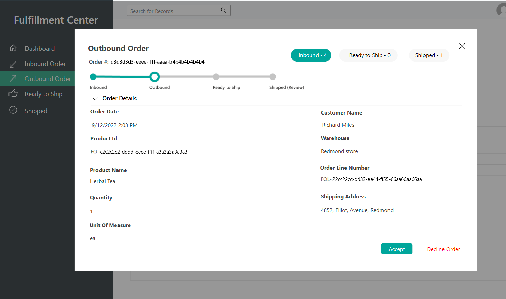

# Set up and open demo providers

[!include [banner](includes/banner.md)]

This article describes how to set up and start demo providers in Microsoft Dynamics 365 Intelligent Order Management.

Demo providers are designed to help you view how orders flow between Intelligent Order Management and third-party connections. After you set up demo providers, you can generate a test order and monitor its status in Intelligent Order Management as it moves through each step of an orchestration flow, from order validation through fulfillment.

> [!NOTE]
> Demo providers are only available in trial environments.

The following demo provider applications are available:

- **Demo e-commerce application** – This application is used to generate an order.
- **Demo fulfillment application** – This application is used to process and fulfill an order.
- **Demo inventory application** – This application is used to update the inventory system after fulfillment.

## Set up demo providers

Before you can start to use demo providers, you must set them up. The setup process has four stages:

1. Activate connections.
1. Publish policies.
1. Add providers.
1. Activate and publish the demo orchestration flow.

### Activate connections

To activate connections, follow these steps.

1. On the Intelligent Order Management home page, select **Settings**, and then select **Initial Connections**.
1. Open each connection, wait for it to be established, and then select **Save and close**. (A green check mark indicates that a connection has been established.)
1. After all the connections have been established, on the top menu, select **Activate System**.

#### Change the fulfillment process policy

To change the fulfillment process policy, follow these steps.

1. Go to **Settings \> General app settings \> Order handling preferences**.
1. In the **Fulfillment Process policy** section, select **Fulfillment Order Creation** to change the policy from **Inventory Check and Fulfillment Order Creation**.

### Publish policies

To publish policies, follow these steps.

1. In the left navigation pane, under **Orchestration**, select **Policies**.
1. Select and publish each policy in the list.

### Add providers

To add providers, follow these steps.

1. In the left navigation pane, under **Providers**, select **Library**.
1. Select and activate the **Internal Application Service**, **Demo Order Fulfillment**, **Demo Order Intake**, and **Demo Order Inventory** providers.
1. Select **Activate Providers**. The **Provider Activation** wizard appears.
1. On the **Terms and conditions** page, read the terms and conditions. If you agree with them, select **Accept**.
1. Complete the **Provider Activation** installation wizard for each provider in the following way:

    1. Ensure that the connection is established. (A green check mark indicates that a connection has been established.)
    1. Keep the default settings for each provider. For the **Internal Application Service** provider, select **No** when you're asked whether you want to create new split order lines. 
    1. Select **Next**.

1. When you reach the end of the wizard, select **Activate**.

After you activate the providers, changes take approximately six minutes to go into effect. You can verify that all the providers are active by going to **Provider \> Installed** and viewing the status for each provider.

### Publish a demo orchestration flow

To publish a demo orchestration flow, follow these steps.

1. Go to **Orchestrations \> Flows**.
1. Select **Demo Order Journey** to open it.
1. Select **Save and Publish**.

> [!NOTE]
> If you experience issues while you're publishing the orchestration flow, reselect the provider action and policy, and then try again.

If the policy isn't published, confirm that the execution policies for **Demo Order Validate Header**, **Demo Order Validate Lines**, and **Simple Fulfillment Determination** are set correctly.

## Start the demo providers

After the orchestration flow is published, the demo providers are ready to use.

### Open the e-commerce demo app

First, open the e-commerce demo app, and play the part of a consumer as you place an order in a simulated e-commerce store. The order will then flow into Intelligent Order Management, where you can view its status and details in the sales and fulfillment order tables.

To open the e-commerce demo app, follow these steps.

1. In the left navigation pane, select the area switcher at the bottom left, and then select **Demo Providers**.
1. On the **Demo Providers** page, under **Ecommerce Store - Demo**, select **Launch Demo**. The e-commerce demo site appears.
1. On the home page or a category page, select a product.
1. Enter or select a quantity.
1. Select **Add To Cart**.
1. On the cart page, select **Place Order**.
1. A checkout page appears that is prefilled with demo customer information. You can optionally change the customer information before you create the order.
1. Select **Create Order**. After the order is successfully created, you're redirected to a confirmation page.

#### Verify the order in Intelligent Order Management

After the order is placed, it can be verified in the Intelligent Order Management sales table.

To verify the order, follow these steps.

1. In the left navigation pane, select the area switcher at the bottom left, and then select **Sales orders**.
1. The order that you created appears at the top of the list. Select the order to open it and review the order details.

When Intelligent Order Management receives an order, it runs an orchestration flow and eventually sends the order to the appropriate warehouse.

### Open the demo fulfillment app

Next, open the demo fulfillment provider app to fulfill the order.

To open the demo fulfillment provider app, follow these steps.

1. In the left navigation pane, select the area switcher at the bottom left, and then select **Demo Providers**.
1. On the **Demo Providers** page, under **Fulfillment Center - Demo**, select **Launch Demo**.
1. Select the order that you placed, and then use the wizard to move through the fulfillment steps, all the way to shipment. After you've completed the wizard, the updated status should be reflected in the Intelligent Order Management sales order table.

#### Inbound Order

In the demo fulfillment application, select **Inbound Order** to view details about the inbound order on the **Inbound Order** page. The following illustration shows an example.

Select **Accept** to move to the next page of the wizard.

#### Outbound Order

On the **Outbound Order** page, you can view details about the outbound order. The following illustration shows an example.

Select **Accept** to move to the next page of the wizard.

#### Ready to Ship

On the **Ready to Ship** page, you can view details about the ship status of the order. The following illustration shows an example.

Select **Ship Order** to move to the next page of the wizard.

#### Order Complete

On the **Shipped** page, you can view details about the shipped order. The following illustration shows an example.

Select **Finish** to close the wizard. Then return to Intelligent Order Management, and review the updated status of your order in the sales orders table.

### Open the demo inventory app

The demo inventory app is where you can view the information about different inventories and their respective products and warehouses. After the order is shipped to the fulfillment center, the quantity of the product is decreased according to the sales order.

To open the demo inventory app, follow these steps.

1. In the left navigation pane, select the area switcher at the bottom left, and then select **Demo Providers**.
1. On the **Demo Providers** page, under **Inventory System - Demo**, select **Launch Demo**.

#### Inventory Dashboard

In the demo inventory app, select **Inventory Dashboard** to view a list of products that have inventory. The following illustration shows an example.

#### Products

Select **Products** to view a list of products and product IDs. The following illustration shows an example.

#### Warehouses

Select **Warehouses** to view a list of warehouses. The following illustration shows an example.

