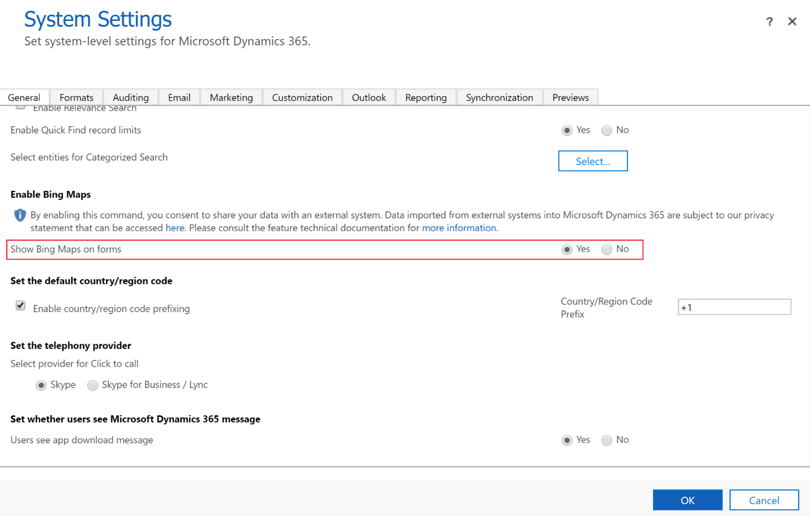

# Enable Bing Maps for your environment

[!include [banner](includes/banner.md)]

Dynamics 365 Intelligent Order Management can display information about fulfillment order source and destination locations using Bing Maps. Enabling Bing Maps for your environment is typically done when you deploy the environment. 

To enable Bing Maps for your environment, follow these steps.

1.	Go to **Settings** > **Advanced Settings**.
2.	Select **Settings** > **Administration** > **System Settings**.
3.	On the **General** tab, select **Yes** for **Show Bing Maps on forms**, and then select **OK**.

The following example image shows the **System Settings** page with the **Show Bing Maps on forms** option highlighted.

## Privacy notice
If you enable the Bing Maps feature, address information is automatically sent over the internet to the Bing Maps service to display an online map of the address within this application. If you click on Bing Maps within this application, you will be redirected to [www.bing.com/maps](https://www.bing.com/maps). Your use of Bing Maps is also governed by the [Bing Maps End User Terms of Use](https://go.microsoft.com/?linkid=9710837). Your administrator can turn the Bing Maps feature on or off from the Microsoft Dataverse system settings as described above.  Turning the Bing Maps app off makes the feature unavailable in this application. Information sent to Bing Maps is subject to [Microsoft Privacy and Cookies](https://go.microsoft.com/fwlink/p/?linkid=521839).
