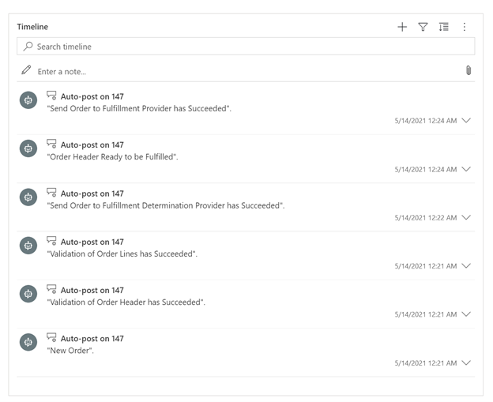

# Enable timeline capabilities

[!include [banner](includes/banner.md)]

This topic describes how to enable timeline capabilities on the **Sales order** and **Fulfillment order** pages in Microsoft Dynamics 365 Intelligent Order Management. 

When the timeline is enabled on the **Sales order** or **Fulfillment order** page, it will list all business events that have been raised by the orchestration flow, in chronological order. Therefore, it can provide valuable insights into how a sales order or fulfillment order and its lines have been processed. It can also help explain the current status of the sales order or fulfillment order.

## Enable timeline

To enable the timeline, follow these steps.

1.	Go to **Settings** > **Advanced Settings**. 
2.	Expand **Settings**. 
3.	Select **Activity Feeds Configuration**.
4.	On the ribbon, select **Refresh**. 
5.	Select **Entity Name Sales Order**. 
6.	On the ribbon, select **Activate**, and then confirm the activation.
7.	When the message "You will need to publish the related entity for form wall changes to take effect" appears, select **OK**.

> [!NOTE]
> You must clear the cache on your browser before the timeline can be populated with data.

When enabled, the timeline should start to list business events as they are raised by the orchestration flow, as shown in the following example image. 

## Additional resources

[Configure timeline](/dynamics365/customer-service/customer-service-hub-user-guide-timeline-admin)
