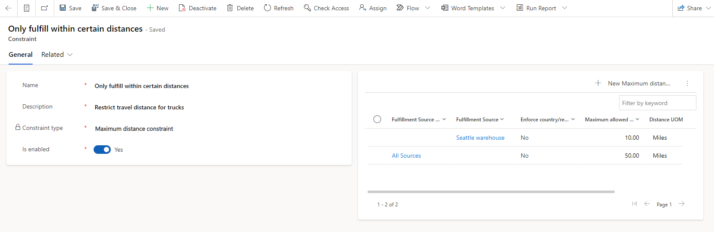

# Fulfillment and Returns Optimization provider overview

[!include [banner](includes/banner.md)]
[!include [banner](includes/preview-banner.md)]

This article provides an overview of the Fulfillment and Returns Optimization provider in Microsoft Dynamics 365 Intelligent Order Management.

The Fulfillment and Returns Optimization provider is an intelligent optimization service that determines the source of order fulfillment while also achieving required goals and respecting the desired configuration that is determined by the business. The Fulfillment and Returns Optimization provider helps you ensure that products are delivered to your customers in the right quantities, from the right sources, and at the right time. In this way, it can help you maximize profits, minimize costs, and satisfy service-level requirements.

In a modern supply network, where product fulfillment can come from multiple channels, organizations must quickly adapt to order changes, supplier availability issues, or spikes in demand. The Fulfillment and Returns Optimization provider helps you maximize order fulfillment and find the right source for the delivery of products, based on different business constraints and business objectives such as minimizing costs by fulfilling orders from the closest sources.

The Fulfillment and Returns Optimization provider is built as a microservice. It reads configuration data such as fulfillment sources, source lists, business constraints, and strategies from Dataverse to optimize order fulfillment. The provider uses Azure Maps to provide geocode shipping address information about orders and fulfillment sources, and the distance between those locations.

## Fulfillment and Returns Optimization provider settings

To enable the Fulfillment and Returns Optimization provider as part of the order orchestration journey, set it up and activate it by following the instructions in [Set up Fulfillment and Returns Optimization provider](set-up-fro-provider.md). After the provider is activated, you must configure the following settings to achieve business goals.

### Sources 

Fulfillment sources are entities such as warehouses, distribution centers, retail stores, drop-ship vendors, and virtual sites that house inventory or provide products. You can create and modify fulfillment sources by selecting the area switcher at the bottom of the left navigation pane and changing the area to **Settings \> Fulfillment Settings**. Then, on the **Fulfillment settings** page, under **Sources**, select **Manage**.

For each of your fulfillment sources, you can define a unique name, set the time zone of the source, set the type of source (warehouse or other), specify where the source is located (latitude and longitude), and specify where the system should look for inventory in the Inventory Visibility service. In addition, you can add details about the average processing time of orders in a warehouse. These details will be used to determine the planned shipment date of different orders. You can also set a cutoff time for a warehouse. Then, if the **Respect warehouse timings constraint** setting is enabled, orders can be sent to a warehouse only between 12 AM and the cutoff time.

### Source lists

Fulfillment source lists let you group a set of sources and manage them in a flexible manner, within specific constraints. To define fulfillment source lists, on the **Fulfillment settings** page, under **Source lists**, select **Manage**.

Depending on your business situation, you can define multiple source lists and use them as needed.

For example, in your strategy definition, you can include all the sources where fulfillment will occur. For your business constraints, you can use a different source list. You can also define different maximum distance constraints for retail stores and warehouses, and restrict partial fulfillment for only your retail stores.

Active source lists are shown at **Source lists \> Manage**. To create a new source list, select **New**. Enter a name that helps easily identify the source list, and then add existing or new sources on the **Sources** tab. To remove a source from a source list, select the source on the **Sources** tab, and then select **Remove**.

### Constraints

Constraints are an optional component of fulfillment optimization. The following business constraints are supported:

- Maximum distance
- Restrict partial fulfillment of orders
- Limit number of warehouses per order
- Respect warehouse timings
- Maximum order lines
- Limit number of warehouses per order line

To create or modify constraints, on the **Fulfillment settings** page, under **Constraints**, select **Manage**. To create a constraint of a specific constraint type, select the appropriate constraint type when you create the constraint.

All business constraints share a set of common attributes as part of their definition. The details vary, depending on the type of business constraint. The following common attributes are applicable to all business constraints:

- **Name** – This attribute is used to identify the business constraint.
- **Description** – This attribute is used to describe the business constraint.
- **Constraint type** – This attribute indicates the type of business constraint.
- **Is enabled** – This attribute is used to enable or disable a business constraint.

You can define multiple business constraints of each type and apply them to different optimization strategies.

#### Maximum distance constraint 

The **Maximum distance** constraint enables an organization to define the maximum distance that a source or group of sources can extend to fulfill an order. Currently, distance is considered the straight-line distance between the source and the customer address, as calculated by Azure Maps.

You can define the maximum distance for a source or a source list. If the maximum distance is defined for a source list that contains an individually defined source distance, an overlapping **Maximum distance** constraint might be defined for the source. In this case, the optimization service applies the lowest defined maximum distance for those sources.

The following illustration shows an example where the Seattle warehouse can deliver only up to 10 miles from its radius, even though it's part of the **All Sources** list, where the maximum distance is 50 miles. Because of the way that this constraint works, the shortest distance is used if there is a conflict.

If no warehouse is suitable for sales orders because of a constraint, the system won't be able to create any fulfillment order for a sales order. Instead, the status of the sales order is changed to **Inventory not found**.

#### Restrict partial fulfillment of orders constraint

Sometimes, the Fulfillment and Returns Optimization provider must handle scenarios where demand exceeds supply. By default, when Intelligent Order Management receives orders that require more quantity than the available inventory, sales orders are split by order line. Some lines of the order are fulfilled, whereas others are either backordered or set to the **Inventory not found** order status. An individual order line can't be split further and partially assigned, but it can be assigned to different sources. When the **Restrict partial fulfillment of orders** constraint is enabled, the Fulfillment and Returns Optimization provider ensures that either the whole order is fulfilled or the order isn't fulfilled at all.

#### Respect warehouse timings constraint

Businesses sometimes have delivery trucks that leave every day at a specific time. To optimize for this scenario, you can configure a different cutoff time for each source. To ensure that this constraint works as expected, before you run it, add cutoff times to the warehouses that must respect them.

When the **Respect warehouse timings** constraint is enabled, the Fulfillment and Returns Optimization provider ensures that sources create fulfillment orders only if they can be sent to the warehouse before the cutoff time. If they can't, the Fulfillment and Returns Optimization provider tries to assign the sales orders to warehouses that are still open to processing orders. In this way, the Fulfillment and Returns Optimization provider optimizes for faster fulfillment and delivery.

#### Limit number of warehouses per order constraint

Sometimes, not all inventory is available at a single source. To fulfill orders in these cases, the Fulfillment and Returns Optimization provider splits a single sales order and assigns different warehouses to different parts of it. By using the **Limit number of warehouses** constraint, you can control the degree to which orders are split.

You can configure this constraint to specify the maximum number of warehouses that you want a single order to be split among. In other words, if you specify three warehouses for this constraint, every sales order must be fulfilled from one, two, or three different warehouses. If you prefer the whole sales order to be fulfilled from only one fulfillment source you must specify one as maximum number of warehouses. If fulfillment of a sales order requires more than three warehouses, the sales order won't be fulfilled at all unless the **Restrict partial fulfillment of orders** constraint is disabled and the **Limit number of warehouses** constraint is enabled.

By default, the Fulfillment and Returns Optimization provider will split the sales order among as many warehouses as are required, while also respecting inventory conditions and other constraints.

To specify the number of warehouses to split sales orders among, select **New Limit Number of Warehouses Constraint** to add an entry, and then select **Save**.

#### Limit number of warehouses per order line constraint

You can configure this constraint to specify the maxiumum number of warehouses that you want a single order line to be split among. In other words, if you do not want to source a single order line using multiple sources, you can specify one on the number of warehouses.

#### Maximum number of order lines constraint

Sometimes, fulfillment sources cannot process more than a certain number of order lines on a given day due to capacity or resource limitations. **Maximum number of order lines constraint** can be used to limit the number of order lines routed to a single fulfillment source. You can configure this constraint to specify the maximum order lines per day per fulfillment source or source list. Once this number has reached for the fulfillment source or source list, they will not be considered for selection during that day.

### Introducing soft constraints

Constraints can now be defined as hard or soft within the **Constraints** set up. If a constraint is defined as **soft** they are checked to see if they can be respected within fulfillment source determination algorithm, and if not they will still not be excluded from the selection.
Constraints by default are hard constraints until they are disabled. To define a **Constraint** as a soft constraint, select **Is hard constraint** as **no** in **Constraints** set up.

Example: If **Limit to one warehouse** is set up as a soft constraint, it will be first checked to see if the order can be fulfilled by a single source, however if that’s not possible multiple sources will be used to fulfill the order.

### Strategies

Strategies help define the optimization configuration that achieves your business needs. A strategy brings together objectives, constraints, and sources that must be considered, and specifies how inventory optimization should occur. To create and modify a strategy, on the **Fulfillment settings** page, under **Strategies**, select **Manage**.

The predefined objective of every strategy is to fulfill orders while also minimizing distance.

Depending on the nature of your business, you can define multiple optimization strategies. You can define a list of fulfillment sources that participate in fulfillment. You can also define constraints that the optimization service must enforce. These constraints are "hard" constraints that the optimization service will mandatorily impose when it determines the optimal source. You can configure a strategy as the default strategy. Only one strategy can be the default strategy at any time.

A strategy can be configured to run in either real-time mode or batched mode. When a strategy runs in batched mode, sales orders that use the strategy will be queued until the configured period is reached. Both real-time mode and batched mode lead to the creation of a single fulfillment plan.

Within a single business, fulfillment optimization can vary, depending on the type of customer, channel, and other business attributes. Intelligent Order Management supports the use of multiple fulfillment strategies. Businesses can set up multiple fulfillment strategies with policies, or by setting the fulfillment strategy attribute on a sales order during the order intake process.

#### Set up a fulfillment strategy

To define a strategy, follow these steps.

1. On the **Fulfillment settings** page, under **Strategies**, select **Manage**.
1. Select **New**.
1. On the **Strategies** page, set the following fields:

    - **Name** – Enter the name of the strategy.
    - **Description** – Enter a description of the strategy.
    - **Source List** – Specify a list of the fulfillment sources that must be considered when the optimization is done.
    - **Is default** – Specify whether the strategy is the default strategy. There must always be a default strategy, and only one strategy per organization can be listed as the default strategy. The default strategy is used if a sales order doesn't specify which strategy must be used to do optimization.
    - **Enable batch processing** – If this option is turned off, every order is processed in real time. If it's turned on, orders are collected into a queue and then periodically processed.
    - **Batch processing in minutes** – Specify the time interval for processing each queue, in minutes. The default value is **2**.
    - **Owner** – The user who created the strategy.
    
No inventory measure must be explicitly added here. Instead, inventory that is used for the Fulfillment and Returns Optimization provider must be configured in the following way in Intelligent Order Management.

1. In the left navigation pane, under **Order settings**, change the area to **Settings \> Index and reservation**.
1. Select **Intelligent Order Management mappings**.
1. Configure the inventory source and the measure name. The measures that are used for the Fulfillment and Returns Optimization provider are **Onhand** and **ATP Onhand**.

### Fulfillment optimization in order orchestration flows

To optimize fulfillment in order orchestration flows, you must first [set up and activate the Fulfillment and Returns Optimization provider](set-up-fro-provider.md). After the provider is activated, you can enable intelligent optimization by using the Fulfillment and Returns Optimization provider as part of the order orchestration journey.

As order processing starts, the service picks up orders that require optimization and determines the optimal location from the closest fulfillment source in the list of sources. The Fulfillment and Returns Optimization provider then calculates the latitude and longitude for the fulfillment source's address and the shipping address on the order line. It also calculates the aerial distances between the two addresses. The provider then applies the constraints and determines the optimal fulfillment source. The results are written to Dataverse for further processing as part of the order orchestration flow.

An organization can query the fulfillment plan to view the results. Fulfillment plans show the order line details, the original quantity on the line, the fulfilled quantity, and the fulfillment type (fully sourced, partially sourced, not sourced, or exception).

### Multiple fulfillment strategies in order orchestration flows

The Fulfillment and Returns Optimization provider supports multiple fulfillment strategies that can be set up based on the needs of different businesses. For example, a business might want to fulfill business-to-business (B2B) orders only from its distribution centers but business-to-consumer (B2C) orders from all its fulfillment sources (such as distribution centers, warehouses, and stores). By having multiple fulfillment strategies, organizations can use different fulfillment approaches for different sales orders.

Businesses can set fulfillment strategy attributes for sales orders during the orchestration journey by adding the fulfillment strategy identifier on the sales order. The fulfillment strategy can be set on a sales order based on the source, or by using transformations as part of the order intake process. The fulfillment strategy can also be set up with policy actions by using sales order attributes and other entities. Policies enable businesses to use the attributes of different entities in the condition builder to set the strategy. If multiple strategies are set up, but the policy assignment for the fulfillment strategy isn't configured, the system uses the configured default strategy.

#### Alternate strategy

The Fulfillment and Returns Optimization also supports definition of alternate strategy. This allows for more flexibility in the rule based fulfillment. If the default strategy assigned to the order is unsuccessful in determining the fulfillment source for the order or order lines, alternate strategy is used to determine the fulfillment source. For example, businesses may want to fulfill their orders using retail store inventory as default and in the absence of which they would want to fulfill by distribution centers. By having the flexibility to define **alternate strategy** for a default strategy, organizations can multiply the options for rule based fulfillment.
On the **Strategies** page, specify **Alternate Strategy** under **General** section.

## Fulfillment plans

The result of any single fulfillment optimization (in batched mode or otherwise) is a single fulfillment plan. This entity contains details of the breakdown between warehouses and assignment of sales orders to those warehouses.

The fulfillment plan is converted into fulfillment orders by an internal Power Automate flow. Fulfillment providers can consume this entity and use it to move the orchestration process to subsequent steps, such as delivery carriers.

## Privacy notice

The Fulfillment and Returns Optimization provider uses the Azure Maps geolocation feature, which is governed by [Service Specific Terms](https://www.microsoft.com/licensing/terms/productoffering/MicrosoftAzure/MCA#ServiceSpecificTerms). The Azure Maps geolocation feature is powered in part by third parties that may operate outside of your tenant's geographic boundary.

If you enable the Fulfillment and Returns Optimization provider, Microsoft shares your customer's address, city, state, and postal code with third parties to retrieve geolocation information, but doesn't share the email address, phone number, or name of the user who entered the information.

Your privacy is important to Microsoft. For more information, see the [Microsoft Privacy Statement](https://go.microsoft.com/fwlink/?LinkId=521839).

## Additional resources

[Fulfillment and Returns Optimization architecture](ifo-arch.md)

[Set up Fulfillment and Returns Optimization provider](set-up-fro-provider.md)

[Orchestration flows](orchestration-flows.md)
