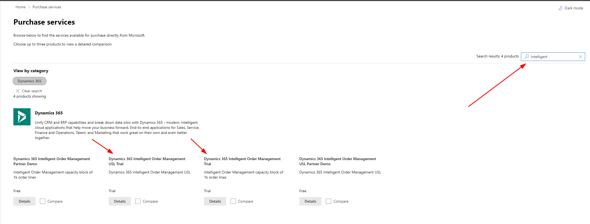
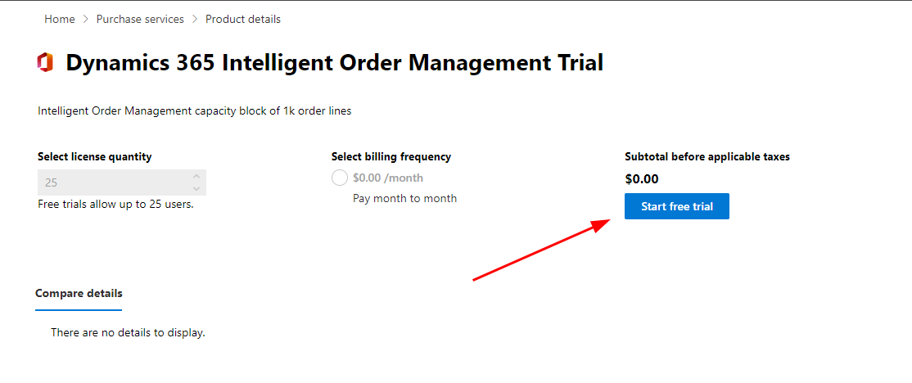
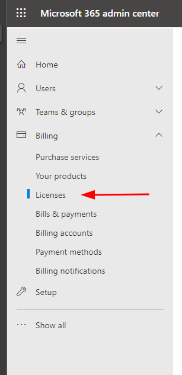
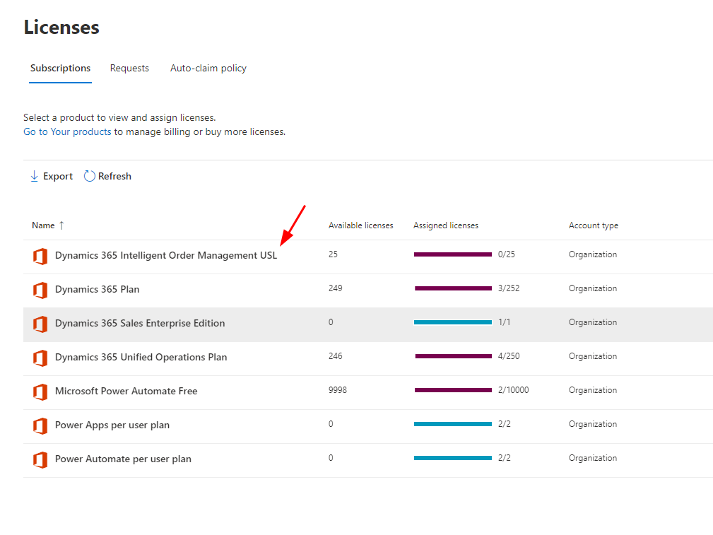

# Get trial licenses for Intelligent Order Management

[!include [banner](includes/banner.md)]

This article describes how to get trial licenses that will allow you to have full operation of Microsoft Dynamics 365 Intelligent Order Management.

To install Dynamics 365 Intelligent Order Management, you must install the appropriate trial licenses. When you're ready to convert your trial licenses to production licenses, you can work with your partner or Microsoft account executive to obtain the correct licenses.

The first trial license that you need is the tenant-level license for Dynamics 365 Intelligent Order Management. After you install this license, you can install Dynamics 365 Intelligent Order Management in any environment in your tenant. You don't have to assign the tenant-level license to users.

> [!NOTE]
> Although the tenant-level license is free, you must sign in to the Microsoft 365 admin center by using an account that can purchase services.

The second trial license that you need is the Dynamics 365 Intelligent Order Management Unlimited Site License (USL) trial license. This license is used to assign users who will deploy Power Automate flows. Dynamics 365 Intelligent Order Management uses Power Automate when providers are activated, policies are published, or orchestrations are published. Only users who perform any of these activities must have a USL license assigned to them.

## Sign up for the trial licenses

To sign up for the trial licenses, follow these steps.

1. Open the [Microsoft 365 admin center](https://admin.microsoft.com).
1. In the left navigation, select **Billing \> Purchase services**.
1. On the **Purchase services** page, in the search field, enter **intelligent**. The **Dynamics 365 Intelligent Order Management Trial** and **Dynamics 365 Intelligent Order Management (USL) Trial** licenses should be included in the search results.

    

1. For the **Dynamics 365 Intelligent Order Management Trial** license, select **Details**, and then select **Start free trial**.

    

1. Select **Try Now**, and then select **Continue**.
1. Repeat steps 2 through 5 for the **Dynamics 365 Intelligent Order Management (USL) Trial** license.

> [!NOTE]
> Licenses aren't immediately synced. In some cases, it can take one to two days before Dynamics 365 Intelligent Order Management appears as an installable product.

## Assign the Dynamics 365 Intelligent Order Management USL trial license to a user

To assign the Dynamics 365 Intelligent Order Management USL trial license to a user, follow these steps.

1. Open the [Microsoft 365 admin center](https://admin.microsoft.com).
1. In the left navigation, select **Billing \> Licenses**.

    

1. On the **Licenses** page, select **Dynamics 365 Intelligent Order Management USL**.

    

1. Select **Assign licenses** to find a user who has Power Automate licenses and assign the USL license to that user.
1. In the **Assign licenses to users** dialog box, in the search field, search for and select the user.
1. Under **Turn apps or services on or off**, select both the **Data integration for IOM with Power Automate USL** checkbox and the **Dynamics 365 Intelligent Order Management USL** checkbox.
1. Select **Assign**.

