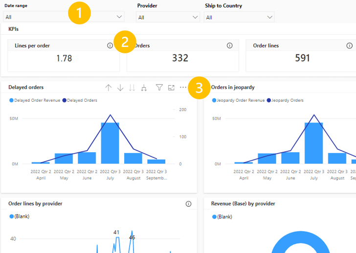
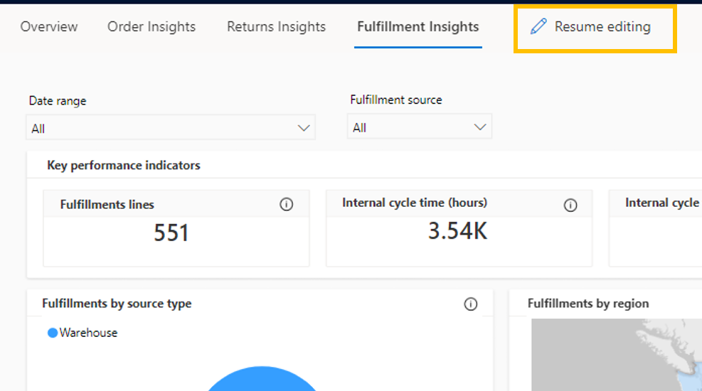
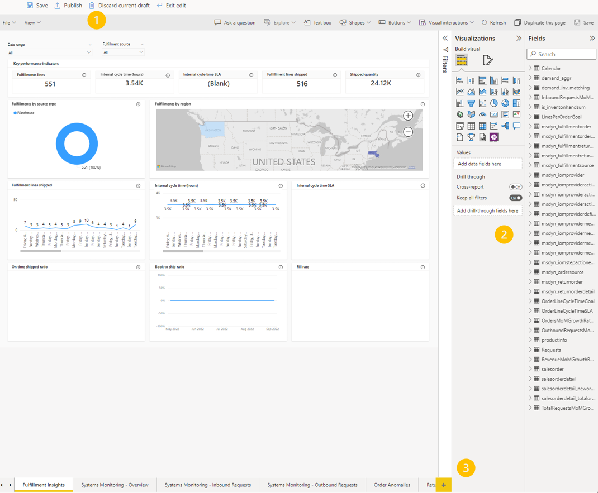

# Intelligent Order Management Insights reporting

[!include [banner](includes/banner.md)]

Microsoft Dynamics 365 Intelligent Order Management provides comprehensive, out-of-the-box reports called **Insights**. **Insights** cover a broad range of KPIs that are critical for your business. 

You can use **Insights** to find various metrics, such as products by order line, orders in jeopardy, returns by return reason, on time shipped ratio, fill rate, and much more. 

Intelligent Order Management **Insights** are powered by [Microsoft embedded Power BI](/power-bi/developer/embedded/embedded-analytics-power-bi).

## Navigating reports

Every **Insights** dashboard includes filters, help text, and settings. 

- (1) Filters - Each dashboard includes a date filter and data filters that are relevant to the page. For example, the **Orders Insights** page has filters for **Providers** and **Ship to country**. Each filter updates the visuals on the entire page.
- (2) Help text - Each visual on the dashboard has an **i** icon that displays helpful information about the related visual.
- (3) Settings - Each visual, when selected, displays a menu with additional settings. These settings include:
    
    - **Drill up**/**Drill down**/**Next level in hierarchy** - Drill up or down on the current visual to see the next level up or down in data. For example, you can drill up from **Months** to **Year**.
    - **Next level in hierarchy**/**Expand all down one level in the hierarchy** - Expand levels down in the hierarchy of data. for example, from **Months** to **Quarters**.
    - **Filters on visual** - Display current filters affecting a specific visual.
    - **Focus mode** - Navigate to an expanded view of a specific visual.
    - **Export data** - Export the underlying data to a CSV format. Any filters that are affecting the visual will be used in the export.
    - **Show as a table** - View the underlying data for a specific visual in a table form.
    - **Spotlight** - Highlight the selected visual.
    - **Get insights** - View auto-generated insights for a specific visual, if available.
    - **Sort axis** - Customize axis information on a specific visual.

## Insights metrics 

The following table provides the full list of current metrics and descriptions for **Insights**. The description in the table is the same as the help text description available in the product.

The **Category** is located in the left navigation menu. **Page** is the tab on the actual page where the report exists. For example, when you select **Order dashboard** in the left page, and and then select **Return Insights**, the page with all the returns metrics will open.

| Category          | Page                 | Metric                          | Type  | Description                                                                                                                                                                                |
|-------------------|----------------------|---------------------------------|-------|--------------------|
| Order dashboard   | Overview             | Lines per order                 | KPI   | Average order lines per order received.  |
| Order dashboard   | Overview             | Orders mtd                      | KPI   | Total orders received for current month to date (Page date filters don't update this KPI). |
| Order dashboard   | Overview             | Orders mom growth rate          | KPI   | Growth rate of orders received month over month.  |
| Order dashboard   | Overview             | Revenue (base) mtd              | KPI   | Total revenue of all orders for current month to date (Page date filters do not update this KPI). |
| Order dashboard   | Overview             | Revenue (base) mom growth rate  | KPI   | Growth rate of revenue from orders month over month.  |
| Order dashboard   | Overview             | Orders by provider              | Graph | Orders received grouped by order providers connected to Intelligent Order Management.  |
| Order dashboard   | Overview             | Order details by region         | Map   | Map view of each order destination region's order details, such as revenue or order count. |
| Order dashboard   | Overview             | Orders by date                  | Graph | Order count by date on a trendline. |
| Order dashboard   | Overview             | Orders by status reason         | Graph | Order count grouped by order status.  |
| Order dashboard   | Overview             | Top products by order line      | Graph | Top products ordered based on order lines.  |
| Order dashboard   | Order insights       | Lines per order                 | KPI   | Average order lines per order received.  |
| Order dashboard   | Order insights       | Orders                          | KPI   | Total orders received.  |
| Order dashboard   | Order insights       | Order lines                     | KPI   | Total order lines received. |
| Order dashboard   | Order insights       | Orders past due                 | KPI   | Orders that are past the requested delivery date. |
| Order dashboard   | Order insights       | Revenue (base)                  | KPI   | Total revenue of all orders.  |
| Order dashboard   | Order insights       | D orders                        | Graph | Sales orders that are delayed from delivery by revenue and order count. |
| Order dashboard   | Order insights       | Orders in jeopardy              | Graph | Sales orders that are in jeopardy as they haven't been sent to fulfillment and are at risk of being delayed by revenue and order count.  |
| Order dashboard   | Order insights       | Order lines by status reason    | Graph | Order lines count grouped by order status.  |
| Order dashboard   | Order insights       | Order lines by provider         | Graph | Orders lines count grouped by order providers connected to Intelligent Order Management.   |
| Order dashboard   | Order insights       | Revenue (base) by provider      | Graph | Revenue of orders received grouped by order providers connected to Intelligent Order Management.   |
| Order dashboard   | Order insights       | Orders by shipping method       | Graph | Order count grouped by shipping method. For example, FedEx or UPS. |
| Order dashboard   | Order insights       | Order lines by provider         | Graph | Order lines count grouped by order providers connected to Intelligent Order Management.    |
| Order dashboard   | Order insights       | Lines per order by provider     | Graph | Average orders lines per order, grouped by provider.  |
| Order dashboard   | Returns insights     | Products returned               | KPI   | Total count of returned products.   |
| Order dashboard   | Returns insights     | Return orders                   | KPI   | Total count of returned orders.   |
| Order dashboard   | Returns insights     | Return order lines              | KPI   | Total count of returned order lines.   |
| Order dashboard   | Returns insights     | Revenue loss (base)             | KPI   | Total revenue lost from returns.   |
| Order dashboard   | Returns insights     | Return rate (revenue)           | KPI   | Return rate by revenue of returns against revenue of sales orders.   |
| Order dashboard   | Returns insights     | Return rate (orders)            | KPI   | Return rate by order line count of returns against order line count of sales orders.  |
| Order dashboard   | Returns insights     | Returns by customer             | Graph | Returns count grouped by highest volume order customers.  |
| Order dashboard   | Returns insights     | Returns by delivery carrier     | Graph | Returns count grouped by delivery carriers such as FedEx or UPS.  |
| Order dashboard   | Returns insights     | Top five returned products      | Graph | Top five products by quantity returned. |
| Order dashboard   | Returns insights     | Returns by return reason        | Graph | Returns count grouped by return reason.  |
| Order dashboard   | Returns insights     | Returns by order status         | Graph | Returns count grouped by order status.    |
| Order dashboard   | Returns insights     | Returns by fulfillment status   | Graph | Returns count grouped by fulfillment status. |
| Order dashboard   | Returns insights     | Returns by warehouse            | Graph | Returns count grouped by warehouse.  |
| Order dashboard   | Returns insights     | Returns by country              | Graph | Returns count grouped by country on a map view.   |
| Order dashboard   | Fulfillment insights | Fulfillment lines               | KPI   | Total fulfillment lines created.   |
| Order dashboard   | Fulfillment insights | Internal cycle time (hours)     | KPI   | The average time it takes to ship an order. |
| Order dashboard   | Fulfillment insights | Internal cycle time (sla)       | KPI   | SLA percentage representing orders that have shipped by an internal cycle time goal. |
| Order dashboard   | Fulfillment insights | Fulfillment lines shipped       | KPI   | Total fulfillment lines that have been shipped.  |
| Order dashboard   | Fulfillment insights | Shipped quantity                | KPI   | Total orders that have been shipped.   |
| Order dashboard   | Fulfillment insights | On-time shipped ratio           | Graph | On time shipped percentage shows the percentage of orders delivered on time. Orders without a requested ship date are excluded from this metric.   |
| Order dashboard   | Fulfillment insights | Book to ship ratio              | Graph | Book to ship ratio shows the value ratio of orders booked vs shipped. |
| Order dashboard   | Fulfillment insights | Fill rate                     | Graph | Fill rate shows the percentage of orders that have been fulfilled successfully. |
| Order dashboard   | Fulfillment insights | Fulfillments by source type     | Graph | Fulfillment orders grouped by source type such as Warehouse. |
| Order dashboard   | Fulfillment insights | Fulfillments by region          | Map   | Map view of fulfillment order details grouped by region of order destination. |
| Order dashboard   | Fulfillment insights | Fulfillment lines shipped       | Graph | Count of fulfillment lines shipped on a trendline.  |
| Order dashboard   | Fulfillment insights | Internal cycle time (hours)     | Graph | The average time it takes to ship an order by date on a trendline.  |
| Order dashboard   | Fulfillment insights | Internal cycle time (sla)       | Graph | SLA percentage representing orders that have shipped by an internal cycle time goal by date on a trendline. |
| Licenses          | Overview             | Total order lines               | KPI   | Total order lines received. |
| Licenses          | Overview             | Orders lines MTD                | KPI   | Total order lines month to date. **Page date** filters don't update this KPI. |
| Licenses          | Overview             | Orders lines mom growth rate    | KPI   | Growth rate of orders lines received month over month. |
| Licenses          | Overview             | Order lines by date             | Graph | Order lines by date on a trendline.  |
| Licenses          | Overview             | Total order lines by date with 6 month proj | Graph | Count of total order lines by date on a trendline, with a six month projection into the future based on historical data.       |
| Product insights  | Overview             | Orders                          | KPI   | Total orders received.  |
| Product insights  | Overview             | Order lines                     | KPI   | Total order lines received.  |
| Product insights  | Overview             | Lines per order                 | KPI   | Average order lines per order received.  |
| Product insights  | Overview             | Ordered quantity                | KPI   | Total quantity of products ordered from sales orders.  |
| Product insights  | Overview             | Ordered quantity per order      | KPI   | Average quantity of products ordered from sales orders.  |
| Product insights  | Overview             | Active products                 | KPI   | Current active products in your inventory.  |
| Product insights  | Overview             | Top products by order lines     | Graph | Top products ordered grouped by order lines.   |
| Product insights  | Overview           | Top products by ordered quantity  | Graph | Top products ordered grouped by ordered quantity.  |
| Product insights  | Overview             | Top products by revenue (base)  | Graph | Top products ordered grouped by revenue.   |
| Product insights  | Overview      | Top products by order lines over time  | Graph | Top products ordered grouped by order lines on a trendline.  |
| Product insights  | Overview             | Key influencers/top segments    | ?     | Key influencers and top segments responsible for product sales.  |
| Monitoring        | Order anomalies      | Order quantities                | Graph | Quantity of ordered products on a trendline with any anomalies. Anomalies are defined as any value that is below 70% of the expected range of that value based on historical data.     |
| Monitoring        | Order anomalies      | Revenue                         | Graph | Revenue from orders on a trendline with any anomalies. Anomalies are defined as any value that is below 70% of the expected range of that value based on historical data.   |
| Monitoring        | Order anomalies      | Top product revenues            | Graph | Top products by quantity ordered on a trendline with any anomalies. Anomalies are defined as any value that is below 70% of the expected range of that value based on historical data. |
| Monitoring        | Order anomalies      | Order delays                    | Graph | Delayed orders on a trendline with any anomalies. Anomalies are defined as any value that is below 70% of the expected range of that value based on historical data.     |
| Monitoring        | Order anomalies      | Quarterly revenue               | Graph | Revenue of orders by quarter on a trendline with any anomalies. Anomalies are defined as any value that is below 70% of the expected range of that value based on historical data.  |
| Monitoring        | Order anomalies      | Orders                          | Table | Total orders on a trendline with any anomalies. Anomalies are defined as any value that is below 70% of the expected range of that value based on historical data.  |
| Provider insights | Overview             | Total requests                  | KPI   | Total message and action events associated with providers connected to Intelligent Order Management. For example, big Commerce orders and order updates, FedEx shipping, and delivery notifications.    |
| Provider insights | Overview             | MTD total request growth rate   | KPI   | Growth rate month to date of requests associated with providers connected to Intelligent Order Management. Page date filters don't update this KPI.  |
| Provider insights | Overview             | SLA total requests              | KPI   | Percentage of requests that met the SLA for a given provider connected to Intelligent Order Management, where the SLA is defined as the length of allowable time for an event to process.                |
| Provider insights | Overview             | Total requests failed           | KPI   | Total requests from providers that have failed.  |
| Provider insights | Overview             | Total requests above threshold  | KPI   | Total requests that exceeded the allowable time for an event to process for a given provider.    |
| Provider insights | Overview           | Total requests by provider      | Graph | Total requests grouped by providers connected to Intelligent Order Management.|
| Provider insights | Overview             | Total requests and message type by provider    | Table | Total requests grouped by provider and type/ This includes inbound vs outbound.  |
| Provider insights | Overview             | Total requests by date          | Graph | Total requests by date on a trendline.  |
| Provider insights | Overview             | Total requests failed by date   | Graph | Total failed requests by date on a trendline. |
| Provider insights | Overview             | Total requests above threshold by date   | Graph | Total requests that exceeded the allowable time for an event to process for a given provider by date on a trendline.  |
| Provider insights | Inbound requests     | Inbound requests                | KPI   | Total requests coming FROM providers connected to Intelligent Order Management. For example, an order from Big Commerce or a shipping notification from FedEx.  |
| Provider insights | Inbound requests     | MTD inbound request growth rate | KPI   | Growth rate month to date of requests coming FROM providers connected to Intelligent Order Management. Page date filters don't update this KPI. |
| Provider insights | Inbound requests     | SLA inbound requests            | KPI   | Percentage of inbound requests that met the SLA for a given provider connected to Intelligent Order Management, where the SLA is defined as the length of allowable time for an event to process.        |
| Provider insights | Inbound requests     | Inbound requests failed         | KPI   | Total requests coming FROM providers that have failed. |
| Provider insights | Inbound requests     | Inbound requests above threshold    | KPI   | Total inbound requests that exceeded the allowable time for an event to process for a given provider.                       |
| Provider insights | Inbound requests     | inbound requests by provider   | Graph | Total requests coming FROM providers, grouped by providers.    |
| Provider insights | Inbound requests     | Inbound requests and message type by provider  | table | Total requests coming FROM providers, grouped by providers and inbound type.                           |
| Provider insights | Inbound requests     | Inbound requests by date by provider      | Graph | Total requests coming FROM providers by date on a trendline.  |
| Provider insights | Inbound requests     | Inbound requests failed by date by provider | Graph | Total requests coming FROM providers that have failed by date on a trendline.       |
| Provider insights | Inbound requests     | Inbound request anomalies on execution time | Graph | Providers with inbound requests that exceeded the allowable time for an event to process.    |
| Provider insights | Outbound requests    | Outbound requests  | KPI   | Total requests sent TO providers connected to Intelligent Order Management. |
| Provider insights | Outbound requests    | MTD outbound requests growth rate     | KPI   | Growth rate month to date of requests sent TO providers connected to Intelligent Order Management. The **Page date** filters don't update this KPI.    |
| Provider insights | Outbound requests    | SLA outbound requests             | KPI   | Percentage of outbound requests that met the SLA for a given provider connected to Intelligent Order Management, where the SLA is defined as the length of allowable time for an event to process.  |
| Provider insights | Outbound requests    | Outbound requests failed         | KPI   | Total requests sent TO providers that have failed.     |
| Provider insights | Outbound requests    | Outbound requests above threshold  | KPI | Total outbound requests that exceeded the allowable time for an event to process for a given provider.   |
| Provider insights | Outbound requests    | Outbound requests by provider     | Graph | Total requests sent TO providers grouped by provider.  |
| Provider insights | Outbound requests    | Outbound requests and message type by provider | Table | Total requests sent TO providers grouped by provider and outbound type. |
| Provider insights | Outbound requests    | Outbound requests by date by provider          | Graph | Total requests sent TO providers by date on a trendline. |
| Provider insights | Outbound requests    | Outbound requests failed by date by provider   | Graph | Total requests sent TO providers that have failed by date on a trendline.        |
| Provider insights | Outbound requests    | Outbound requests anomalies on execution time  | Graph | Providers with outbound requests that exceeded the allowable time for an event to process.  |

## Customize dashboards 

Only users with [administrator](/power-bi/admin/service-admin-role) and author access can customize your organization's **Insights** reports or create new reports.

For more details about administering roles, see [What is Power BI administration](/power-bi/admin/service-admin-administering-power-bi-in-your-organization) and [Grant users access](/power-platform/admin/grant-users-access).

If you do have the  proper access to customize or create **Insights** reports, you can select **Resume editing** on any **Insights** page.

When you select **Resume editing** you will be in edit mode.

- (1) Editing controls - Use the controls on the top menu bar to **Save**, **Discard current draft**, or **Publish** your current draft. If you publish, you will publish changes for everyone in your organization.
- (2) Customization controls - There are three controls in the right pane:

    - **Filters** - Expand the **Filters** section to see which filters are currently applied, and to edit or add more.
    - **Visualizations** - Select any visual on the main screen and then select a new visual to change it. For more information about changing the visuals, see [Change the type of visualization in a Power BI report](/power-bi/visuals/power-bi-report-change-visualization-type). You can also edit axis information, legends, and more. For more detailed instructions, see [Customize visualization titles, backgrounds, labels, and legends](/power-bi/visuals/power-bi-visualization-customize-title-background-and-legend).
    - **Fields** - These are the fields available for your current schema. Selecting any visual in the main screen highlights the fields being used for that specific visual. You can add or delete fields and update the data powering any visual from here.

For more information on how to customize PBI reports, see [Customize reports guide](/dynamics365/customer-service/customize-reports)

- (3) New page - Create a new blank page to build your own dashboard of visuals. For instructions about how to add viduals to a page, see [Add visuals to a Power BI report](/power-bi/visuals/power-bi-report-add-visualizations-i?tabs=powerbi-desktop).

