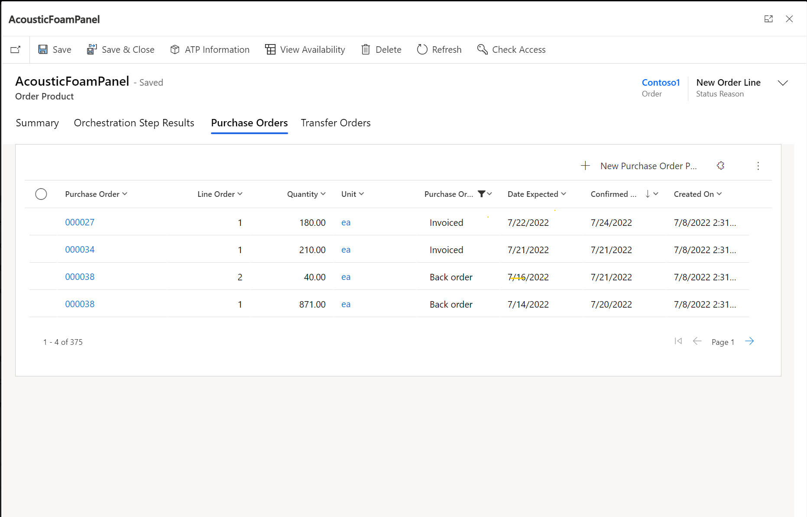

# Integrate Supply Chain Management procurement with Intelligent Order Management

[!include [banner](includes/banner.md)]
[!include [banner](includes/preview-banner.md)]

This article describes how to integrate procurement in Microsoft Dynamics 365 Supply Chain Management with Dynamics 365 Intelligent Order Management.

To extend support for inbound transactions and provide transaction visibility alongside inventory visibility, a **Purchase Orders** entity has been introduced in Intelligent Order Management. The **Purchase Orders** entity includes the following features:

- Dual-write support for purchase orders is available, so that purchase order data flows seamlessly from Dataverse into Intelligent Order Management and is visible in real or near-real time.
- Users can create purchase orders in Intelligent Order Management. The purchase orders are then processed in Supply Chain Management via dual-write support.
- The user interface (UI) fields for the **Purchase Orders** entity have been designed to support sales order fulfillment scenarios.
- Transaction status and visibility of purchase orders from Supply Chain Management are available directly in Intelligent Order Management.
- The **Purchase Order products** view is available on the **Sales Order** products tab, which provides visibility into incoming inventory from individual purchase order transactions. The **Purchase Order products** view is also available on the site map, for easy access to the status of individual purchase order lines at the product level.

For more information about purchase orders, see [Purchase order overview](/dynamics365/supply-chain/procurement/purchase-order-overview).

## Dual-write support for purchase orders

The following prerequisites must be met before you can activate dual-write support for purchase orders:

- Install or update the following dual-write packages to ensure that you have the latest versions:

    - Dual-write core solution package
    - Dual-write Application Core package
    - Dual-write finance package
    - Dual-write Human Resources package

- If dual-write for sales orders is already installed in your environment, ensure that it's up to date.
- If an older version of Intelligent Order Management is running in your instance, and dual-write is already installed there, ensure that you import the user experience (UX) solution package for purchase orders and transfer orders.

## General guidelines for installing the add-on UX package for new users

- If you're installing Intelligent Order Management first, you should install the dual-write solution before you import the UX package solution.
- If you're installing the dual-write solution first, the UX package solution will be imported as part of the installation. You can then install Intelligent Order Management.

## Initial synchronization of prerequisite tables

After all the preceding prerequisites have been met, you must do an initial synchronization of the prerequisite and dependent master data and tables, so that existing purchase orders are available in both Supply Chain Management and Intelligent Order Management. For information about which tables you must sync and how to sync them, see [Integrate procurement between Supply Chain Management and Field Service](/dynamics365/fin-ops-core/dev-itpro/data-entities/dual-write/scm-field-service-procurement).

## Dual-write purchase order mapping reference

For information about dual-write purchase order mapping, see [Mapping reference](/dynamics365/fin-ops-core/dev-itpro/data-entities/dual-write/mapping-reference#183).

## Create a purchase order

To create a purchase order in Intelligent Order Management, follow these steps.

1. In the site map, go to **Purchase orders**.
1. Select **New**, enter values for the mandatory fields, and then select **Save**.
1. On the **Purchase Order** header entity, enter values in the **Name**, **Receiving Warehouse**, **Site**, **Vendor**, and **Company** fields. The **Name** value denotes the purchase order number that will be assigned in Supply Chain Management.

    > [!NOTE]
    > If you save the header without entering any of the field values, and you then want to edit them immediately afterward, you must confirm the header in Supply Chain Management before you can update any of the fields on the **Purchase Order** page.

1. Select **Save**.
1. Select **New Purchase Order Product**, and then select values in the **Existing Product**, **Line number**, **Associate to Warehouse**, **Quantity**, and **Unit of measure** fields. 
1. Select **Save**. If the transaction is successfully saved, the dual-write operation was successful, and the purchase order was created and updated in Supply Chain Management.

## UI fields for purchase order entities

The following sections list the UI fields that are available for purchase order entities.

### Purchase Order header fields

- Name
- Purchase Order ID
- Contact Email
- Receiving Warehouse
- Vendor
- Vendor Reference
- Company
- Receiving Site ID
- Reason Code
- Reason Comment
- Delivery Terms
- Shipping Via
- Expected Date
- Confirmed Delivery Dates
- Delivery Address

### Purchase Order product fields

- Purchase Order ID
- Existing Product
- Description
- Line Number
- Associate to Warehouse
- Company
- Receiving Site ID
- Quantity
- Unit Cost
- Discount Amount
- Discount Percentage
- Total Price
- Amount
- Purchase Order line Status

### Purchase Order Goods Receipt header fields

- Name
- Purchase Order
- Note
- Company
- Order Vendor
- Record ID
- Ship Via
- Date Received
- Requester Personnel
- Delivery Term
- Remaining Inventory Quantity
- Remaining Purchase Quantity

### Purchase Order Goods Receipt product fields

- Name
- Purchase order ID
- Purchase Order Product
- Quantity
- Product Receipt Number
- Product Receipt Date
- Company
- Expected Delivery Date
- Ordered Purchase Quantity
- Received Inventory Quantity

## Supported dual-write scenarios

The following dual-write scenarios are supported:

- Purchase orders can be created and updated by Dataverse users, but the process and data are controlled by Supply Chain Management. The constraints on updates to purchase order columns in Supply Chain Management apply when updates come from Intelligent Order Management. For example, you can't update a purchase order if it has been finalized, and you can't update a purchase order that was created in Intelligent Order Management until the purchase order is confirmed in Supply Chain Management.
- Several columns are managed only by Supply Chain Management and can't be updated in Intelligent Order Management. To learn which columns can't be updated, review the mapping tables in the product. Most of these columns are set to read-only on Dataverse pages.

    For example, the columns for price information are managed by Supply Chain Management. Supply Chain Management has trade agreements in place, and columns such as **Unit price**, **Discount**, and **Net amount** come only from Supply Chain Management. To ensure that a price is synced to Intelligent Order Management, you should use the **Sync** feature on the **Purchase Order** and **Purchase Order Product** pages in Dataverse after purchase order data is entered. For more information, see [Sync with the Dynamics 365 Supply Chain Management procurement data on demand](/dynamics365/fin-ops-core/dev-itpro/data-entities/dual-write/scm-field-service-procurement#sync-procurement).

- Product receipts (which are known as purchase order receipts in Dataverse) are managed by Supply Chain Management and can't be created from Dataverse if Supply Chain Management is installed. The product receipts from Supply Chain Management are synced from Supply Chain Management to Dataverse.
- Under-delivery is allowed in Supply Chain Management. The OneFSSCM solution adds logic so that, when a product receipt line (known as a purchase order receipt product in Dataverse) is created or updated, an inventory journal row is created in Dataverse to adjust the remaining quantity that is on order for under-delivery scenarios.

## Transaction status and visibility of purchase orders from Supply Chain Management directly in Intelligent Order Management

As a purchase order progresses in Supply Chain Management, status updates flow back to Intelligent Order Management for tracking and visibility. You can view open purchase order lines and purchase order line status by going to **Purchase Order products** in the site map. In this way, you can stay informed about incoming inventory. Purchase order product fields such as **Expected date** and **Confirmed delivery date** provide insights into the in-transit purchase orders.

The **Purchase Order Receipt** and **Purchase Order Receipt products** entities provide visibility into the **Received inventory quantity**, **Remaining inventory quantity**, **Product receipt date**, and **Purchased quantity** values. The **Purchase Order Receipt** entity on a purchase order can be accessed via a separate tab on the purchase order page. Fields on the purchase order page can provide insights into under-receipts and over-receipts.

The following illustration shows an example of the **New Purchase Order Receipt Product** page.

For information about the detailed mapping between Supply Chain Management purchase order status and purchase order line status, see [Integrate procurement between Supply Chain Management and Field Service](/dynamics365/fin-ops-core/dev-itpro/data-entities/dual-write/scm-field-service-procurement).

## Purchase order product view on the sales order products page

The **Purchase Orders** tab that is available on the sales order products page lists all the open purchase order lines for the product. The following illustration shows an example.

