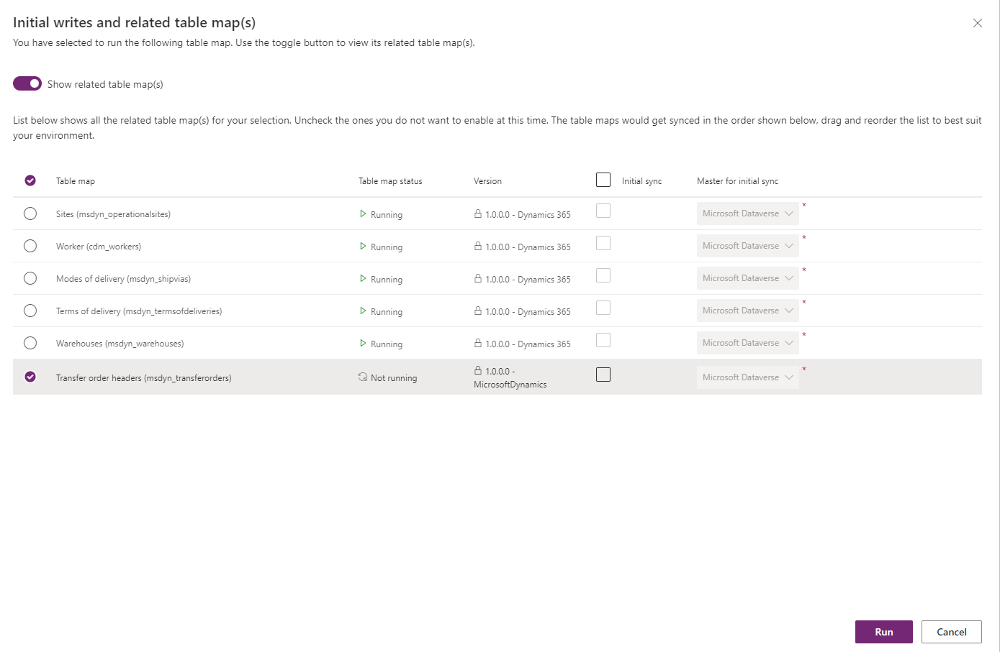
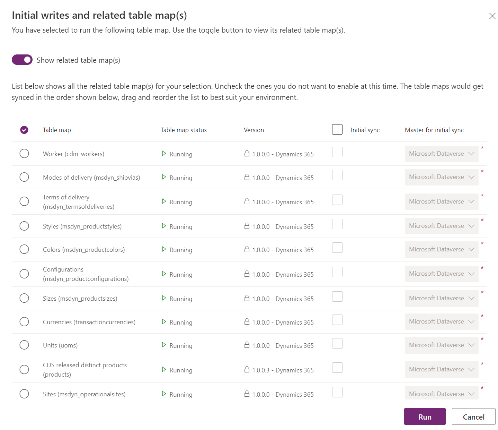
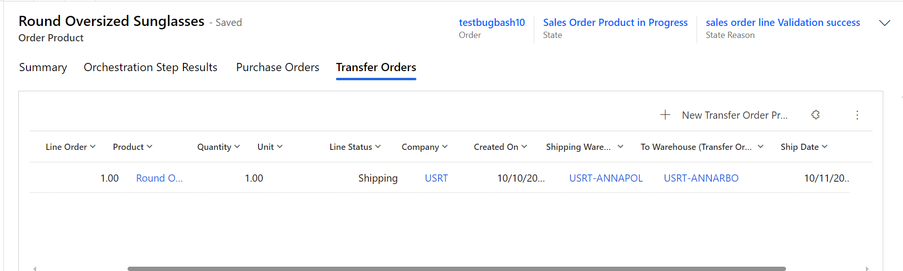

# Integrate Supply Chain Management transfer orders with Intelligent Order Management

[!include [banner](includes/banner.md)]
[!include [banner](includes/preview-banner.md)]

This article describes how to integrate transfer orders in Microsoft Dynamics 365 Supply Chain Management with Dynamics 365 Intelligent Order Management.

Warehouse workers create transfer orders to transfer products from one warehouse or location to another. Here are some typical reasons why transfer orders are created:

- Product transfers from manufacturing to a distribution facility
- Stock replenishment at a store from a distribution center
- Ad-hoc transfers to a warehouse from another warehouse to meet a spike in demand
- Transfers between warehouses for service purposes, such as packaging and customization requirements

As part of the process of extending support and providing visibility into enterprise transactions, a **Transfer Order** entity has been introduced in Intelligent Order Management. This entity includes the following features:

- Dual-write support for transfer orders is available, so that transfer order data flows seamlessly from Dataverse into Intelligent Order Management and is visible in real or near-real time.
- Transfer orders can be created in Intelligent Order Management. They are then processed in Supply Chain Management via dual-write support.
- The user interface (UI) fields for the **Transfer Orders** entity have been designed to support sales order fulfillment scenarios.
- Transaction status and visibility of transfer orders from Supply Chain Management are available directly in Intelligent Order Management.
- The **Transfer Order products** view is available on a tab of the sales order product page and provides visibility into the transfers from individual transfer order transactions.

## Dual-write support for transfer orders

The following prerequisites must be met before you can activate dual-write support for transfer orders:

- Install or update the following dual-write packages to ensure that you have the latest versions:

    - Dual-write core solution package
    - Dual-write Application Core package
    - Dual-write Finance package
    - Dual-write Human Resources package

- If dual-write for sales orders is already installed in your environment, ensure that it's up to date.
- If an older version of Intelligent Order Management is running in your instance, and dual-write is already installed there, ensure that you import the user experience (UX) solution package for purchase orders and transfer orders.

## General guidelines for installing the add-on UX package for new users

- If you're installing Intelligent Order Management first, you should install the dual-write solution before you import the UX package solution.
- If you're installing the dual-write solution first, the UX package solution will be imported as part of the installation. You can then install Intelligent Order Management.

## Initial synchronization of prerequisite tables

After all the preceding prerequisites have been met, you must sync the reference data between Supply Chain Management and Dataverse before you can create new transfer orders and work with existing transfer orders. You will use the initial write functionality to detect the table relationships and find the tables that you must enable for a given map.

In the dual-write synchronization settings, you will see the prerequisite tables for both the **Transfer Order Headers** table map and the **Transfer Order Products** table map.

The following tables must be synced for the **Transfer Order Header** table map:

- Sites
- Worker
- Modes of delivery
- Terms of delivery
- Warehouses

The following tables must be synced for the **Transfer Order Products** table map:

- Worker
- Modes of delivery
- Terms of delivery
- Styles
- Colors
- Configurations
- Sizes
- Currencies
- Units
- CDS released distinct products
- Sites
- Warehouses

For more information about dual-write mapping references, see [Dual-write mapping reference](/fin-ops-core/dev-itpro/data-entities/dual-write/mapping-reference).

## Create a transfer order

To create a transfer order, follow these steps.

1. In the left navigation pane, under **Orders**, select **Transfer orders**. 
1. Select **New**.
1. Set the following mandatory fields:

    1. In the **Name** field, specify a transfer order ID. (It should match the ID that is used in Supply Chain Management.)
    1. Set the **Company** field.
    1. In the **From warehouse** field, specify the warehouse to transfer from. In the **To warehouse** field, specify the warehouse to transfer to.
    1. Optional: In the **Ship date** field, specify when the transfer will be shipped, if you know the date. In the **Receive date** field, specify when the transfer will be received. You can leave both these optional fields blank.

1. To create a transfer order product, select **New Transfer Order product**, and then enter values in the **Product**, **Line number**, and **Transfer quantity** fields. If you see that other fields are locked, the values come from Supply Chain Management as part of dual-write synchronization.
1. If you set the **Ship date** and **Receive date** fields on the header, the values are entered by default on the lines. However, you can override them.
1. Select **Save**. After **Transfer Order Products** is saved, it's synced to Supply Chain Management for further processing.

## Process transfer order and status updates

As transfer orders are processed in Supply Chain Management, status updates are reflected in Dataverse via dual-write and become visible in Intelligent Order Management. When a transfer order is shipped, the status is updated to **Shipped** on the header and lines. The **Shipped Quantity** value is reflected on the **Transfer Order product** page. When the transfer order is received in Supply Chain Management, the status is updated to **Received** on the header. After the item is received, the **Line Status** value is set to **None**.

## View transfer order products on the sales order product page

A view of transfer orders is available via a tab on the sales order product page. The **Transfer Orders** tab shows the list of transfers for the order product, including values for the **Shipping Warehouse** and **To Warehouse** fields. This tab provides visibility into incoming inventory for the warehouse that is assigned to the sales order product.

