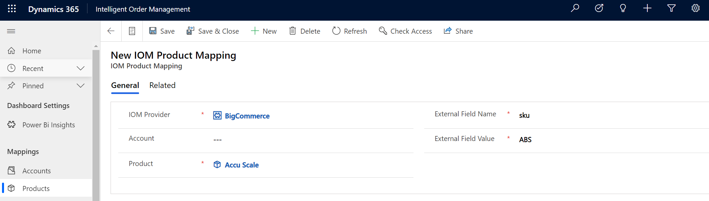

# Internal external ID mapping

[!include [banner](includes/banner.md)]

Dynamics 365 Intelligent Order Management provides out-of-the-box internal external ID mappings. With the internal external ID mappings functionality, you can do the following.

- Define the relationship between identities in an enterprise across applications and operating systems.
- Leverage mapping for multiple integrations.
- Enable an end-to-end visualization of mapping across multiple systems.
- Configure and add your own mapping and mapping tables.

## Configurations

The following configurations are provided with Intelligent Order Management.

- Accounts
- Products
- Price Lists
- Warehouses
- Currencies
- Unit Groups
- Units

On the **Configurations** page, you can configure the mapping of columns and values across your different providers. Each of the configurations above map to a corresponding Microsoft Dataverse mapping table that will preserve mappings so they can be used in various provider integrations.

The mappings listed below are transactional mappings that don't need to be configured. The transactional mappings are view-only.

- Orders
- Order Products
- Fulfillment Orders
- Fulfillment Order Products

## Example scenario

This scenario demonstrates how you can use internal external ID mappings when working with multiple providers. Every provider has a unique master data setup for **Products** or **Warehouses**. To integrate with these providers, you would need to transform each of these datasets into provider mapping terminology. With internal external ID mapping, you can set up the mapping once and leverage the mapping for all subsequent integrations.

When a transaction flows into or out of Intelligent Order Management through a provider, the mapping service uses the internal external ID mappings to look up mapped values and transform the payload.

To set up a product mapping, follow the steps below.

1. In Intelligent Order Management, select **Configuration** on the bottom left to open a page that displays all of the out-of-the-box mappings.
1. Select **Products**. The **Products mapping** page opens.
1. Select **New** to add a new mapping.
1. In the **IOM Provider** field, enter the provider whose product master data you want to map with Intelligent Order Management.
1. In the **Product** field, enter the Intelligent Order Management product number.
1. In the **External Field Name** field, enter the external field name for the provider.
1. In the **External Field Value** field, enter the external product number to be mapped for the provider.
1. Select **Save & Close**.

> [!NOTE]
> Provider-based grouping of mappings isn't currently available. We're planning on providing this functionality in upcoming releases.

