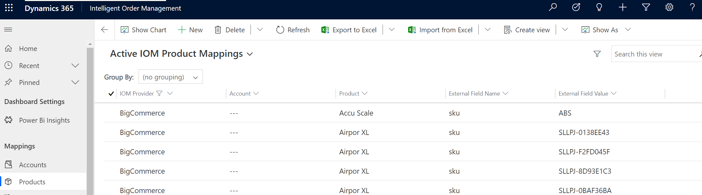

# Internal external ID mapping

[!include [banner](includes/banner.md)]

<!--- waiting for clarification for this section --->
Dynamics 365 Intelligent Order Management provides out-of-the-box internal external ID mappings. With the internal external ID mappings functionality, you can do the following.

- Define the relationship between identities in an enterprise across applications and operating systems.
- Enable an end-to-end visualization of mapping across multiple systems.
- Configure and add your own mapping and mapping tables.
- Leverage mapping for multiple integrations.

## Configurations

The following configurations are provided with Intelligent Order Management.

- Accounts
- Products
- Price Lists
- Warehouses
- Currencies
- Unit Groups
- Units

On the **Configurations** page, you can configure the mapping of columns and values across your different providers. Each of the configurations above map to a corresponding Microsoft Dataverse mapping table that will preserve mappings so they can be used in various provider integrations.

## Example scenario

This scenario demonstrates how you can use internal external ID mappings when working with multiple providers. Every provider has a unique master data setup for **Products** or **Warehouses**. To integrate with these providers, you would need to transform each of these datasets into provider mapping terminology. With internal external ID mapping, you can set up the mapping once and leverage the mapping for all subsequent integrations.

When a transaction flows into Intelligent Order Management, or goes out through a provider, the mapping service will use the internal\external ID mappings to look up mapped values and transform payload accordingly 

Below **Steps** show how quickly you can setup a **Product** mapping:

1. On the homepage, at bottom left select the **Configuration** screen.
2. This will show up all the **Out of the Box Mappings** available.
3. As an example click on **Products**. This will open the Products mapping screen.
4. Click on **New** to add a new mapping.
5. Enter the **IOM Provider** instance whose Product master data you wish to map within Inetlligent Order Management.
6. In **Product** enter the IOM Product number.
7. In **External Field Name** enter the external field name for the provider.
8. In **External Field Value** enter the external Product number to be mapped for the provider.
9. Click on **Save & Close**.

**Note:** 
1. Provider based grouping of mappings is not available as part of current release. This will be covered in upcoming releases.
2. Below mappings are **Transactional mappings** which need not be configured and is **View Only**.
    1. Orders.
    2. Order Products.
    3. Fulfillment Orders.
    4. Fulfillment Order Products.
