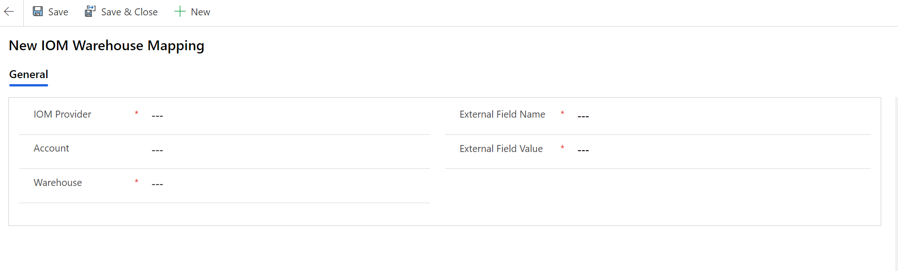
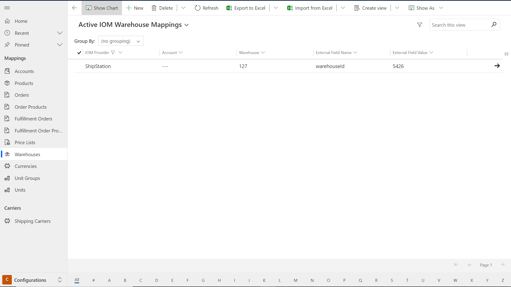
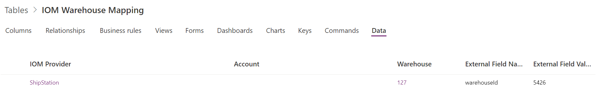

# Internal External ID mapping in Intelligent Order Management

[!include [banner](includes/banner.md)]
[!include [banner](includes/preview-banner.md)]

Dynamics 365 Intelligent Order Management comes with an Out of the box Internal External ID mappings. This will allow you to:

1. **Define** relationship between identities in an enterprise such that applications and operating systems from one user identity to another, related user identity
1. **Smooth** integration across multiple systems
1. Enable an **end to end visualization** of multiple systems representation for same entity.

# What is Intelligent Order Management Offering?

In order to be able to leverage the full potential of Internal External ID mapping, Intelligent Order Management offers the below:

1. Out of the box **configurable** mapping and mapping tables.
1. Easy **integration** across multiple systems.
1. **End to End visibility** in Intelligent Order Management on the connecting systems.
1. **Flexibility** to add your own mappings.

**Below are the Out of the Box mapping configurations available:**

1. Accounts
2. Products
3. Price Lists
4. Warehouses
5. Currencies
6. Unit Groups
7. Units

You will now see a new page added into the homepage called as **Configurations**. This page will allow you to configure the mapping of columns and values across your different providers.
Each of the above Out of the Box configurations will map to a corresponding **dataverse mapping table** that will preserve these mappings for usability in various integrations with providers.

**Example Scenario:** Consider a scenario where you are working with multiple providers. Every provider has their own master data setup for **Products** or **Warehouses**. For any integration with these providers, there would be a constant need of transforming these datasets into providers mapping terminology. This is where Intelligent Order Management can help by letting you do a one time mapping setup and leverage that for all subsequent integrations with several providers.

Whenever a transaction flows into Dynamics 365 Intelligent Order Management, and goes out through a provider, the mapping service will use the external ID mappings to look at values received and sent in the document communication. 

Below **Steps** show how quickly you can setup a **Warehouse** mapping:

1. On the homepage, at bottom left select the **Configuration** screen.
2. This will show up all the **Out of the Box Mappings** available.
3. As an example click on **Warehouses**. This will open the Warehouse mapping screen.
4. Click on **New** to add a new mapping.
5. Enter the **IOM Provider** whose master data you wish to map within Inetlligent Order Management.
6. In **Warehouse** enter the IOM Warehouse number.
7. In **External Field Name** enter the field name for the provider.
8. In **External Field Value** enter the warehouse number to be mapped for the provider.
9. Click on **Save & Close**.
10. This will also create an entry in the dataverse **IOM Warehouse Mapping** table.

**Note:** 
1. Provider based grouping of mappings is not available as part of current release. This will be covered in upcoming releases.
2. Below mappings are **Transactional mappings** which need not be configured and is **View Only**.
    1. Orders.
    2. Order Products.
    3. Fulfillment Orders.
    4. Fulfillment Order Products.
