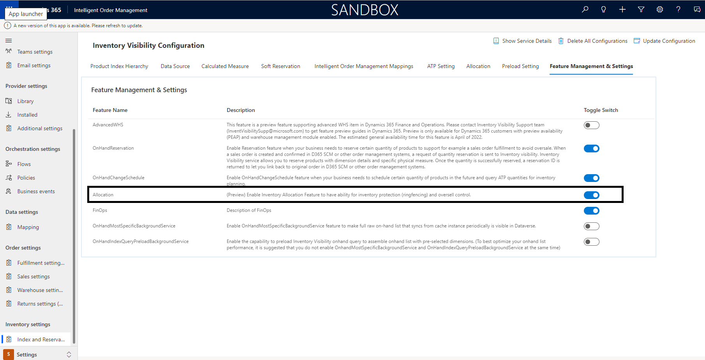

# Set up inventory allocation

[!include [banner](includes/banner.md)]

This article describes how to set up the inventory allocation feature of the Inventory Visibility add-in in Microsoft Dynamics 365 Intelligent Order Management.

For information about the Inventory Visibility add-in, see [Inventory Visibility Add In](/dynamics365/supply-chain/inventory/inventory-visibility). For information about how to add the Inventory Visibility add-in as a provider in Intelligent Order Management, see [Set up Inventory Visibility provider](set-up-inventory-visibility-provider.md).

## Key terms

The following terms and concepts are useful in discussions of inventory allocation:

- **Allocation group** – The group that owns the allocation, such as a sales channel, customer group, or order type.
- **Allocation group value** – The value of each allocation group. For example, **web** or **store** might be the value of a sales channel allocation group, and **VIP** or **normal** might be the value of a customer allocation group.
- **Allocation hierarchy** – A way to combine allocation groups hierarchically. For example, you can define **channel** as hierarchy level 1, **region** as level 2, and **customer group** as level 3. During inventory allocation, you must follow the allocation hierarchy sequence when you specify the value of the allocation group. For example, you might allocate 200 red bikes in priority order to the web channel, the London region, and the VIP customer group.
- **Available to allocate** – The virtual common pool that indicates the quantity that's available for further allocation. It's a calculated measure that you can define by using your own formula. If you're also using the soft reservation feature, we recommend that you use the same formula to calculate available-to-allocate and available-to-reserve quantities.
- **Allocated** – A physical measure that shows the allocated quota that can be consumed by the allocation groups.
- **Consumed** – A physical measure that indicates quantities that have been consumed against the original allocated quantity. As numbers are added to this physical measure, the allocated physical measure is automatically reduced.

## Business background and purpose

In many cases, manufacturers, retailers, and other supply chain business stakeholders must preallocate stock for important sales channels, locations, or customers, or for specific sales events. Inventory allocation is a typical practice in the sales operational planning process. It's done before actual sales activities occur and a sales order is created.

For example, a bicycle company that does both online and in-store sales has limited stock available for a popular bicycle. In each sales channel, the company has a few important corporate partners (marketplaces and large retailers) that demand that the company save a specific portion of the bicycle's available inventory for them. To satisfy corporate partners, the bicycle company must be able to balance stock distribution across channels, and also manage the expectations of its VIP partners. The best way to achieve both goals is to use inventory allocation. In this way, each channel and retailer can receive specific allocated quantities that can be sold to consumers later.

Inventory allocation has two basic business purposes:

- **Inventory protection (also known as ringfencing)** – Organizations want to preallocate restricted or limited stock to prioritized channels, regions, VIP customers, and subsidiary companies. The Inventory Visibility add-in inventory allocation feature helps protect allocated inventory, so that the other allocations, reservations, or sales demands won't affect previously allocated inventory.
- **Oversell control** – Oversell control restricts allocated quantities, so that receiving parties don't consume more than their allocated quantity. The Inventory Visibility add-in inventory allocation feature puts a restriction on previously allocated quantities. Therefore, receiving parties such as channels or customer groups won't over-consume when actual sales transactions that are based on soft reservations go into effect.

## Inventory Visibility inventory allocation feature

The Inventory Visibility add-in inventory allocation feature consists of the following components:

- The predefined, allocation-related data source, physical measures, and calculated measures
- Customizable allocation groups that have a maximum of eight levels
- A set of allocation application programming interfaces (APIs):

    - allocate
    - reallocate
    - unallocate
    - consume
    - query

Although the inventory allocation feature doesn't set aside physical inventory quantities, it does refer to the available physical inventory quantity of a product to define the initial quantity of the available-to-allocate virtual pool. Inventory allocation is a soft allocation. In other words, the allocation is done before actual sales transactions occur and doesn't depend on sales orders. For example, you can allocate stock to your most important sales channels or large corporate retailers before any e-commerce customers visit the sales channel or retail store to purchase the stock.

Inventory allocation differs from inventory soft reservation in that soft reservation is usually linked to actual sales transactions such as sales order lines. If you want to use the allocation and soft reservation features together, we recommend that you do inventory allocation first. Then soft reserve against the allocated quantities.

The inventory allocation feature lets sales planners and account managers manage and preallocate important stock across allocation groups such as channels, regions, and customer groups. It also supports real-time tracking, adjustment, and analytics of consumption against allocated quantities, so that replenishment or reallocation can be done on time. This ability to have real-time visibility into allocation, consumption, and allocation balance is especially important at fast sale or promotional events.

## Prerequisites

Before you configure settings for the Inventory Visibility add-in inventory allocation feature, you must complete the following prerequisite steps.

### Turn on the inventory allocation feature

To turn on the inventory allocation feature in Intelligent Order Management, follow these steps.

1. Go to **Settings**.
1. Select **Index and Reservation**.
1. On the **Feature Management & Settings** tab, turn on the toggle switch for **Allocation**.

### Enable a product for allocation

To enable a product for allocation in Intelligent Order Management, follow these steps.

1. Go to **Products**, and open the product.
1. On the **Additional Details** tab, in the **Inventory** section, in the **Allows Inventory Allocation** field, select **Yes**.

## Configure inventory allocation settings

The process of configuring the Inventory Visibility add-in inventory allocation feature has three phases:

- Set up the data source and its measures.
- Set up the allocation group name and hierarchy.
- Map allocation groups to Intelligent Order Management mappings.

### Set up the data source and its measures

When you enable the inventory allocation feature and call the configuration update API, the Inventory Visibility add-in creates one predefined data source and several initial measures.

#### Predefined data source

The predefined data source is named **@iv**.

#### Initial physical measures

The following initial physical measures are created:

- **@iv**
- **@allocated**
- **@cumulative\_allocated**
- **@consumed**
- **@cumulative\_consumed**

#### Initial calculated measures

The following initial calculated measures are created:

- **@iv**
- **@iv.@available\_to\_allocate = ?? – ?? – @iv.@allocated**

#### Add other physical measures to the available-to-allocate calculated measure

To use allocation, you must set up the available-to-allocate calculated measure (**@iv.@available\_to\_allocate**). For example, you have the **fno** data source and the **onordered** measure, and the **pos** data source and the **inbound** measure, and you want to do allocation on the on-hand inventory for the sum of **fno.onordered** and **pos.inbound**. In this case, the **@iv.@available\_to\_allocate** measure should contain both **pos.inbound** and **fno.onordered** in the formula, as shown in the following example:

`@iv.@available_to_allocate = fno.onordered + pos.inbound – @iv.@allocated`

> [!NOTE]
> The **@iv** data source is a predefined data source, and the physical measures that are defined in **@iv** and prefixed with an at sign (@) are predefined measures. These measures are a predefined configuration for the inventory allocation feature. Therefore, to help avoid unexpected errors when you use the feature, don't change or delete the predefined measures. You can add new physical measures to the predefined **@iv.@available\_to\_allocate** calculated measure, but you must not change its name.

### Set up the allocation group name and hierarchy

In the current release, a maximum of two allocation group names can be set and will be extended to allocation groups. The groups have a hierarchy.

To set up the allocation groups, follow these steps.

1. Go to **Settings**.
1. Select **Index and Reservation**.
1. Select the **Allocation** tab.

For example, you use two group names, and set them to **channel** and **customerGroup**. Those names will then be valid for allocation-related requests when you call the configuration update API.

### Map allocation groups to Intelligent Order Management mappings

To be able to call groups from Intelligent Order Management order orchestration flows, you must map allocation groups to a predefined list of allocation groups.

To map allocation groups, follow these steps.

1. Go to **Settings**.
1. Go to **Index and Reservations**.
1. On the **Intelligent Order Management Mappings**, in the **Set Allocation Group Mappings** section, in the  **Allocation Group Name** field, select the predefined allocation group name from Intelligent Order Management to map the Inventory Visibility allocation group.

## Use the allocation API

Intelligent Order Management has a set of APIs to perform operations that are relevant to allocation. As part of order orchestration, Intelligent Order Management will automatically determine whether it must call Microsoft Dynamics 365 Supply Chain Management APIs or Intelligent Order Management APIs. For more information about Supply Chain Management APIs, see [Using the allocation API](/dynamics365/supply-chain/inventory/inventory-visibility-allocation#using-allocation-api).

The following APIs are available for allocation as part of Intelligent Order Management. The request and response for the payloads resemble what's available from Supply Chain Management. The table shows the mapping between the Intelligent Order Management APIs and Inventory Visibility add-in APIs, and provides links to relevant documentation.

| Intelligent Order Management API | Inventory Visibility API | Method | Description | Documentation |
|---|---|---|---|---|
| OnHandAllocate | POST /api/environment/\{environmentId\}/allocation/allocate | POST | Allocate inventory across allocated groups. | [Allocate Inventory](/dynamics365/supply-chain/inventory/inventory-visibility-allocation#allocate) |
| OnHandReallocate | POST /api/environment/\{environmentId\}/allocation/reallocate | POST | Reallocate inventory. | [Reallocate inventory](/dynamics365/supply-chain/inventory/inventory-visibility-allocation#reallocate) |
| OnHandUnallocate | POST /api/environment/\{environmentId\}/allocation/unallocate | POST | Unallocate inventory. | [Unallocate Inventory](/dynamics365/supply-chain/inventory/inventory-visibility-allocation#unallocate) |
| OnHandConsume | POST /api/environment/\{environmentId\}/allocation/consume | POST | Consume allocated inventory. | [Consume allocated inventory](/dynamics365/supply-chain/inventory/inventory-visibility-allocation#consume) |
| OnHandAllocationQuery | /POST /api/environment/\{environmentId\}/allocation/query | POST | Query from allocated inventory. | [Allocation Query](/dynamics365/supply-chain/inventory/inventory-visibility-allocation#query) |
