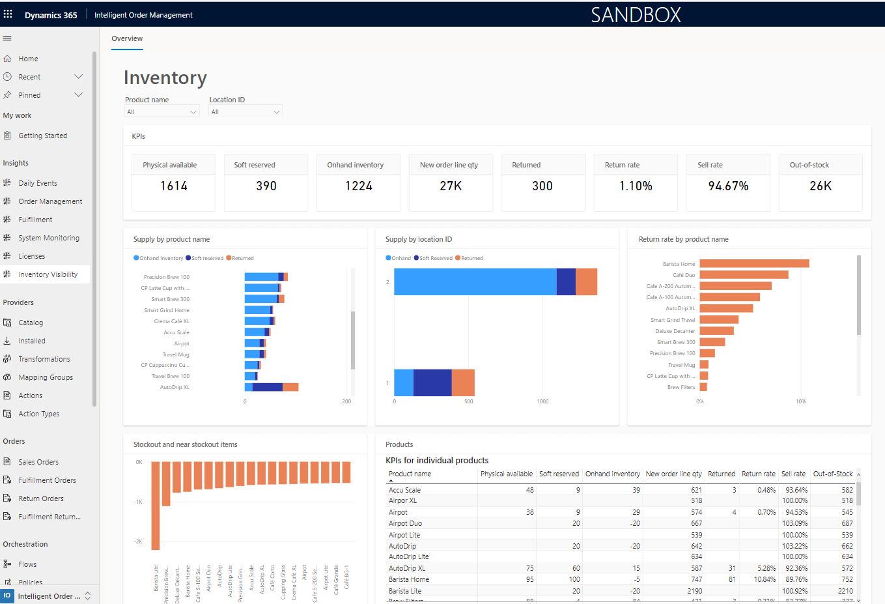

# Inventory dashboards

[!include [banner](includes/banner.md)]

This topic provides an overview of inventory-related dashboards in Microsoft Dynamics 365 Intelligent Order Management.

Inventory management is one of the most expensive parts of the order management process. Intelligent Order Management's inventory dashboards provide visibility into the items that your business has in stock versus the demand for those items. It also provides other relevant key performance indicators (KPIs) that can help you lower costs.

The following illustration shows an example of an inventory dashboard in Intelligent Order Management.

## Prerequisites and setup

To view inventory dashboards for your Intelligent Order Management organization, you must first ensure that your organization's Intelligent Order Management build version is 1.0.0.4354 or later.

Dashboards can provide useful information only if your Intelligent Order Management organization is configured to use the Inventory Visibility service. For more information, see [Inventory Visibility Add-in overview](/dynamics365/supply-chain/inventory/inventory-visibility).

To configure the Inventory Visibility service for your Intelligent Order Management organization, follow these steps.

1. In Intelligent Order Management for your organization, at the bottom of the left navigation pane, select the area switcher, and then select **settings**.
1. Under **Inventory visibility**, go to the **Index and reservation** section.
1. On the **Feature management** tab on the right side, turn on the **OnHandMostSpecificBackgroundService** option. This setting ensures that data flows from the Inventory Visibility service into Intelligent Order Management, so that it can be consumed by the dashboard. Note that turning this flag off after the dashboard is functional, will cause the dashboard displaying incorrect information as the data is picked up from the time the flag is turned on and won't consider the prior data before the flag was turned off.

    Next, you must enable Microsoft Power BI Insights.

1. In the left navigation pane, select **Power BI Insights**.
1. Select **Manage**, set the status to **Enabled**, and then select **Save & Close**.

## Visualizations

This section provides information about the visualizations that inventory dashboards provide: filters, KPIs, charts, and tables.

### Filters

Two interactive dashboard filters are provided out of the box: **Product name** and **Location ID**. These filters are useful when you must drill down on one or more products or locations. They refine your data so that the KPIs and charts reflect the selected products or locations.

#### Product name

Product name information flows into the inventory dashboard from the **Products** section of Intelligent Order Management. The **Products** section contains data for all products that sales orders can be created for and inventory can be recorded for.

#### Location ID

Location ID information flows into the inventory dashboard from the inventory dashboard configuration page.

### KPIs

- **Physical available** – The value is the sum of all units that are physically available in the warehouse. It includes items that are "soft reserved." The value of this KPI is updated whenever inventory data is uploaded into the system. When items are shipped out of warehouses, the number of those items is deducted from the KPI value.
- **Soft reserved** – After fulfillment optimization occurs and the warehouses for sales orders are determined, the appropriate items in that warehouse are soft reserved. When items are soft reserved, the number of those items is added to the value of this KPI, to ensure that the same items aren't double booked against two different orders. After soft-reserved items are shipped, the number of those items is deducted from the KPI value.
- **Onhand inventory** – The value shows the number of units that are available when the warehouse source for sales orders is evaluated. It's calculated by subtracting the **Soft reserved** KPI value from the **Physical available** KPI value. When a fulfillment optimization runs, the **Onhand inventory** KPI value is the inventory value that is considered.
- **New order line qty** – The value is the total number of product units that are in demand. It's calculated by adding the quantity value of all order lines that are in a new state.
- **Returned** – The value is the number of product units that have been returned to the warehouse after they were sold to customers.
- **Return rate** – The value is the return rate of product units that have been returned to the warehouse after they were sold to customers. It's calculated as (*Units returned* &divide; *Units sold*) &times; 100.
- **Sell rate** – The value is the rate at which items are sold to customers. It's calculated as (*Units sold* – *Units returned*) &divide; (*Units in stock* + *Units sold*) &times; 100.
- **Out-of-stock** – The value is the number of units of products that must be replenished to fulfill demand. It's calculated as *Units in supply* – *Units in demand*.

### Charts

- **Supply by product name** – This stacked bar chart shows a breakdown of the inventory supply by product name. It shows the distribution of on-hand, soft-reserved, and returned quantities of the product. Each bar total represents the **Physical available** KPI for the product.
- **Supply by location ID** – This stacked bar chart shows a breakdown of the inventory supply by location. It shows the distribution of on-hand, soft-reserved, and returned quantities of the product. Each bar total represents the **Physical available** KPI for the location.
- **Return rate by product name** – This bar chart shows the rate of return broken down by product name.
- **Stockout and near stockout item** – This chart shows the number of product units that are understocked or that are nearing an understocked state in comparison to demand. The bars below the zero line represent understocked products, and the value on each bar represents the number of units of the corresponding product that are in deficit. The bars above the zero line represent products that are nearing an understocked state, and the value on each bar represents the number of units of the corresponding product that will remain after the current demand is satisfied.

### Table

- **Products** – This table represents all products and their individual KPIs, as described in the [KPIs](#kpis) section.

## Frequently asked questions

### After setup, how long does it take for the dashboard to provide useful information about the organization?

After the initial setup, it can take up to 24 hours for the reports to be provisioned. If it takes longer than 24 hours, contact Microsoft Support for help.

### Does the inventory dashboard represent data in real time?

Currently, the inventory dashboard is more suitable as a daily report that can be used to assess the health of a business's inventory than as a real-time representation of inventory information. You can expect 4 to 10 hours of latency for the information that flows into the inventory dashboard. A feature that provides real-time information on the inventory dashboard is planned for an upcoming release.

### Can I view data for specific products that I care about?

Yes. There are **Product name** and **Location ID** filters that you can use to refine the product data that is represented in the KPIs and charts.

### Can I sort the data differently than what is available out of the box?

Yes. When you hover on a chart, a vertical ellipsis appears in the upper-right corner. To resort the data, select the ellipsis, select **Sort axis**, and then select the option that you want.

### Can I modify the KPIs that the dashboard provides?

Currently, only the KPIs that are described in the [KPIs](#kpis) section are available. Market research showed that these KPIs are the most useful for most businesses. If you have suggestions for new KPIs or charts, or changes to the existing KPIs and charts, contact the team at <D365OMS@microsoft.com>.

### I'm unsure how some of these KPIs are being calculated. How do I get more information?

The [KPIs](#kpis) section describes how these KPIs are calculated. You can also hover on an inventory dashboard KPI number (not the KPI name) to open a tooltip that describes how that KPI is being calculated.

### Can I look for historical information of the inventory?

All data that is shown on the inventory dashboard is a current representation of the inventory system. (However, keep in mind that there are 4 to 10 hours of latency.) The ability to view previous states of the inventory system isn't currently supported.

### Can I use the inventory dashboard if Intelligent Order Management is connected to  dynamics supply chain management?

No. Currently the dashboard is only supported for IV datasource, which means this can't be used when your inventory is managed within dynamics supply chain management.

