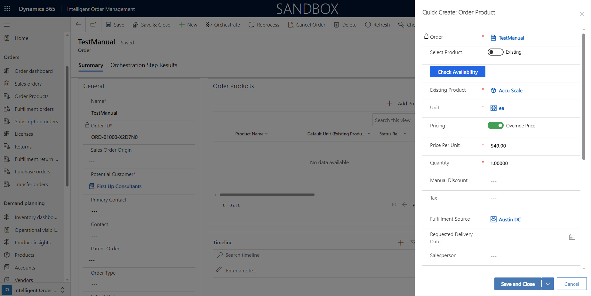

# Inventory operations visibility

[!include [banner](includes/banner.md)]

This article describes inventory operations visibility in Microsoft Dynamics 365 Intelligent Order Management.

Inventory operations visibility is a key feature of Intelligent Order Management that enables end-to-end visibility of inventory across your organizational units. Having full visibility enables you to prepare for the unexpected and helps you make better business decisions.

Three primary benefits can be attained with inventory operational visibility:

- Optimized stock levels
- Reduced supply chain costs
- Improved decision making

To provide customers with these benefits, Intelligent Order Management has introduced near real-time inventory query screens that can be used across different areas of the application. These inventory query screens are updated with information from your source system, which is a fundamental tenet of heterogeneous supply chain systems.

> [!NOTE]
> Intelligent Order Management query screens are intelligent and can automatically detect an enabled instance of Dynamics 365. Inventory query screen use Dynamics 365 Finance inventory capabilities for querying and highlighting product availability. If available-to-promise inventory capabilities are enabled, then an inventory query screen can also query incoming availability from Dynamics 365 Finance.

## How to access the inventory query screen

You can access the inventory query screen from multiple areas for different scenarios. The following use cases highlight some of the methods.

### Use case #1: An inventory planner wants operational visibility

To obtain operational visibility, the inventory planner would follow these steps.

1. In the left navigation pane, select **Demand planning \> Operational visibility**. On the **Onhand Query** page that appears, the left half of the screen is for queries and the right side displays the results.
1. The **Organization ID** value will be automatically populated with the Dataverse organization ID when using Intelligent Order Management without Supply Chain Management. You must enter the **Company ID** value in the **Organization ID** field when dual-write is enabled in Dynamics 365 Finance.
1. Enter values for the following mandatory fields:
   1. **Site ID**.
   1. **Location ID**. Use the **Warehouse ID** associated with a store or warehouse.
1. For **Product ID**, enter the product ID you want to search for. Use the ID associated with product name in the product master.
1. If you've uploaded your demand and supply view using [Dynamics 365 Inventory Services](/dynamics365/supply-chain/inventory/inventory-visibility-available-to-promise), select the **Query ATP** checkbox. 
1. Select **Query**. Query results appear on the right side of the page.
1. To hide the query section of the screen and just display the results, on the top right of the screen, select **Combo \> Hide search criteria**.

The following screenshot shows an example query result.

  
### Use case #2: A customer representative wants to view availability from the Products screen

To view availability from the **Products** screen, the customer representative would follow these steps.

1. In the left navigation pane, select **Demand planning \> Products**.
1. Select a product, and then select **View**.
1. On the upper menu bar, select **View Availability**. The **Onhand Query** page appears with the **Organization ID** and **Product ID** values automatically populated. The **Organization ID** field is populated with the Dataverse organization ID for Dynamics 365 Intelligent Order Management. You must enter the **Company ID** value in the **Organization ID** field when dual-write is enabled in Dynamics 365 Finance.
1. Enter values for the following mandatory fields:
    1. **Site ID**   
    1. **Location ID**. Use the **Warehouse ID** associated with a store or warehouse.
1. If you've uploaded your demand and supply view using [Dynamics 365 Inventory Services](/dynamics365/supply-chain/inventory/inventory-visibility-available-to-promise), select the **Query ATP** checkbox. 
1. Select **Query**. Query results appear on the right side of the page.
1. To hide the query section of the screen and just display the results, on the top right of the screen, select **Combo \> Hide search criteria**.

### Use case #3: A customer representative wants to view availability from the Order Products screen

To view availability from the **Order Products** screen, the customer representative would follow these steps.

1. In the left navigation pane, select **Orders \> Sales Orders**.
1. Select  **New** to create a new order.
1. Enter the order details, and then select **Save** to save the order header.
1. Go to **Order \> Order Products**, and then select **+ Add Products**. The **Quick Create: Order Product** flyout menu appears on the right.
    
1. Set the **Select Product** toggle to **Existing** or **Write-in**, and then select or add the product.
1. Add the **Unit** value.
1. Select **Check Availability**. The **Onhand Query** page appears with the **Organization ID** and **Product ID** values automatically populated. The **Organization ID** field is populated with the Dataverse organization ID for Dynamics 365 Intelligent Order Management. You must enter the **Company ID** value in the **Organization ID** field when dual-write is enabled in Dynamics 365 Finance. If you've entered the **Fulfillment Source**, the query screen will also have the **Location ID** value populated.
    
1. Enter the **Site ID** value.
1. Check the **Query ATP** selection in case you've uploaded your demand and supply view using [Dynamics 365 Inventory Services.](/dynamics365/supply-chain/inventory/inventory-visibility-available-to-promise)
1. Select **Query**. Query results appear on the right side of the page.
1. To hide the query section of the screen and just display the results, on the top right of the screen, select **Combo \> Hide search criteria**.
1. Review the availability. When done, select **Save** on the **Order Products** form.

Query results are displayed based on the physical and calculated measures that are configured as part of inventory configuration.
