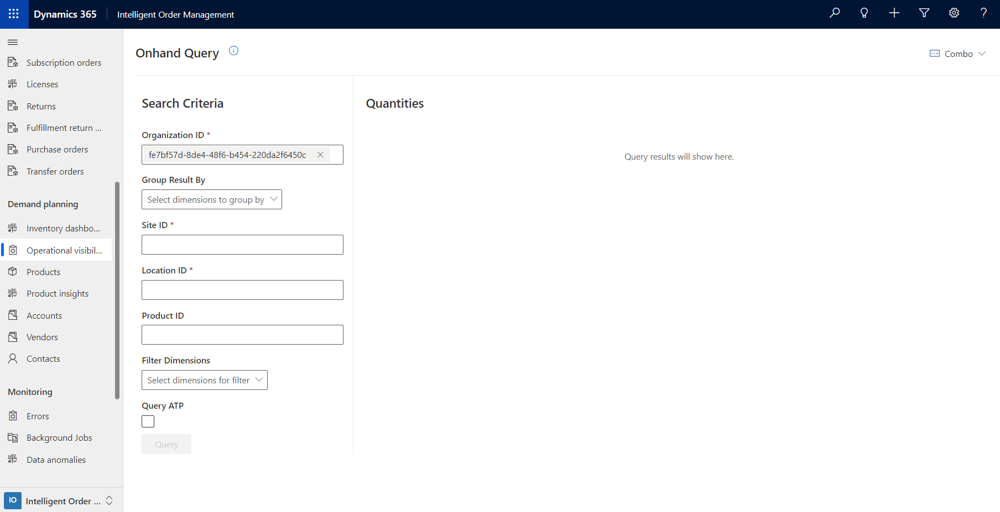
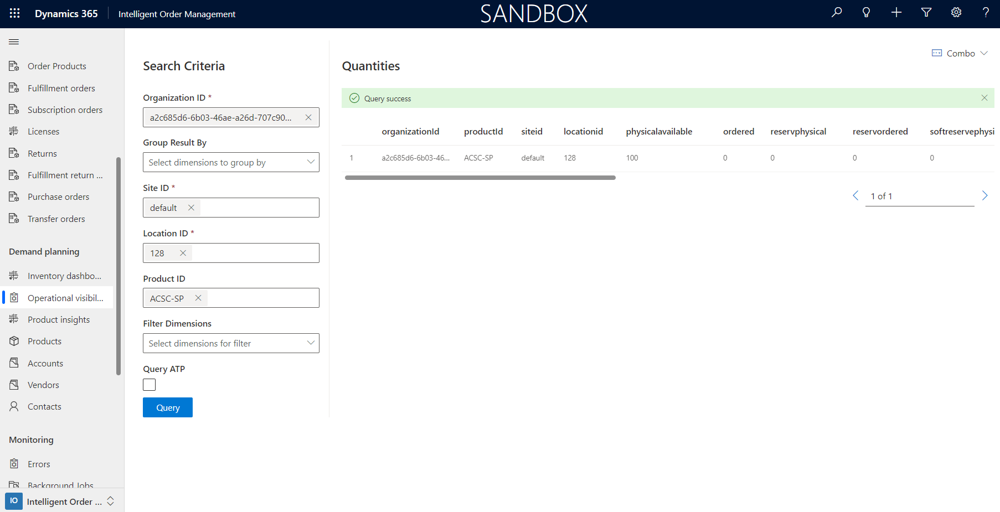
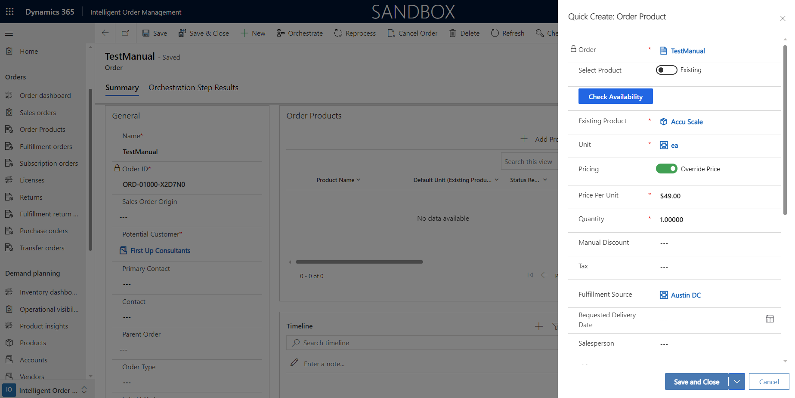
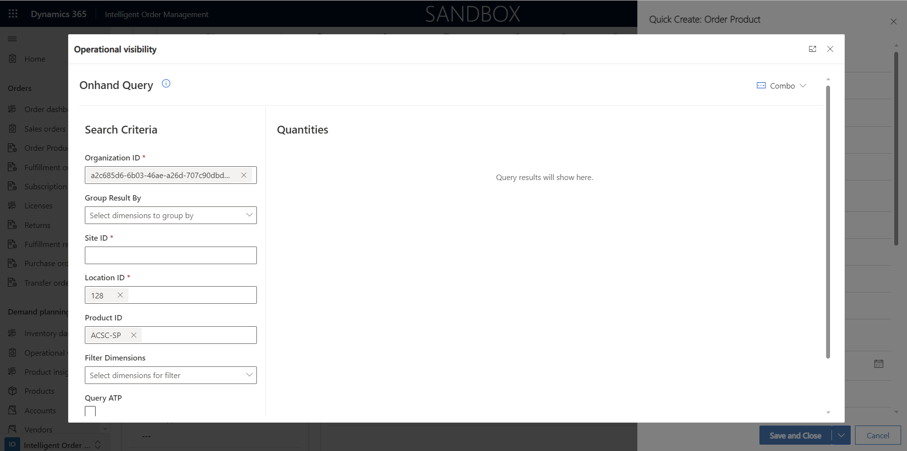

# Inventory operations visibility

[!include [banner](includes/banner.md)]
[!include [banner](includes/preview-banner.md)]

This article describes inventory operations visibility in Microsoft Dynamics 365 Intelligent Order Management.

Inventory operations visibility is a key feature of Intelligent Order Management that enables end-to-end visibility into inventory across your organizational units. This full visibility helps you prepare for the unexpected and make better business decisions.

Inventory operational visibility has three primary benefits:

- Optimized stock levels
- Reduced supply chain costs
- Improved decision making

To provide these benefits to customers, Intelligent Order Management has introduced near-real-time inventory query pages that can be used across different areas of the application. These inventory query pages are updated with information from your source system. In this way, they follow a fundamental principle of heterogeneous supply chain systems.

> [!NOTE]
> Query pages in Intelligent Order Management can automatically detect an enabled instance of Dynamics 365. Inventory query pages use inventory capabilities in Dynamics 365 Finance to query and highlight product availability. If available-to-promise (ATP) inventory capabilities are enabled, an inventory query page can also query incoming availability from Finance.

## Access inventory query pages

You can access inventory query pages from multiple areas for different scenarios. The following use cases highlight some of the methods.

### Use case 1: An inventory planner wants operational visibility

To get operational visibility, an inventory planner will follow these steps.

1. In the left navigation pane, under **Demand planning**, select **Operational visibility**. The **Onhand Query** page appears. Queries are defined on the left side of the page, and the results appear on the right side.
1. If you're using Intelligent Order Management without Dynamics 365 Supply Chain Management, the **Organization ID** field is automatically set to the Dataverse organization ID. If dual-write is enabled in Finance, you must enter the **Company ID** value in this field.
1. Set the following mandatory fields:

    - **Site ID**
    - **Location ID** – Enter the **Warehouse ID** value that is associated with a store or warehouse.

1. In the **Product ID** field, enter the product ID to search for. Use the ID that is associated with the product name in the product master.
1. If you've uploaded your demand and supply view by using [Dynamics 365 Inventory Services](/dynamics365/supply-chain/inventory/inventory-visibility-available-to-promise), select the **Query ATP** checkbox.
1. Select **Query**. Query results appear on the right side of the page.
1. To hide the query section of the page and show only the results, select **Combo \> Hide search criteria** in the upper right.

The following illustration shows an example of the query results for this use case.

### Use case 2: A customer representative wants to view availability from the Products page

To view availability from the **Products** page, a customer representative will follow these steps.

1. In the left navigation pane, under **Demand planning**, select **Products**.
1. Select a product, and then select **View**.
1. On the upper toolbar, select **View Availability**. The **Onhand Query** page appears. The **Organization ID** and **Product ID** fields are automatically set.
1. By default, the **Organization ID** field is set to the Dataverse organization ID for Intelligent Order Management. If dual-write is enabled in Finance, you must enter the **Company ID** value in this field.
1. Set the following mandatory fields:

    - **Site ID**
    - **Location ID** – Enter the **Warehouse ID** value that is associated with a store or warehouse.

1. If you've uploaded your demand and supply view by using [Dynamics 365 Inventory Services](/dynamics365/supply-chain/inventory/inventory-visibility-available-to-promise), select the **Query ATP** checkbox.
1. Select **Query**. Query results appear on the right side of the page.
1. To hide the query section of the page and show only the results, select **Combo \> Hide search criteria** in the upper right.

### Use case 3: A customer representative wants to view availability from the Order Products page

To view availability from the **Order Products** page, a customer representative will follow these steps.

1. In the left navigation pane, under **Orders**, select **Sales Orders**.
1. Select **New** to create an order.
1. Enter the order details, and then select **Save** to save the order header.
1. In the left navigation pane, under **Orders**, select **Order Products**.
1. Select **Add Products**. The **Quick Create: Order Product** dialog box appears.

    

1. Set the **Select Product** option to **Existing** or **Write-in**, and then select or add the product.
1. Add the **Unit** value.
1. Select **Check Availability**. The **Onhand Query** page appears. The **Organization ID** and **Product ID** fields are automatically set. If you've entered the **Fulfillment Source** value, the **Location ID** field is also automatically set.

    

1. By default, the **Organization ID** field is set to the Dataverse organization ID for Intelligent Order Management. If dual-write is enabled in Finance, you must enter the **Company ID** value in this field.
1. Set the **Site ID** field.
1. If you've uploaded your demand and supply view by using [Dynamics 365 Inventory Services](/dynamics365/supply-chain/inventory/inventory-visibility-available-to-promise), select the **Query ATP** checkbox.
1. Select **Query**. Query results appear on the right side of the page.
1. To hide the query section of the page and show only the results, select **Combo \> Hide search criteria** in the upper right.
1. Review the availability. When you've finished, select **Save** on the **Order Products** page.

Query results that are shown are based on the physical and calculated measures that are configured as part of inventory configuration.
