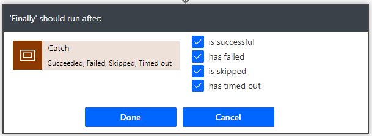

# Create fulfillment provider

[!include [banner](includes/banner.md)]

This topic describes the steps required to create a fulfillment provider in Microsoft Dynamics 365 Intelligent Order Management.

## Create new provider definition

To create new provider definition, follow these steps.

1. Go to **Providers \> Catalog**.
1. Select **New Provider Definition**.
1. For **Display Name**, enter "IOMLabFulfillmentProvider".
1. For **Logical Name**, enter "msdyn_IOMLabFulfillmentProvider".
1. For **Description**, enter "IOM lab fulfillment provider".
1. For **Logo**, select "IOMLab.png".
1. For **Service Type**, enter "Fulfillment".
1. Select **Save and close**.

## Add provider definition to solution

To add a provider definition to the solution, follow these steps.

1. Go to the [Power App Maker portal](https://make.powerapps.com) and navigate to the newly-created solution **IOMLabProviders**.
1. Select **Add existing \> IOM Provider Definition**.
1. Select **IOMLabFulfillmentProvider** and then select **Add** to add it to the solution. 

## Create provider action to send a fulfillment payload to Outlook

To create a provider action to send a fulfillment payload to Outlook, follow these steps.

1. Go to the [Power App Maker portal](https://make.powerapps.com) and navigate to **Solutions**.
1. Open the **Default Solution**.
1. Select **New**.
1. Select **Cloud Flow**, and then name it "IOM Lab Send To Fulfillment (Outlook)".
1. Select the trigger type as **Manually trigger a flow** and then do the following:
    1. Select **Add an input**, select **Text**, and then enter "ProviderActionExecutionEventId" in the first field.
    1. Select **Add an input**, select **Text**, and then enter "EntityRecordId" in the first field.

    
1. Create a variable initialization action:
    - For **Name**, enter "ExecutionResult".
    - For **Type**, select **Boolean**.
    - For **Value**, enter "true".  
1. Create a second variable initialization action:
    - For **Name**, enter "ProcessedSaleOrderLines".
    - For **Type**, select **Array**.
1. Create a third variable initialization action:
    - For **Name**, enter "ProcessedFulfillmentOrderLines".
    - For **Type**, select **Array**.

    
1. Add a **Try** scope.
1. Within the **Try** scope, add a "perform an unbound action" action as follows:
    - **ProviderActionExecutionEventId**: Under **Dynamic content**, select **ProviderActionExecutionEventId**.
    - **PowerAutomateRunId**: Specify the following as an expression: `workflow()['run']?['name']`.

    
1. Add a **Get a row by ID** action and then do the following:
    - For **Table name**, enter "Fulfillment Orders".
    - For **Row ID**, select **EntityRecordId** under **Dynamic content**.

    
1. Add a **Send an email** action from the Outlook.com connector, as follows. There are couple of email connectors, make sure to select Outlook.com since that's the connection set up earlier.
    - On the **To** line, "placeholder@placeholder.com” is used as placeholder text. This will be replaced by a provider parameter in later steps.
    - On the **Subject** line, "name" is obtained from the **Get fulfillment order** step under **Dynamic content**.
    - For **Body**, specify the following as an expression: `outputs('Get_fulfillment_order')['body']`

        
1. Add a **List rows** action as follows:
    - For **Table name**, enter "Fulfillment Order Products".
    - For **Fetch Xml query** enter the following: </br>

    ```XML
    <fetch>  
      <entity name="msdyn_fulfillmentorderdetail">  
       <all-attributes />
   	     <filter>
         <condition attribute="msdyn_fulfillmentid" operator="eq" value="@{triggerBody()['text_1']}"/>
         </filter>
      </entity>  
    </fetch>
    ```

    
1. Add an **Apply to each** control with a **Send an email** action as follows:   
    - **value** is obtained from the **Get fulfillment order line** step under **Dynamic content**. 
    - **name** is obtained from the **Get fulfillment order line** step under **Dynamic content**. 
    - **Current item** is selected from under **Dynamic content**.

    
1. Within the loop, add an **Append to array variable** action as follows:
    - For **Name**, enter "ProcessedFulfillmentOrderLines".
    - For **Value**, select **Fulfillment line ID** from under **Dynamic content**. 

    
1. Within the loop, add another **Append to array variable** action as follows:
    - For **Name**, enter "ProcessedSalesOrderLines".
    - For **Value**, select **Sales line ID** from under **Dynamic content**.

    
1. Collapse the **Try** scope by selecting its title bar. 
1. Select **New step** and add another scope named "Catch".
1. On the **Catch** scope, select the ellipsis ("**...**"), select **Configure run after**, and configure as follows:
    - Select the **has failed** checkbox.
    - Select the **has timed out** checkbox.

    
1. In the **Catch** scope, select **Add an action** and add a **Set variable** action, and rename it "Set the execution result to failed".
1. Configure the properties as follows:
    - For **Name**, enter "ExecutionResult".
    - For **Value**, enter "false".

    
1. Select **New step**, and add another scope named "Finally".
1. On the **Finally** scope, select the ellipsis ("**...**"),  select **Configure run after**, and configure as follows:
    - Select the **is successful** checkbox.
    - Select the **has timed out** checkbox.
    - Select the **is skipped** checkbox.
    - Select the **has timed out** checkbox.

    
1. In the **Finally** scope, add a "condition" step and compare the **ExecutionResult** variable to true as follows:
    - In the first field, select the **ExecutionResult** variable.
    - In the second field, select **is equal to**.
    - In the third field, select **true**.

    
1. In the **If yes** branch, add a **Run a child flow** action and rename it "Raise Business Events for processed fulfillment order lines".
1. Configure the properties as follows:
    - For **Child flow**, enter "IOM Raise Business Event".
    - For **BusinessEventDefinitionId**, enter "063d85c8-60a4-eb11-9443-000d3a313675".
    - For **EntityRecordId**, specify the following as expressions: `string(variables('ProcessedFulfillmentOrderLines'))`

    
1. In the **If yes** branch, add another **Run a child flow** action and rename it "Raise Sales Order Aggregated Events".
1. Configure the properties as follows:
   - For **LineBusinessEventDefinitionId**, enter "ccf64002-61a4-eb11-9443-000d3a313675".
   - For **LineRecordId**, specify the following as an expression: `string(variables('ProcessedSalesOrderLines'))`.
   - For **OrderBusinessEventDefinitionId**, enter "48688716-61a4-eb11-9443-000d3a313675".

    
1. Collapse the condition step.  
1. Add a **Perform an unbound action** action as follows:
    - For **Action name**, enter "msdyn_CompleteProviderActionExecution".
    - For **ExecutionResult**, select the **ExecutionResult** variable from under **Dynamic content**.
    - For **ProviderActionExecutionEventId**, select **ProviderActionExecutionEventId** from under **Dynamic content**.

    
1. Select **Save**.

## Add a provider definition logic definition to the Outlook provider definition

To add a provider definition logic definition to the Outlook provider definition, follow these steps.

1. Go to **Providers \> Catalog**.
1. Select the newly-created **IOMLabFulfillmentProvider**.
1. Select **Edit** on the menu bar. 
1. Select the **Logic definitions** tab.
1. Select **+ New IOM Provider Definition Logic Definition**.
1. For **Display Name**, enter "IOM Lab Send to Fulfillment (Outlook)".
1. For **Logical Name**, enter "msdyn_LabSentToFulfillmentOutlook".
1. For **Provider Definition**, enter "IOMLabFulfillmentProvider".
1. For **Logic Type**, enter "Provider Action".
1. For **Workflow Name**, enter "IOM Lab Send to Fulfillment (Outlook)".
1. For **Timeout Minutes**, enter "2".
1. For **Max Retry Attempts**, enter "3".
1. For **Description**, enter "IOM Lab Send to Fulfillment (Outlook)".
1. For **Action Type**, enter "Send to Fulfillment".
1. Select **Save**. This will generate a JSON representation of the message handler cloud flow and populate the **Client Data** field.
1. Replace the placeholder email with provider parameter as follows:
    1. Copy the text block in the **Client Data** field and paste it into Notepad. 
    1. In the text block, find "placeholder@placeholder.com" and replace it with "{{IOMLabOutboundFulfillmentEmail}}".
    1. Copy the modified text block back into the **Client Data** field.
    1. Select **Save and close**.
1. Select **Connections**. You should see both the **Microsoft Dataverse** and **Outlook.com** connection reference definitions listed.

## Add pa provider definition logic definition to the Outlook IOMLabProviders solution

To add a provider definition logic definition to the Outlook IOMLabProviders solution, follow these steps.

1. Go to the [Power App Maker portal](https://make.powerapps.com) and navigate to the newly-created solution **IOMLabProviders**.
1. Select **Add existing \> IOM Provider Definition Logic Definition**.
1. Select **IOM Lab Send To Fulfillment (Outlook)** and then select **Add** to add it to the solution. 

## Add provider definition connection references to IOMLabProviders solution

To add provider definition connection references to the IOMLabProviders solution, follow these steps.

1. Go to the [Power App Maker portal](https://make.powerapps.com) and navigate to the newly-created solution **IOMLabProviders**.
1. Select **Add existing \> IOM Provider Definition Connection Reference**.
1. Select both the **Microsoft Dataverse** and **Outlook.com** provider definition connection references, and then select **Add** to add them to the solution. 

## Create a provider action to send a fulfillment payload to RequestBin

To create a provider action to send a fulfillment payload to RequestBin, follow these steps.

1. Go to the [Power App Maker portal](https://make.powerapps.com) and navigate to **Solutions**.
1. Open the **Default Solution**.
1. Select **New**.
1. Select **Cloud Flow**, and then name it "IOM Lab Send To Fulfillment (RequestBin)".
1. Select the trigger type as **Manually trigger a flow** and then do the following:
    1. Select **Add an input**, select **Text**, and then enter "ProviderActionExecutionEventId" in the first field.
    1. Select **Add an input**, select **Text**, and then enter "EntityRecordId" in the first field.

    
1. Create a variable initialization action:
    - For **Name**, enter "ExecutionResult".
    - For **Type**, select **Boolean**.
    - For **Value**, enter "true".  
1. Create a second variable initialization action:
    - For **Name**, enter "ProcessedSaleOrderLines".
    - For **Type**, select **Array**.
1. Create a third variable initialization action:
    - For **Name**, enter "ProcessedFulfillmentOrderLines".
    - For **Type**, select **Array**.

    
1. Add a **Try** scope.
1. Within the **Try** scope, add a **Perform an unbound action** action as follows:
    - **ProviderActionExecutionEventId**: Under **Dynamic content**, select **ProviderActionExecutionEventId**.
    - **PowerAutomateRunId**: Specify the following as an expression: `workflow()['run']?['name']`.

    
1. Add a **Get a row by ID** action and configure it as follows:
    - For **Table name**, enter "Fulfillment Orders".
    - For **Row ID**, select **EntityRecordId** under **Dynamic content**.

    
1. Add a **Create fulfillment order** action from the RequestBin connector, as follows. 
    - For **Body**, select **body** from under **Dynamic content**.

    
1. Add a **List rows** action as follows:
    - For **Table name**, enter "Fulfillment Order Products".
    - For **Fetch Xml query** enter the following: </br>

    ```XML
    <fetch>  
      <entity name="msdyn_fulfillmentorderdetail">  
       <all-attributes />
   	     <filter>
         <condition attribute="msdyn_fulfillmentid" operator="eq" value="@{triggerBody()['text_1']}"/>
         </filter>
      </entity>  
    </fetch>
    ```

    
1. Add an "Apply to each" control with a **Create fulfillment order lines** action from the RequestBin connection as follows:
    - **value** is obtained from the **Get fulfillment order line** step under **Dynamic content**. 
    - **Current item** is selected from under **Dynamic content**.
1. Within the loop, add an **Append to array variable** action as follows:
    - For **Name**, enter "ProcessedFulfillmentOrderLines".
    - For **Value**, select **Fulfillment line ID** from under **Dynamic content**. 
1. Within the loop, add another **Append to array variable** action as follows:
    - For **Name**, enter "ProcessedSalesOrderLines".
    - For **Value**, select **Sales line ID** from under **Dynamic content**.
1. Collapse the **Try** scope by selecting its title bar. 
1. Select **New step** and add another scope renamed "Catch".
1. On the **Catch** scope, select the ellipsis ("**...**"), select **Configure run after**, and configure as follows:
    - Select the **has failed** checkbox.
    - Select the **has timed out** checkbox.
1. In the **Catch** scope, select **Add an action** and add a **Set variable** action, and rename it "Set the execution result to failed".
1. Configure the properties as follows:
    - For **Name**, enter "ExecutionResult".
    - For **Value**, enter "false".
1. Select **New step**, and add another scope renamed "Finally".
1. On the **Finally** scope, select the ellipsis ("**...**"),  select **Configure run after**, and configure as follows:
    - Select the **is successful** checkbox.
    - Select the **has timed out** checkbox.
    - Select the **is skipped** checkbox.
    - Select the **has timed out** checkbox.
1. In the **Finally** scope, add a "condition" step and compare the **ExecutionResult** variable to "true" as follows:
    - In the first field, select the **ExecutionResult** variable.
    - In the second field, select **is equal to**.
    - In the third field, select **true**.
1. In the **If yes** branch, add a **Run a child flow** action and rename it "Raise Business Events for processed fulfillment order lines".
1. Configure the properties as follows:
    - For **Child flow**, enter "IOM Raise Business Event".
    - For **BusinessEventDefinitionId**, enter "063d85c8-60a4-eb11-9443-000d3a313675".
    - For **EntityRecordId**, specify the following as expressions: `string(variables('ProcessedFulfillmentOrderLines'))`
1. In the **If yes** branch, add another **Run a child flow** action and rename it "Raise Sales Order Aggregated Events".
1. Configure the properties as follows:
   - For **LineBusinessEventDefinitionId**, enter "ccf64002-61a4-eb11-9443-000d3a313675".
   - For **LineRecordId**, specify the following as an expression: `string(variables('ProcessedSalesOrderLines'))`.
   - For **OrderBusinessEventDefinitionId**, enter "48688716-61a4-eb11-9443-000d3a313675".
1. Collapse the condition step.  
1. Add a **Perform an unbound action** action as follows:
    - For **Action name**, enter "msdyn_CompleteProviderActionExecution".
    - For **ExecutionResult**, select the **ExecutionResult** variable from under **Dynamic content**.
    - For **ProviderActionExecutionEventId**, select **ProviderActionExecutionEventId** from under **Dynamic content**.
1. Select **Save**.

## Add provider definition logic definition to the provider definition (RequestBin)

To add a provider definition logic definition to the RequestBin provider definition, follow these steps.

1. Go to **Providers \> Catalog**.
1. Select the newly-created **IOMLabFulfillmentProvider**.
1. Select **Edit** on the menu bar. 
1. Select the **Logic definitions** tab.
1. Select **+ New IOM Provider Definition Logic Definition**.
1. For **Display Name**, enter "IOM Lab Send to Fulfillment (RequestBin)".
1. For **Logical Name**, enter "msdyn_LabSentToFulfillmentRequestBin".
1. For **Provider Definition**, enter "IOMLabFulfillmentProvider".
1. For **Logic Type**, enter "Provider Action".
1. For **Workflow Name**, enter "IOM Lab Send to Fulfillment (RequestBin)".
1. For **Timeout Minutes**, enter "2".
1. For **Max Retry Attempts**, enter "3".
1. For **Description**, enter "IOM Lab Send to Fulfillment (RequestBin)".
1. For **Action Type**, enter "Send to Fulfillment".
1. Select **Save**. This will generate a JSON representation of the message handler cloud flow and populate the **Client Data** field.
1. Select **Save and close**.
1. Select **Connections**. You should see the **Microsoft Dataverse**, **Outlook.com**, and **RequestBin** connection reference definitions listed.

## Add provider definition parameter to the provider definition

To add a provider definition parameter to the provider definition, follow these steps.

1. Select **Parameters**. 
1. Select **+ New IOM Provider Definition Parameter**.
1. For **Display Name**, enter "IOMLAbOutboundFulfillmentEmail".
1. For **Data Type**, enter "Text".
1. For **Provider Definition**, enter "IOMLabFulfillmentProvider".
1. For **Key**, enter "IOMLabOutboundFulfillmentEmail".
1. For **Logical Name**, enter "msdyn_IOMLabOutboundFulfillmentEmail".
1. For **Is Required**, enter "Yes".
1. Select **Save and close**.

## Add provider definition logic definition to IOMLabProviders solution (RequestBin)

To add a provider definition logic definition to the RequestBin IOMLabProviders solution, follow these steps.

1. Go to the [Power App Maker portal](https://make.powerapps.com) and navigate to the newly-created solution **IOMLabProviders**.
1. Select **Add existing \> IOM Provider Definition Logic Definition**.
1. Select **IOM Lab Send To Fulfillment (RequestBin)** and then select **Add** to add it to the solution. 

## Add provider definition connection reference to IOMLabProviders solution

To add a provider definition connection reference to the IOMLabProviders solution, follow these steps.

1. Go to the [Power App Maker portal](https://make.powerapps.com) and navigate to the newly-created solution **IOMLabProviders**.
1. Select **Add existing \> IOM Provider Definition Connection Reference**.
1. Select **RequestBin** and then select **Add** to add it to the solution.

## Add provider definition parameter to IOMLabProviders solution

To add a provider definition parameter to the IOMLabProviders solution, follow these steps.

1. Go to the [Power App Maker portal](https://make.powerapps.com) and navigate to the newly-created solution **IOMLabProviders**.
1. Select **Add existing \> IOM Provider Definition Parameter**.
1. Select **IOMLabOutboundFulfillmentEmail** and then select **Add** to add it to the solution.

Next quick start lab step: [Export provider solution](lab-export-provider-solution.md)
