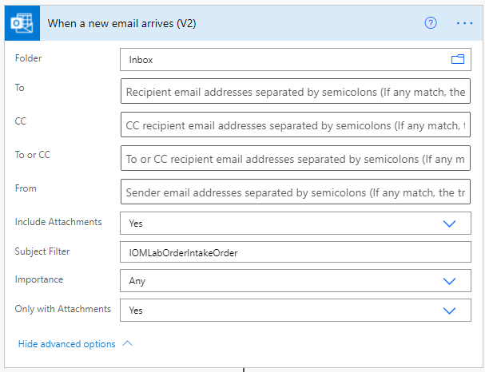
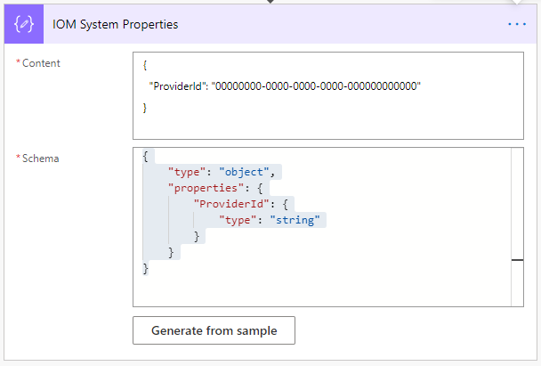

# Create intake provider

[!include [banner](includes/banner.md)]

This topic describes the steps required to create an intake provider in Microsoft Dynamics 365 Intelligent Order Management.

## Create new provider definition

To create new provider definition, follow these steps.

1. Go to **Providers \> Catalog**.
1. Select **New Provider Definition**.
1. For **Display Name**, enter "IOMLabOrderIntakeProvider".
1. For **Logical Name**, enter "msdyn_IOMLabOrderIntakeProvider".
1. For **Logo**, select "IOMLab.png".
1. For **Service Type**, enter "Order intake".
1. For **Description**, enter "IOM lab order intake provider".
1. Select **Save & close**.

## Add provider definition to solution

To add a provider definition to a solution, follow these steps.

1. Go to the [Power App Maker portal](https://make.powerapps.com) and navigate to the newly-created solution **IOMLabProviders**.
1. Select **Add existing \> IOM Provider Definition**.
1. Select **IOMLabOrderIntakeProvider**, and then select **Add** to add it to the solution. 

## Add transformation to the provider definition

To add a transformation to the provider definition, follow these steps.

1. Go to **Providers \> Catalog**.
1. Select the newly-created **IOMLabOrderIntakeProvider**.
1. Select **Edit** on the menu bar. 
1. Select the **Transformations** tab.
1. Select **+ New IOM Provider Definition Transformation**.
1. For **Display Name**, enter "IOMLab Order to Dataverse Order". 
1. For **Logical Name**, enter "msdyn_IOMLabOrderIntake_Order".
1. For **Provider Definition**, enter or select **IOMLabOrderIntakeProvider**.
1. For **Source Object Name**, enter "IOMLabOrderIntakeProvider".
1. For **Destination Object Name**, enter "Dataverse Order".
1. For **Transformation**, paste in the following M query code:
```M
shared ImportMappingKey = [
    account = {
			[
				ExternalRecordKey = [ProviderName = "IOMLabOrderIntakeProvider"],
				SelectedFields = {"accountid"}
			]
    },
		pricelevel = {
			[
				ExternalRecordKey = [ProviderName = "IOMLabOrderIntakeProvider"],
				SelectedFields = {"pricelevelid"}
			]
    },
		product = List.Distinct(List.Transform(Source[orderdetails], each
			[
				ExternalRecordKey = [sku = _[sku]],
				SelectedFields = {"productid"}
			])),
		uom = List.Distinct(List.Transform(Source[orderdetails], each
			[
				ExternalRecordKey = [unit = _[unit]],
				SelectedFields = {"uomid"}
			]))
];
shared TransformSourceData =
let
	orderProducts = Source[orderdetails],
	account = IOM.MapRecord(IOM.MappingTables[account], [ProviderName = "IOMLabOrderIntakeProvider"]),
	pricelevel = IOM.MapRecord(IOM.MappingTables[pricelevel], [ProviderName = "IOMLabOrderIntakeProvider"]),
			
	orderheader = Record.FromTable
					(
						Table.SelectRows
						(
							Record.ToTable
							(
								[
									ordernumber = Text.From(Source[ordernumber]),
									name = ordernumber,
									#"customerid_account@odata.bind" = "/accounts(" & Text.From(account[accountid]) & ")",
									#"pricelevelid@odata.bind" = "/pricelevels(" & Text.From(pricelevel[pricelevelid]) & ")",
									billto_city = Record.FieldOrDefault(Source, "billtocity"),
									billto_stateorprovince = Record.FieldOrDefault(Source, "billtostateorprovince"),
									billto_country = Record.FieldOrDefault(Source, "billtocountry"),
									billto_postalcode = Record.FieldOrDefault(Source, "billtozip"),
									shipto_city = Record.FieldOrDefault(Source, "shiptocity"),
									shipto_stateorprovince = Record.FieldOrDefault(Source, "shiptostateorprovince"),
									shipto_country = Record.FieldOrDefault(Source, "shiptocountry"),
									shipto_postalcode = Record.FieldOrDefault(Source, "shiptozip")
								]
							), each [Value] <> null
						)
					),

	orderlines = List.Transform(orderProducts, each
						Record.FromTable
						(
							Table.SelectRows
							(
								Record.ToTable
								(
									[
										ispriceoverridden = true,
										#"productid@odata.bind" = "/products(" & IOM.MapRecord(IOM.MappingTables[product], [sku = Record.FieldOrDefault(_, "sku")])[productid] & ")",
										#"uomid@odata.bind" = "/uoms(" & IOM.MapRecord(IOM.MappingTables[uom], [unit = Record.FieldOrDefault(_, "unit")])[uomid] & ")",
										quantity = [quantity]
									]
								), each [Value] <> null
							)
						)
					),

	salesorder = Record.AddField(orderheader, "order_details", orderlines)

in Text.FromBinary(Json.FromValue(salesorder));

```
12. For **Transformation Source Type**, enter "JsonPayload".
13. Select **Save**.
14. Create a JSON file, paste in the following code, and save it.
```JSON
{
  "ordernumber": "IOMLabOrder001",
  "shiptocity": "BELLEVUE",
  "shiptostateorprovince": "WA",
  "shiptocountry": "US",
  "shiptozip": "98007",
  "billtocity": "BELLEVUE",
  "billtostateorprovince": "WA",
  "billtocountry": "US",
  "billtozip": "98007",
  "orderdetails": [
    {
      "sku": "883988211855",
      "unit": "each",
      "quantity": 11
    }
  ]
} 

```
15. Next to the **Sample Data** field, select **Choose File** and upload the JSON file you created.
16. Select **Save & close**.

## Add provider definition transformation to solution

To add a provider definition transformation to a solution, follow these steps.

1. Go to the [Power App Maker portal](https://make.powerapps.com) and navigate to the newly-created solution **IOMLabProviders**.
1. Select **Add existing \> IOM Provider Definition Transformation**.
1. Select **IOMLab Order to Dataverse Order**, and then select **Add** to add it to the solution.

## Create provider message handler

To create a provider message handler, follow these steps.

1. Go to the [Power App Maker portal](https://make.powerapps.com), navigate to **Solutions**, and open the **Default Solution**. 
1. Select **New**.
1. Select **Cloud Flow**, and then name it "IOM Lab Order Intake Message Request Handler".
1. Select the trigger type as **Outlook.com – When a new email arrives (V2)**, and then sign in with your outlook.com account credentials.
1. For **Folder**, select **Inbox**.
1. For **To**, select **Recipient email addresses separated by semicolons**.
1. For **CC**, select **CC recipient email addresses separated by semicolons**.
1. For **To or CC**, select **To or CC recipient email addresses separated by semicolons**.
1. For **From**, select **Sender email addresses separated by semicolons**.
1. For **Include Attachments**, select **Yes**.
1. For **Subject Filter**, select **IOMLabOrderIntakeOrder**.
1. For **Importance**, select **Any**.
1. For **Only with Attachment**, select **Yes**.

    
1. Select **New step** and add "parse json".
1. For **Content**, paste in the following code:
    ```JSON
    {
    "ProviderId": "00000000-0000-0000-0000-000000000000"
    }
    ```
1. Select **Generate from sample** and paste in the following sample schema code:
    ```JSON
    {
      "type": "object",
      "properties": {
        "ProviderID": {
          "type": "string"
        }
      }
    }
    ```
1. Select **Done**.
1. Select the ellipsis ("**...**") and then select **Rename**. 
1. Rename the action "IOM System Properties".
1. Select **Save**.

    
1. Select **New step**, add "parse json", and rename to "Initialize Provider Variables".
1. For **Content**, paste in the following code:
    ```JSON
    {
      "SourceObjectName": "IOMLab Order",
      "DestinationObjectName": "Dataverse Order"
    }
    ``` 
1. Select **Save**.
1. Select **New step**, add "initialize variable", and rename to "Initialize Processing Execution Result".
1. For **Name**, enter "ExecutionResult".
1. For **Type**, select **Boolean**.
1. For **Value**, select **true**.
1. Select **Save**.
1. Select **New step**, add "scope", and rename to "Try".
1. In the **Try** scope, select **Add an action**.
1. Add "perform an unbound action" from the **Dataverse** connector and rename it "Acknowledge the Provider Message in IOM".
1. For **Action Name**, enter "msdyn_CreateProviderMessageRequestExecution".
1. For **PowerAutomateWorkflowId**, enter ``workflow()['tags']['xrmWorkflowId']`` as an expression. 
1. For **PowerAutomateRunId**, enter ``workflow()['run']?['name']`` as an expression. 
1. For **ProviderExternalRequestId**, enter ``guid()`` as an expression. 
1. Select **Save**.
1. Select **Add an action**, and then add an "apply to each" control.
1. For **Select an output from previous steps**, enter "Attachments".
1. Select **Add an action** within the **Apply to each** loop, add "run a child flow" from the **Flow** connector, and rename it "Transform Message with Power Query Online".
1. For **Provider Id**, select the **ProviderId** variable.
1. For **Source Object Name**, select the **SourceObjectName** variable.
1. For **Destination Object Name**, select the **DestinationObjectName** variable.
1. For **Payload**, enter ``decodeBase64(items('Apply_to_each')?['ContentBytes'])`` as an expression.
1. Select **Save**.
1. After the transformation step, select **Add an action**, add "run a child flow" from the Flow connector, and rename it "Create Order".
1. For **Child Flow**, enter "IOM Sales Order Creation".
1. For **Payload**, enter ``string(json(outputs('Transform_Message_with_Power_Query_Online')?['Body']?['result'])?[0][0])`` as an expression.
1. Select **Save**.
1. Collapse the **Try** scope by selecting its title bar.
1. Select **New step**, add "scope", and rename it "Catch".
1. In the **Catch** scope, select the ellipsis ("**...**"), and then select **Configure run after**.
1. Select the **has failed** and **has timed out** checkboxes, and then select **Done**.
1. In the **Catch** scope, select **Add an action**, add "set variable" and rename it "Set the execution result to failed".
1. For **Name**, enter "Executionresult".
1. For **Value**, select **False**.
1. Select **Save**.
1. Collapse the **Catch** scope by selecting its title bar.
1. Select **New step**, add "scope", and rename it "Finally".
1. In the **Finally** scope, select the ellipsis ("**...**"), and then select **Configure run after**. 
1. Select the **is successful**, **has failed**, **is skipped**, and **has timed out** checkboxes, and then select **Done**.
1. In the **Finally** scope, select **Add an action**, add "perform an unbound action" and rename it "Save Provider message request execution result".
1. For **Action Name**, enter "msdyn_UpdateProviderMessageRequestStatus".
1. For **ProviderMessageRequestExecutionId**, enter ``@outputs('Acknowledge_the_Provider_Message_in_IOM')?["body/ProviderMessageRequestExecutionId']``.
1. Select **Save**.

## Add provider definition logic definition to the provider definition

To add a provider definition logic definition to the provider definition, follow these steps.

1. In your Intelligent Order Management application, go to **Providers \> Catalog**.
1. Select the newly-created **IOMLabOrderIntakeProvider**.
1. Select **Edit** on the menu bar. 
1. Select the **Logic definitions** tab.
1. Select **+ New IOM Provider Definition Logic Definition**.
1. For **Display Name**, enter "IOM Lab Order Intake Message Request Handler".
1. For **Logical Name**, enter "msdyn_LabOrderIntakeMessageRequestHandler".
1. For **Provider Definition**, enter "IOMLabOrderIntakeProvider".
1. For **Logic Type**, enter "Provide Message Handler".
1. For **Workflow Name**, enter "IOM Lab Order Intake Message Request Handler".
1. For **Timeout Minutes**, enter "2".
1. For **Max Retry Attempts**, enter "3".
1. For **Description**, enter "IOM Lab Order Intake Message Request Handler".
1. Select **Save**. This generates a JSON representation of the message handler cloud flow and fills in the **Client Data** field.
1. Select **Save & close**.
1. Select **Connections**. You should see both the **Microsoft Dataverse** and **Outlook.com** connection reference definitions listed. 

> [!NOTE]
> If you see connections reference definitions other than **Microsoft Dataverse** and **Outlook.com**, this means that you are using more than one Dataverse connection reference in your order intake message handler flow. To fix this, go to your flow and ensure that all Dataverse actions are using the same connection reference.

## Add provider definition logic definition to IOMLabProviders solution

To add a provider definition logic definition to the IOMLabProviders solution, follow these steps.

1. Go to the [Power App Maker portal](https://make.powerapps.com) and navigate to the newly-created solution **IOMLabProviders**.
1. Select **Add existing \> IOM Provider Definition Logic Definition**.
1. Select **IOM Lab Order Intake Message Request Handler** and then select **Add** to add it to the solution.

## Add provider definition connection reference to IOMLabProviders solution

To add a provider definition connection reference to the IOMLabProviders solution, follow these steps.

1. Go to the [Power App Maker portal](https://make.powerapps.com) and navigate to the newly-created solution **IOMLabProviders**.
1. Select **Add existing \> IOM Provider Definition Connection Reference**.
1. Select the **Microsoft Dataverse** and **Outlook.com** connection reference definitions and then select **Add** to add them to the solution. 

Next quick start lab step: [Create fulfillment provider](lab-create-fulfillment-provider.md).
