# Create order orchestration

[!include [banner](includes/banner.md)]

This topic describes the steps required to create order orchestration in Microsoft Dynamics 365 Intelligent Order Management.

## Add the Validate order header tile

To add the **Validate order header** tile, follow these steps.

1. Go to **Orchestration \> Flows** and select **New**.
1. Enter a name for your new flow, and then select **Save**.
1. Select the plus symbol ("+") and then add the **Validate order header** tile.

    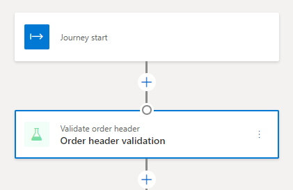
1. In the **Validate order header** dialog box, do the following:
    1. For **Name**, enter "Order header validation".
    1. For **Action Type**, enter "Order Validation".
    1. For **Input Events**, enter "New Order".
    1. For **Execution Policies**, enter "Order header validation policy".

    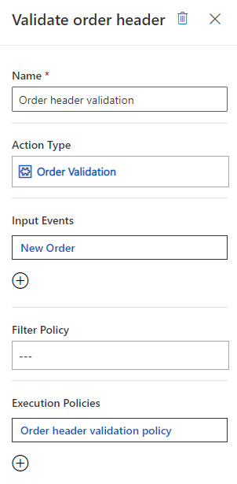
1. Select **Save**.

## Add the Validate order line tile

To add the **Validate order line** tile, follow these steps.

1. Go to **Orchestration \> Flows** and select **New**.
1. Select the plus symbol ("+") and then add the **Validate order line** tile.

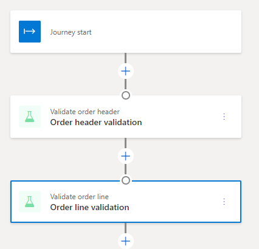
1. In the **Validate order line** dialog box, do the following:
    1. For **Name**, enter "Order line validation".
    1. For **Action Type**, enter "Order Line Validation".
    1. For **Input Events**, enter "Validation of Order Header has Succeeded".

    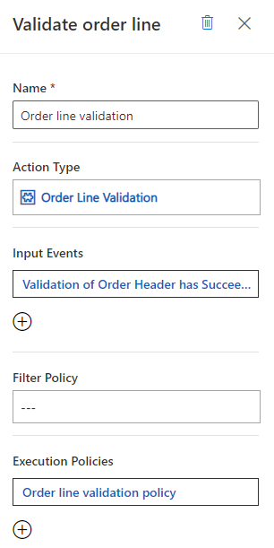
1. Select **Save**.

## Add a Custom tile

To add a **Custom** tile, follow these steps.

1. Go to **Orchestration \> Flows** and select **New**.
1. Select the plus symbol ("+") and then add a **Custom** tile.

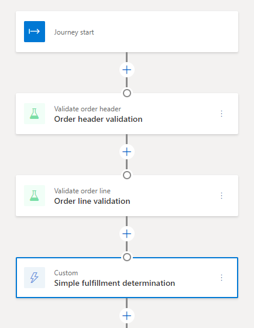
1. In the **Custom** dialog box, do the following:
    1. For **Name**, enter "Simple fulfillment determination".
    1. For **Action Type**, enter "Policy Based Fulfillment Determination".
    1. For **Input Events**, enter "Validation of Order Lines has Succeeded".
    1. For **Execution Policies**, enter "Simple fulfillment assignment policy".

    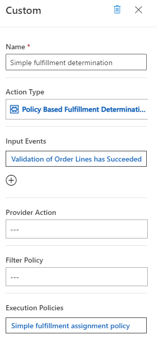
1. Select **Save**.

## Add a Splitter tile

To add a **Splitter** tile, follow these steps.

1. Go to **Orchestration \> Flows** and select **New**.
1. Select the plus symbol ("+") and then add a **Splitter** tile.

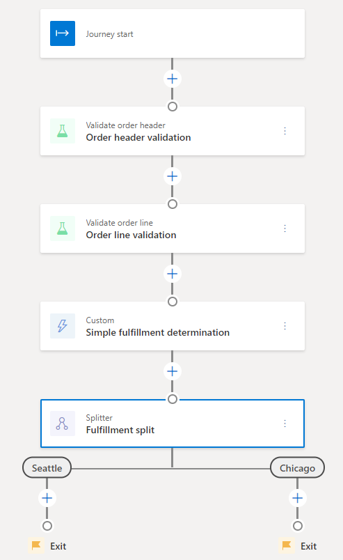
1. In the **Splitter** dialog box, do the following:
    1. For **Name**, enter "Fulfillment split".
    1. For the two **Splitter Settings** fields, enter "Seattle" and "Chicago" respectively.

    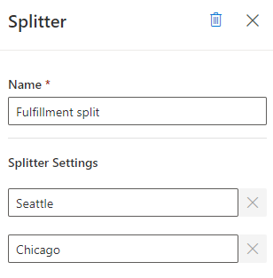
1. Select **Save**.

## Add a Send to fulfillment tile under Seattle branch

To add a **Send to fulfillment** tile under the Seattle branch, follow these steps.

1. Go to **Orchestration \> Flows** and select **New**.
1. Under the **Seattle** branch, select the plus symbol ("+") and then add a **Send to fulfillment** tile.

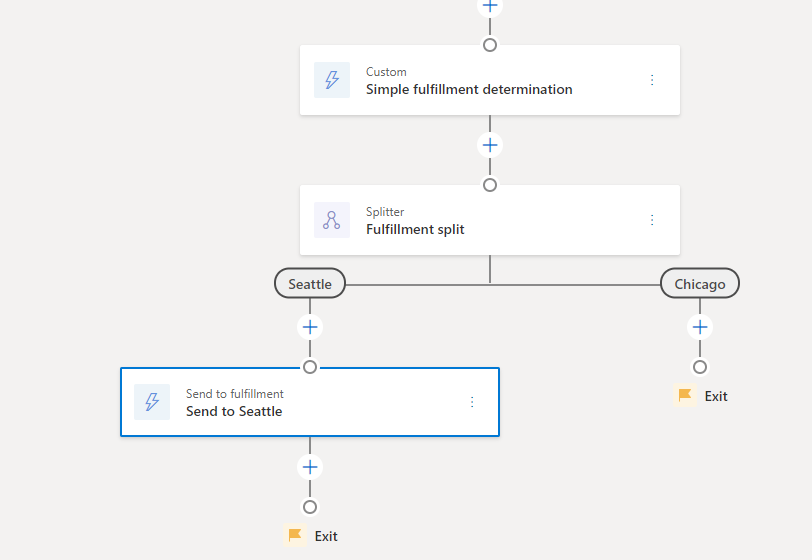
1. In the **Send to fulfillment** dialog box, do the following:
    1. For **Name**, enter "Send to Seattle".
    1. For **Action Type**, enter "Send to Fulfillment".
    1. For **Input Events**, enter "Creation of Fulfillment Order has Succeeded".
    1. For **Provider Action**, enter "IOM Lab Send to Fulfillment (Outlook)".
    1. For **Filter Policy**, enter "Fulfillment filter policy - Seattle".

    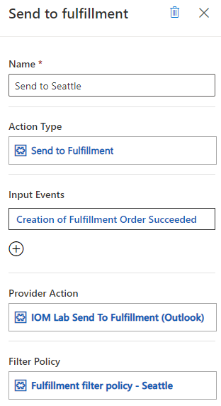
1. Select **Save**.

## Add a Send to fulfillment tile under Chicago branch

To add a **Send to fulfillment** tile under the Chicago branch, follow these steps.

1. Go to **Orchestration \> Flows** and select **New**.
1. Under the **Chicago** branch, select the plus symbol ("+") and then add a **Send to fulfillment** tile.

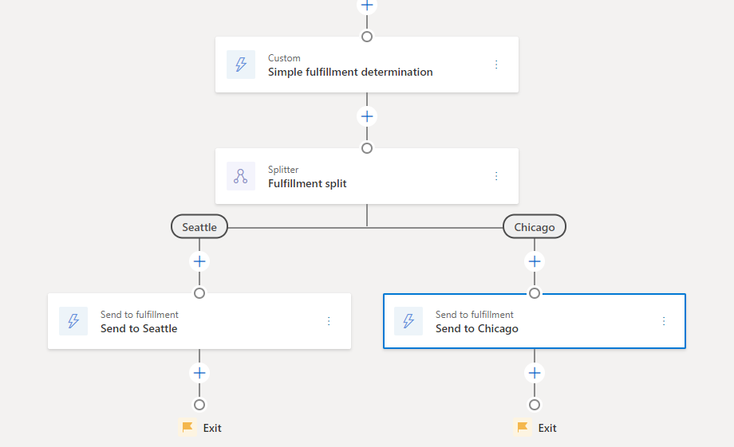
1. In the **Send to fulfillment** dialog box, do the following:
    1. For **Name**, enter "Send to Chicago".
    1. For **Action Type**, enter "Send to Fulfillment".
    1. For **Input Events**, enter "Creation of Fulfillment Order has Succeeded".
    1. For **Provider Action**, enter "IOM Lab Send to Fulfillment (RequestBin)".
    1. For **Filter Policy**, enter "Fulfillment filter policy - Chicago".

    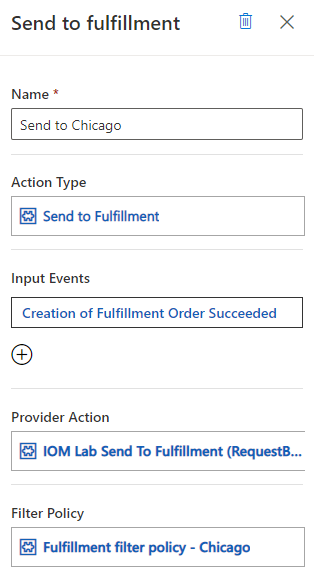
1. Select **Save**.

## Publish the orchestration flow

After you are done creating the order orchestration flow, select **Publish** to publish the flow. 

If you've followed along, you should see the transpiled Power Automate cloud flows as shown in the following illustration.

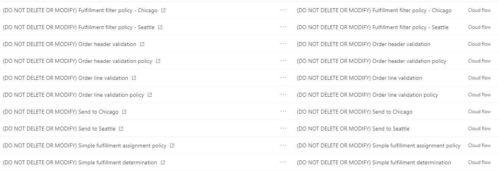

Next quick start lab step: [Run sample order orchestration flow](lab-run-sample-order-orch-flow.md)
