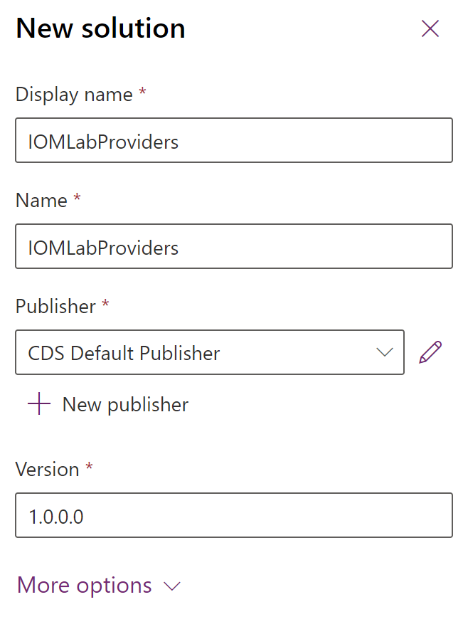

# Create a new provider solution package

[!include [banner](includes/banner.md)]

This topic describes the steps required to create a new provider solution package in Microsoft Dynamics 365 Intelligent Order Management.

It is recommended to have one provider per solution, but multiple providers can be included in the same solution. This is the solution that can be shared and will be installed on Intelligent Order Management environments.

## Create a new provider solution

To create a new provider solution, follow these steps.

1. Go to the [Power App Maker Portal](https://make.powerapps.com) and sign in with your IOM credentials. 
1. Go to **Solutions**.
1. Select **New solution**.
1. For **Display name**, enter "IOM LabProviders".
1. For **Name**, enter "IOM LabProviders".
1. For **Publisher**, select **CDS Default Publisher**.
1. For **Version**, enter "1.0.0.0".

Next quick start lab step: [Create RequestBin custom connector](lab-create-requestbin-connector.md).
