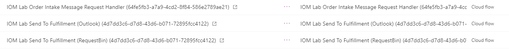

# Onboard provider instance

[!include [banner](includes/banner.md)]

This topic describes the steps required to onboard a provider instance in Microsoft Dynamics 365 Intelligent Order Management.

> [!NOTE]
> If you followed the previous provider creation steps you can skip this section, since you have already created these application connections.

## Create application connections

### Create Outlook connection

To create an Outlook connection, follow these steps.

1. Select **New connection**.
1. In the search box in the upper right corner, enter "Outlook.com".
1. Select the plus symbol ("**+**") to create the connection.
1. Sign in with your Outlook credentials (user name and password), which are not related to your Intelligent Order Management credentials.

### Create RequestBin connection

To create a RequestBin connection, follow these steps.

1. Select **New connection**.
1. In the search box in the upper right corner, enter "requestbin".
1. Select the plus symbol ("**+**") to create the connection.

## Add provider for order intake

To add a provider for order intake, follow these steps.

1. Go to **Providers \> Catalog** and select **Add Provider** on the **IOMLabOrderIntakeProvider** tile.
1. Under the **Connections** section, select **Microsoft Dataverse** to navigate to the **IOM Provider Connection Reference** form. Similar to how platform connection references were set up, you'll need to set up connection references to corresponding Power Automate connections created in previous steps.  
1. On the **IOM Provider Connection Reference** form: 
    1. Copy the connection URL from the Dataverse Power Automate connection details page and paste it into the **Connection URL** field.
    1. Select **Save**. 
    1. Select **Activate**.
    1. Select **Save & close**.
1. On the **IOM provider** form, under the **Connections** section select **Outlook.com**.
1. On the **IOM Provider Connection Reference** form: 
    1. Copy the Outlook.com connection URL from the corresponding Power Automate connection details page and paste it into the **Connection URL** field.
    1. Select **Save**. 
    1. Select **Activate**.
    1. Select **Save & close**.
1. On the **IOM provider** form, select **Activate**. This action deploys the Power Automate flow that processes the incoming email with order attachment.

## Add provider for fulfillment 

To add a provider for fulfillment, follow these steps.

1. Go to **Providers \> Catalog** and select **Add Provider** on the **IOMLabFulfillmentProvider** tile.
1. Under the **Connections** section, set up all the connections listed. 
1. On the **Parameters** tab, enter the email account where you want the fulfillment order payload to be sent to. This can be any valid email address. 
1. On the **IOMLabFulfillmentProvider** form: 
    1. Select **Save**. 
    1. Select **Activate**.
    1. Select **Save and close**.

## View the deployed Power Automate component

To view the deployed Power Automate component, follow these steps.

1. Go to the [Power App Maker portal](https://make.powerapps.com) and confirm that you are in the correct Intelligent Order Management trial environment. To check which environment you are in, select the **Environment** icon on the top right corner of the maker portal.
1. Go to **Solutions \> Default Solution**. 
1. Filter the solution component to display only "Cloud flow". You should now see the following Power Automate flows.

Next quick start lab step: [Create policies](lab-create-policies.md)

