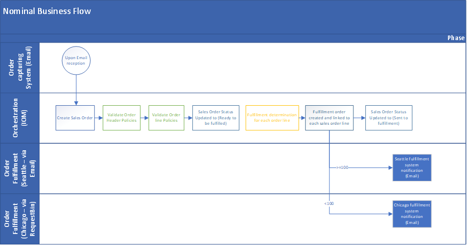
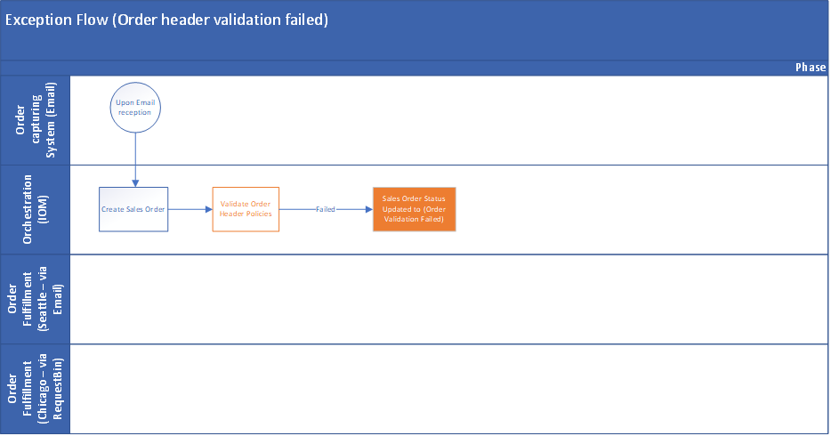
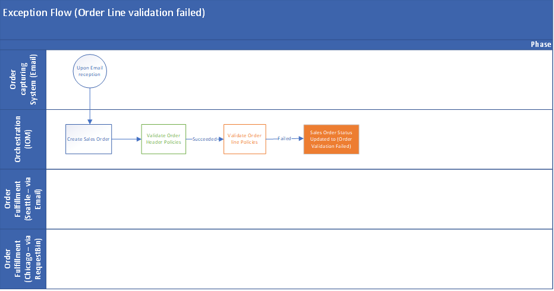

# Quick start lab overview

[!include [banner](includes/banner.md)]

This topic provides an overview of the quick start lab for Microsoft Dynamics 365 Intelligent Order Management.

In this quick start lab, you will learn how to:

-	Create providers.
-	Set up platform connection references.
-	Set up Power Automate connections.
-	Onboard providers.
-	Set up policies.
-	Set up order orchestration flows.
-	Set up internal and external ID mappings.
-	Test the end-to-end order orchestration at runtime.

## Lab scenarios  

The quick start lab includes the following scenarios.

-	Order comes into IOM as email attachment.
-	Validate order header to make sure ship to country is US.
-	Validate order line to make sure quantity is more than 1.
-	Route order based on quantity.
    - If quantity >= 100, send to Seattle store.
    - If quantity < 100, send to Chicago store.
-	If order is routed to Seattle store, emails with fulfillment order attached will be sent.
-	If order is routed to Chicago store, requests with fulfillment order as payload will be sent to RequestBin.

## Lab business components

The quick start lab uses the following business components.

- Order capturing endpoint: Email
- Order fulfillment endpoints:
    - Orders fulfilled from Seattle: Email
    - Orders fulfilled from Chicago: Request Bin
- Order orchestration flow and central visibility (Dynamics 365 Intelligent Order Management app)

## Lab flows

The quick start lab will demonstrate the following flows.

### Nominal business flow

The following illustration shows a nominal business flow in Intelligent Order Management.

### Exception flow (order header validation failed)

The following illustration shows an nominal exception flow caused by an order header validation failure in Intelligent Order Management.

### Exception flow (order line validation failed)

The following illustration shows an nominal exception flow caused by an order line validation failure in Intelligent Order Management.

Next quick start lab step: [Create and configure connections](lab-create-configure-connections.md)
