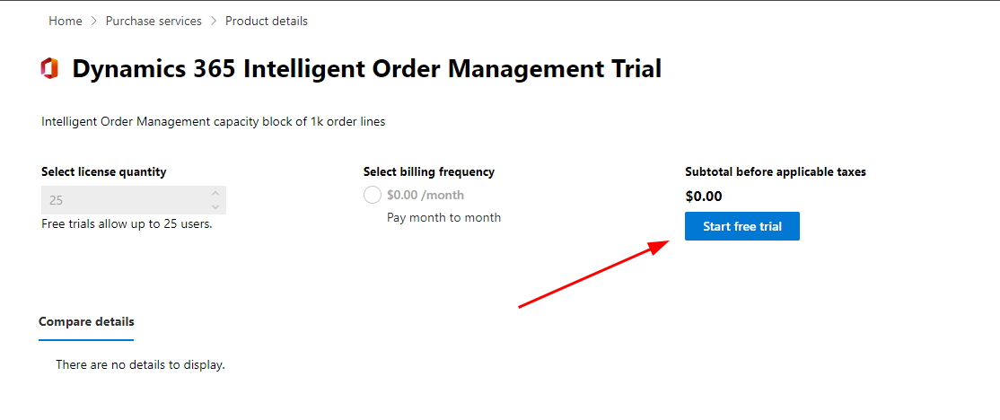

# Get a license for Intelligent Order Management

[!include [banner](includes/banner.md)]

This article describes how to get a license for Microsoft Dynamics 365 Intelligent Order Management.

In order to install Dynamics 365 Intelligent Order Management, you'll need to install the appropriate licenses. This article will walk through how to get trial licenses that will allow you to have full operation of Intelligent Order Management. When you're ready to convert your trial licenses to production licenses, you can work with your partner or Microsoft account executive to obtain the correct licenses.

The first tril license you'll need is the tenant level license for Dynamics 365 Intelligent Order Management. Once installed, the tenant level license will allow you to install Intelligent Order Management on any environment within the tenant. You don't need to assign users to the tenant level license.

> [!NOTE]
> Although the tenant level license is free, you'll need to sign in to the Microsoft administrator portal with an account that has the ability to purchase services.

The next trial license you'll need is the Dynamics 365 Intelligent Order Management Unlimited Site License (USL) trial license, which is used for assigning users who will deploy Microsoft Power Automate flows. Dynamics 365 Intelligent Order Management uses Power Automate when activating providers, publishing policies, or publishing orchestrations. Only users who do any of these activities will need a license assigned.

## Sign up for the trial licenses

To sign up for the trial licenses, follow these steps.

1. Go to `https://admin.microsoft.com`.
1. On the left navigation pane, select **Billing \> Purchase services**.

    

1. Find the license for **Dynamics 365 Intelligent Order Management Trial**, select **Details**, then select **Start free trial**.
1. Select **Try Now**, and then select **Continue**.
1. Repeat steps 2-4 to sign up for the **Dynamics 365 Intelligent Order Management (USL) Trial** license.

    

> [!NOTE]
> Licenses aren't synced immediately and can take 1-2 days in some cases before Dynamics 365 Intelligent Order Management appears as an installable product.

## Assign the Dynamics 365 Intelligent Order Management USL trial license to a user

To assign the Dynamics 365 Intelligent Order Management USL trial license to a user, follow these steps.

1. Go to `https://admin.microsoft.com`. 
1. On the left navigation pane, select **Billing \> Licenses**.

    

1. On the **Licenses** page, select **Dynamics 365 Intelligent Order Management USL**.

    

1. Select **Assign Licenses** to locate a user with Microsoft Power Automate licenses to assign the license to, and then select **Assign**.
1. On the **Assign licenses to users** flyout menu, in the search box search for and select the user.
1. Under **Turn apps or services on or off**, select both the **Data integration for IOM with Power Automate USL** and **Dynamics 365 Intelligent Order Management USL** checkboxes.
1. Select **Assign**.

