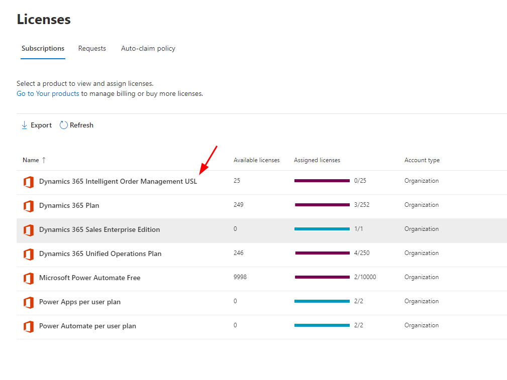

# Get a license for Intelligent Order Management

[!include [banner](includes/banner.md)]

This article describes how to get a license for Microsoft Dynamics 365 Intelligent Order Management.

In order to install Dynamics 365 Intelligent Order Management, you'll need to have the appropriate licenses installed. This guide will use the Trial licenses, which will allow full operation of Dynamics 365 Intelligent Order Management. When you're ready to convert your trial license to a Production License, you'll work with your Partner, and/or your Microsoft Account Executive to get the correct licenses applied.

The first license you'll need is the tenant level license for Dynamics 365 Intelligent Order Management. Once installed, the license will allow you to install Intelligent Order Management on any environment within that tenant. You don't need to assign this license.

> [!NOTE]
> You'll need to sign in to the admin portal with an account that has the ability to purchase services. Although the license is free, it's still required to have this role.

1. Go to `https://admin.microsoft.com`.
1. On the left menu, select **Billing \> Purchase services**.

    

1. Select the license for Dynamics 365 Intelligent Order Management Trial, select **Details**, then select **Start Free Trial**.
1. Select **Try Now**, and then select **Continue**.
1. Repeat steps 2-4 for Dynamics 365 Intelligent Order Management Unlimited Site License (USL).

    

> [!NOTE]
> Licenses aren't synced immediately and can take 1-2 days in some cases before Dynamics 365 Intelligent Order Management shows up as an installable product

## Assign user license

The Dynamics 365 Intelligent Order Management USL is used for assigning users who will deploy Microsoft Power Automate flows. Dynamics 365 Intelligent Order Management uses Power Automate when activating providers, publishing policies, or publishing orchestrations. Only users who do any of these activities will need a license assigned.

1. Go to `https://admin.microsoft.com`. 
1. On the left menu, select **Billing \> Licenses**.

    

1. Open your Dynamics 365 Intelligent Order Management USL license.
1. Select **Assign License** to locate a user with Microsoft Power Automate licenses to assign the license to, and then select **Assign**.

