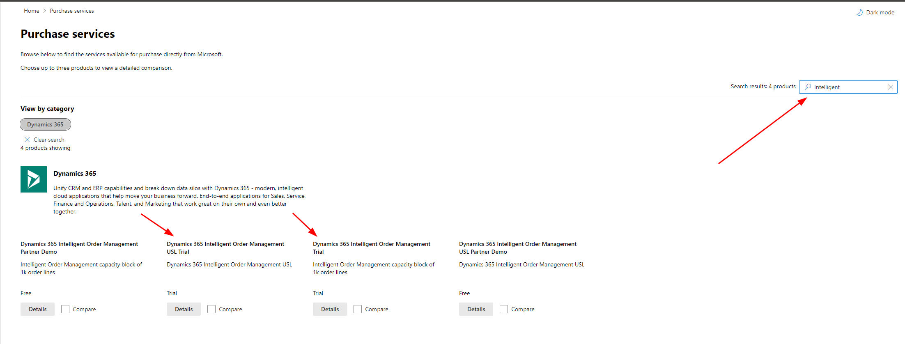
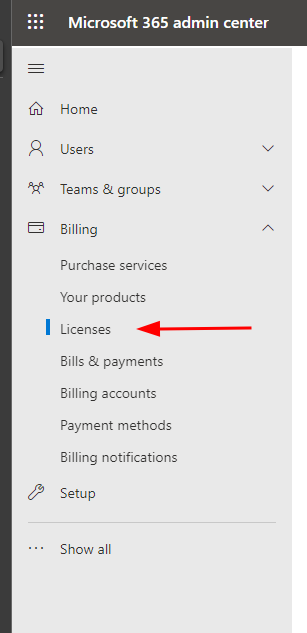

# Getting a License

In order to install Dynamics 365 Intelligent Order Management, you will
need to have the appropriate licenses installed. This guide will use the
Trial licenses which will allow full operation of Dynamics 365
Intelligent Order Management. When you are ready to convert these to a
Production License, you will work with your Partner and/or your
Microsoft Account Executive to get the correct licenses applied.

The first license you will need is the tenant level license for Dynamics
365 Intelligent Order Management. Once installed, this will allow you to
install Intelligent Order Management on any environment within that
tenant. You do not need to assign this license.

**Note:** you will need to login to the admin portal with an account
that has the ability to purchase services. Although the license is free,
it is still required to have this role.

1.  Navigate to <https://admin.microsoft.com>

2.  On the left menu, select Billing \> Purchase services

3.  Select the license for Dynamics 365 Intelligent Order Management
    Trial, click on Details, then click on Start Free Trial

4.  Finish by clicking Try Now and then Continue

5.  Repeat steps 2-4 but for Dynamics 365 Intelligent Order Management
    USL

**Note:** Licenses are not synced immediately and can take 1-2 days in
some cases before Dynamics 365 Intelligent Order Management shows up as
an installable product

## Applying User License

The Dynamics 365 Intelligent Order Management USL is used for assigning
users who will deploy Power Automate Flows. Dynamics 365 Intelligent
Order Management uses Power Automate when activating Providers,
publishing Policies, or publishing Orchestrations. Only users who do one
of these activities will need a license assigned.

1.  On <https://admin.microsoft.com> navigate to Billing \> Licenses in
    the left panel

2.  Open up your Dynamics 365 Intelligent Order Management USL license

3.  Click Assign License, then find the user to assign the license to.
    Make sure they have the Power Automate licenses and click Assign

