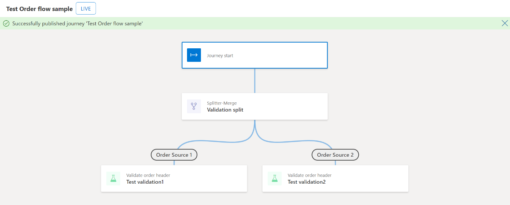

# Create orchestration flows

[!include [banner](includes/banner.md)]

This article explains orchestration flows and shows you how to create them in Microsoft Dynamics 365 Intelligent Order Management.

Orchestration flows are a central concept in Intelligent Order Management. You can create orchestration flows that determine how data obtained from configured providers are being orchestrated.

Intelligent Order Management supports the ability to define orchestration flows for different purposes. Such as, ordering intake to fulfillment, and collecting and distributing inventory visibility information.

## Orchestration types

Orchestration types control which actions and elements can be used to define the orchestration flow. One orchestration type is currently supported out-of-the-box. Additional orchestration types will be released over time.

| Type            | Purpose                                                                                                        |
|---------------------|--------------------------------------------------------------------------------------------------------------------|
| Order orchestration | Allows users to define an end-to-end orchestration flow for orders, from order capture to fulfillment and billing. |

## Orchestration fields

An orchestration flow record consists of three fields, as listed in the following table.

| Field | Description |
|-------------------------|-------------------------|
| Name | A unique name provided by the user. |
| Orchestration type | Specifies the orchestration type. |
| Created on | The date and time when the orchestration flow was created. |
| Status | 
An orchestration flow can be in two status states:
<ul><li>**Unpublished** – The orchestration flow and its actions aren't run when data flows into the system.</li><li>**Published** – This status is obtained when the orchestration flow is published using the **Publish** action in designer view. The orchestration flow and its actions are executed when data flows into the system.</li></ul> |

## Actions and elements 

Actions and elements can be used to define the orchestration flow in designer view. The following table lists actions and elements for the order orchestration type.

| Action or Element                                          | Description                                                                                                                                                                  |
|----------------------------------------------------------------|------------------------------------------------------------------------------------------------------------------------------------------------------------------------------|
| Validate Order Header                                          | Performs validation on the order header level.                                                                                                                               |
| Validate Order Line                                            | Performs validation on the order line level.                                                                                                                                 |
| Send to DOM                                                    | Sends orders and order lines to the distributed order management (DOM) provider for fulfillment determination. Fulfillment orders and fulfillment order lines are generated. |
| Assign Fulfillment Source                                      | Allows fulfillment determination to be assigned by simple user-defined policy and rules. Fulfillment orders and fulfillment order lines are generated.                       |
| Send to Fulfillment                                            | Sends fulfillment orders and fulfillment order lines to the fulfillment provider.                                                                                            |
| Send to Fulfillment – Dynamics 365 finance and operations apps | Sends orders and order lines to finance and operations apps. The fulfillment determination takes place in finance and operations apps.                                       |
| Send to Invoice                                                | Sends orders and order lines to the billing provider.                                                                                                                        |
| Custom                                                         | Allows adding user-defined actions to the orchestration flow. For example, a user-defined action can be used to orchestrate orders to a custom provider.                     |

The following table lists other available actions and elements.

| Action or Element | Description |
|-------------------------|-------------------------|
| Condition | 
Allows you to split the orchestration flow into two paths, with no constraint that the paths will merge again.
<ul><li>**Yes** – This path is triggered if the previous orchestration step succeeded.</li><li>**No** – This path is triggered if the previous orchestration step failed.</li></ul> |
| Splitter | 
Allows you to split the orchestration flow into a user-defined number of paths, with no constraint that the paths will merge again.

**Note:** Adding a filter policy in the subsequent action is used to define the split in path.
 |
| Condition-Merge | 
Allows you to split the orchestration flow into two paths, with the constraint that the paths will merge again.
<ul><li>**Yes** – This path is triggered if the previous orchestration step succeeded.</li><li>**No** – This path is triggered if the previous orchestration step failed.</li></ul> |
| Splitter-Merge | 
Allows you to split the orchestration flow into a user-defined number of paths, with the constraint that the paths will merge again.

**Note:** Adding a filter policy in the subsequent action is used to define the split in path.
 |

## Create a new orchestration flow

To create a new orchestration flow, follow these steps.

1. Go to **Orchestration &gt; Flows**.
1. Select **New** to initiate the orchestration flow creation process. The orchestration flow designer canvas opens.
1. In the upper-left corner, enter a unique name such as "Test Order flow sample."
1. In the **Orchestration Type** field, select **Order Orchestration**.
1. In the **Description** field, enter "My first orchestration flow."
1. In the designer canvas, select the plus symbol ("+") to add an **Action** or **Element**.
1. Select **Splitter-Merge**.
1. In the **Name** field, enter "Validation split."
1. In **Splitter Settings**, delete **Branch 1** and enter **Order Source 1**, and then delete **Branch 2** and enter **Order Source 2**.
1. In the designer canvas under **Order Source 1**, select the plus symbol ("+") to add an **Action** or **Element**.
1. Select **Validate order header**. 
1. In the **Name** field, enter "Test validation 1."
1. In the **Input Events** field, select **New order**.
1. Select **Add**.
1. In the **Filter Policies** field, select **Filter Policy – BigCommerce**.
1. In the **Execution Policies** field, select **Order header Validation Policy**.
1. Select **Add**.
1. In the designer canvas under **Order Source 2**, select the plus symbol ("+") to add an **Action** or **Element**.
1. Select **Validate order header**.
1. In the **Name** field, enter "Test validation 2."
1. In the **Input Events** field, select **New order**.
1. Select **Add**.
1. In the **Filter Policies** field, select **Filter Policy – Orderfull**.
1. In the **Execution Policies** field, select **Order header Validation Policy**.
1. Select **Add**.
1. Select **Publish**.

The following illustration shows an example orchestration flow named "Test Order flow sample."

> [!NOTE]
> -   Several orchestration flows of the same type can be in the status "Published" simultaneously. An order and its lines can be processed by multiple orchestration flows. Adding and configuring filter policies is important if you create and publish several orchestration flows.
> -   An orchestration flow can't be edited after it's published.
> -   A published orchestration flow can be stopped, which updates the status to "Unpublished" to ensure data no longer flows through that orchestration flow.
> -   You may receive a message that explains that a stopped orchestration flow can't be restarted. This message is incorrectly generated from the designer platform and doesn't apply to the implementation of the designer in Intelligent Order Management.
> -   An unpublished orchestration flow can be edited and published again, which updates the status to "Published" to ensure data again flows through the new version of the orchestration flow.

## Pause and resume Orchestration flow (preview)

This newly introduced feature allows an Intelligent Order Management user to pause the orchestration flow during business hours to manage unforeseen downtimes caused by provider connection issues or to make changes to the orchestration flow mid day and republish if needed. 

To enable this feature, you should turn on the following settings in Microsoft Power Apps.

- Go to **Solution** >**Default solution**>**Settings**>**Enable orchestration pause and resume** and under **Setting environment value** >**Add existing value** to **yes**
- Go to **Solution** >**Default solution**>**Settings**>**Enable plugin triggers for step execution in a journey** and change the default value to **yes**

[!INCLUDE[footer-include](includes/footer-banner.md)]
