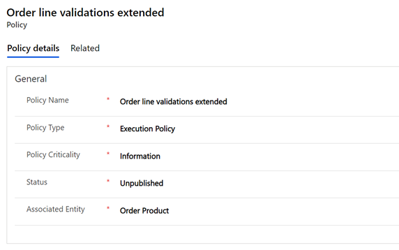
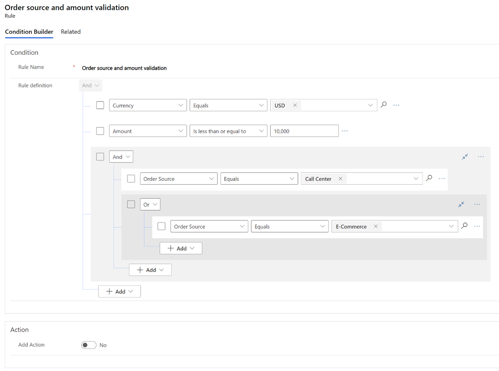

# Policies and rules

[!include [banner](includes/banner.md)]
[!include [banner](includes/preview-banner.md)]

This topic covers policy types and describes how to create a policy with rules in Dynamics 365 Intelligent Order Management.

## Policy types

Policies and their associated rules are used for different purposes in the Dynamics 365 Intelligent Order Management orchestration flow, so policies are classified into different policy types. Policy types ensure that users can easily select the appropriate policies in the orchestration flow. The four supported policy types are listed below. 

| Policy type                   | Purpose                                                                                                          |
|-------------------------------|------------------------------------------------------------------------------------------------------------------|
| Filter policy                 | Allows users to define an   orchestration step that only applies to a selected group that is defined by   rules. |
| Provider action policy        | Determines provider-specific actions.                                                                            |
| Execution policy              | Allows validation of data   running through an orchestration flow.                                               |
| Fulfillment assignment policy | Allows manual fulfillment determination defined by rules.                                                        |

## Policy fields

A policy consists of five fields, as listed below.

| Policy field       | Purpose                                                                                                                                                                                                                                                                                                                                                                                                                                                                    |
|--------------------|----------------------------------------------------------------------------------------------------------------------------------------------------------------------------------------------------------------------------------------------------------------------------------------------------------------------------------------------------------------------------------------------------------------------------------------------------------------------------|
| Policy Name        | A unique name provided by the user.                                                                                                                                                                                                                                                                                                                                                                                                                                        |
| Policy Type        | The user can select one of four policy types: **Filter policy**, **Provider action policy**, **Execution policy**, **Fulfillment assignment policy**.                                                                                                                                                                                                                                                                                                                                    |
| Policy Criticality | The user can select one of two options:  **Information** - The rules of the policy will be evaluated but the orchestration flow will not be stopped in the case of an unsuccessful evaluation.  **Critical information** - The rules of the policy will be evaluated and the orchestration flow will be stopped in the case of an unsuccessful evaluation.                                                                                                           |
| Satus              | A policy and its associated rules can be in one of two status states: **Unpublished** - The default status of a policy. A policy and its rules are not available to select in the orchestration flow when in this status state. **Published** - This status is obtained when the policy and its associated rules are published using the **Publish** action. The policy and its rules are available to select in the orchestration flow when in this status state. |
| Associated Entity  | The user can select one of four primary entities for the policy: **Order**, **Order product**, **Fulfillment order**, **Fulfillment order product**. The   rules defined can be used against the primary entity or any related entity in the data model.                                                                                                                                                                                                                             |

## Create a new policy

To create a new policy, follow these steps.

1.	Go to **Orchestration** > **Policies**.  
2.	Select **New** to initiate the policy creation process.
3.	In the **Policy Name** field, enter a unique name (for example, “Order line validations extended”). 
4.	In the **Policy Type** field, select **Execution Policy**. 
5.	In the **Policy Criticality** field, select **Information**. 
6.	In the **Associated Entity** field, select **Order Product**. 
7.	Select **Save**.

The following image shows the policy details entered for the “Order line validations extended” policy example.

## Rules

You can create conditional rules in Dynamics 365 Intelligent Order Management by using Condition Builder's user interface.

To add a condition to your flow, select **New step**, and then select **Condition**. An **Add** button appears that, when selected, presents the following options:

   - **Add row**: Each individual condition that you check for (such as “the value is greater than 10,” or “the list does not contain Test”) creates a new row in Condition Builder.
   - **Add group**: You can combine one or more rows together in a group. Each group is combined by using either an **And** or an **Or** operator. If you select **And**, then all the condition rows must be true. If you select **Or**, then only one of the condition rows needs to be true.
   - **Add related entity**: You can add conditions against values in related entities. You can also select between entities that are related to the primary entity of the policy. The supported relations are **Many to One** and **One to Many**.

You can have as many rows or groups as you need to build out your logic and you can continue adding rows or groups both at the top level of the condition, and inside groups using Add buttons. If you want a simplified view of the condition, you can collapse it using a button at the top-right of each group.

Additionally, there is an ellipsis menu (“...”) on the right side of each row and group that allows you to delete a row or group. There are also check boxes on the left side of each row or group that allow you to select several different rows, and then select **Group** from the ellipsis menu to combine the rows into a single group.

The supported operators differentiate per field type, as shown in the following table.

| Operator                      | Field | Entity-based field |
|-------------------------------|-------|--------------------|
| Equals                        | Y     | Y                  |
| Does not   equal              | Y     | Y                  |
| Is   greater than             | Y     |                    |
| Is   greater than or equal to | Y     |                    |
| Is less   than                | Y     |                    |
| Is less   than or equal to    | Y     |                    |
| Contains   data               | Y     | Y                  |
| Does not   contain data       | Y     | Y                  |

## Create a new rule

To create a new example rule, follow these steps.

1.	Go to **Orchestration** > **Policies**.
2.	Select a policy record (for example, “Order line validations extended”).
3.	Select **New Rule** to initiate the rule creation process.
4.	In the **Rule Name** field, enter a unique name (for example, “Order source and amount validation”).
5.	Select **Add**, and then select **Add Row**.
6.	Select **Currency**.
7.	Select the **Equals** operator.
8.	Select **USD**.
9.	Select **Add**, and then select **Add Row**.
10.	Select **Amount**.
11.	Select the **Is less than or equal to** operator.
12.	Enter “10,000.”
13.	Select **Add**, and then select **Add Group**.
14.	Select **Order source**.
15.	Select the **Equals** operator.
16.	Select **Call center**.
17.	Select  **Add**, and then select **Add Group**.
18.	Change the condition to **Or**.
19.	Select **Order source**.
20.	Select the **Equals** operator.
21.	Select **E-commerce**.
22.	Select **Save & Close**.
23.	Select **Publish**.

> [!NOTE] 
> Policies and associated rules are validated for errors during the publishing process. 

The following image shows the "Order source and amount validation" rule example as it would appear in Condition Builder.

## Add custom action

If you want to add a custom specific action that is not triggered by the orchestration flow when a rule is evaluated, under **Action** select **Yes** for **Add Action**. You can then create a Power Automate flow that performs the desired action.
