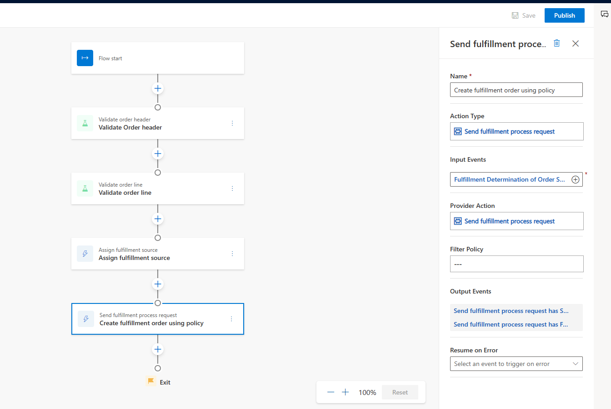

# Policy-based fulfillment

This article provides an overview of the settings and prerequisites that you should consider when you set up policy-based fulfillment in Microsoft Dynamics 365 Intelligent Order Management.

In policy-based fulfillment, an execution policy sets the fulfillment source at the line level. Choose this option when the rules are simple or the number of sources is limited.

## General settings for policy-based fulfillment

To configure your preferences for policy-based fulfillment, follow these steps:

1. Go to **Settings** \> **General Settings** \> **Order handling preferences** \> **Manage**.
1. Under **Fulfillment process policy**, select one of the following policy options:

    - **Inventory On hand check** – This option checks inventory availability for the selected fulfillment source, but it doesn't create a fulfillment order.

        > [!NOTE]
        > If you use this option to send the whole sales order to Dynamics 365 Supply Chain Management, use the **Send sales order to fulfillment** action. When you use this execution policy, assign both a fulfillment source and a shipping warehouse.

    - **Fulfillment order creation - Fulfillment order creation without inventory check** – This option enables a fulfillment order to be created without an availability check. This option is best suited to cases where fulfillment is done by using enterprise resource planning (ERP), and the fulfillment order must be created to record the status of the fulfillment from ERP.
    - **Inventory check and fulfillment order creation** – This option is best suited to cases where the sales order must be sent to warehouse management or ERP applications after fulfillment is determined.

        > [!NOTE]
        > If you use this option to send all sales order lines that have a fulfillment order to Supply Chain Management, use the **Send sales order lines to billing** action.

For all the preceding policy options, the action type that's used for policy-based fulfillment is **Send fulfillment process request**.

## Sample flow for policy-based fulfillment

