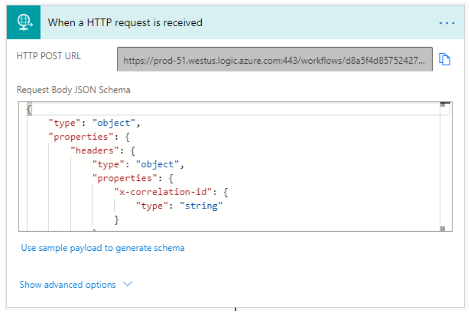

# Power BI dashboards in Intelligent Order Management

[!include [banner](includes/banner.md)]
[!include [banner](includes/preview-banner.md)]

Dynamics 365 Intelligent Order Management ships with set of dashboards embedded into the user interface which are based on Power BI technology. These dashboards provide longer-range insights into the order and fulfillment data moving through the app.

**Note:** You don't have to obtain additional licenses to view these dashboards. The Dynamics 365 Intelligent Order Management license allows you to view your data in these Power BI based dashboards

**Note:** Trial environments have a known issue with deploying the embedded Power BI. This is currently not supported by the platform

**Integration to Power BI**

The integration between Power BI and Dynamics 365 Intelligent Order Management is pre-configured and does not require any additional setup.

**Architecture**

The Power BI based dashboards are using an architecture modelled in the diagram below.

1.  Data is created or updated in Dataverse when entries are entered into The Dynamics 365 Intelligent Order Management application.

2.  The Dataverse data is synchronized to Managed Data Lake leveraging Athena. This synchronization is currently executed every 4 hours. This can currently not be modified.

3.  A data snapshot is copied and transferred to the analytics platform storage account

4.  Data is transformed for Power BI KPI's

5.  The transformed data is copied and transferred back to the Dataverse, Managed Data Lake

6.  Power BI Dashboard is provisioned or refreshed

7.  Power BI Dashboard and pages embedded into the Dynamics 365 Intelligent Order Management application

**Customizations**

Dashboards based on embedded Power BI cannot be customized. The platform currently does not support such actions.

The data stored in Managed Data Lake is not accessible for any customizations. In case custom reports or insights are required these can be built accessing data stored in Dataverse
