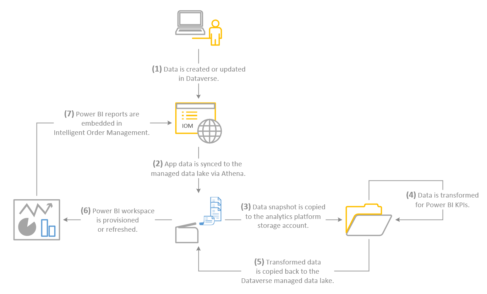

# Power BI dashboards in Intelligent Order Management

[!include [banner](includes/banner.md)]
[!include [banner](includes/preview-banner.md)]

Dynamics 365 Intelligent Order Management includes a set of dashboards embedded into the user interface that are based on Power BI technology. The Power BI dashboards provide longer-range insights into the order and fulfillment data moving through the app.

The Intelligent Order Management license allows you to view your data in the Power BI based dashboards, so you don't have to obtain additional licenses to view the dashboards.

> [!NOTE]
> There's a known issue with trial environments. Deploying embedded Power BI is currently not supported by the platform.

## Integration to Power BI

Integration between Power BI and Intelligent Order Management is preconfigured and doesn't require additional setup.

## Architecture

The Power BI dashboards use the architecture modeled in the diagram below.

1.  Data is created or updated in Microsoft Dataverse when entries are entered in Intelligent Order Management.

2.  The Dataverse data is synchronized to Dataverse managed data lake leveraging Amazon Athena. Synchronization is executed every 4 hours. The synchronization timing can't be modified.

3.  A data snapshot is copied and transferred to the analytics platform storage account.

4.  The data is transformed for Power BI KPI's.

5.  The transformed data is copied and transferred back to Dataverse managed data lake.

6.  The Power BI Dashboard is provisioned or refreshed.

7.  Power BI Dashboard and pages are embedded into the Intelligent Order Management application.

## Customizations

Customization of dashboards based on embedded Power BI isn't supported. 

The data stored in managed data lake isn't accessible for any customizations. If custom reports or insights are required, you can build them by accessing data stored in Dataverse.
