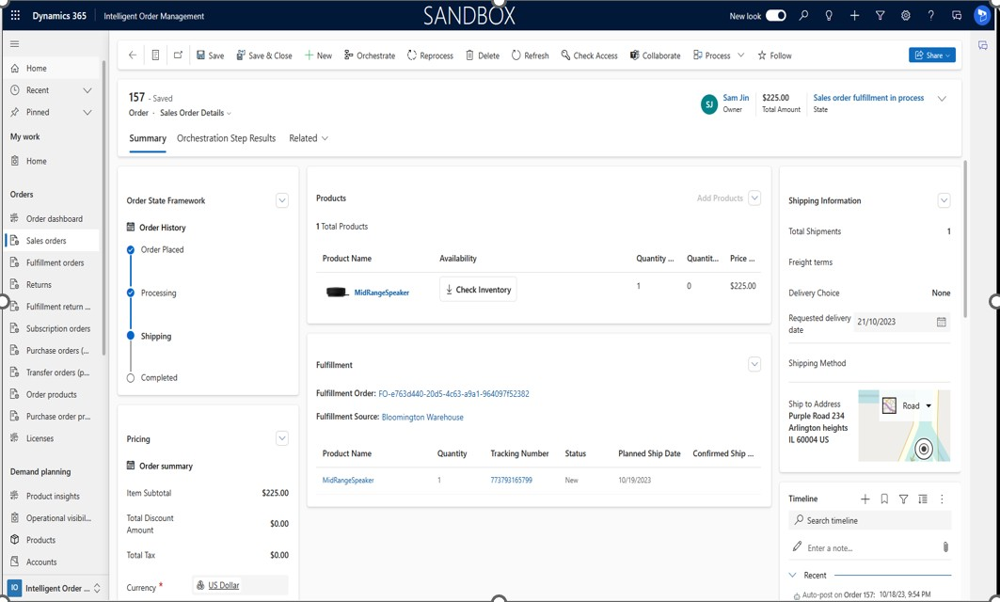

# Sales order form denormalization
This article describes the UX changes made in sales order form following the microsoft fluent protocols. This allows for a simpler workflow to create, modify and view orders in Dynamics 365 IOM.

## Enabling the feature

- Goto **Settings** > **General Settings** > **Feature version controls** > **Manage**.
- Select **Enhanced Pages Sales order KPI view** and select toggle to **ON**.

  By enabling this feature, your sales order form view will be modified to the new view.

## Changes summary  

  -  Reorganization of sales order form into **Pricing**, **General** , **Billing** , **Shipping** and **Delivery**
  -  View the realtime inventory for order lines without switching screens and reduced clicks.
  -  View your order details and related fulfillments along with tracking in one page without clicks.

