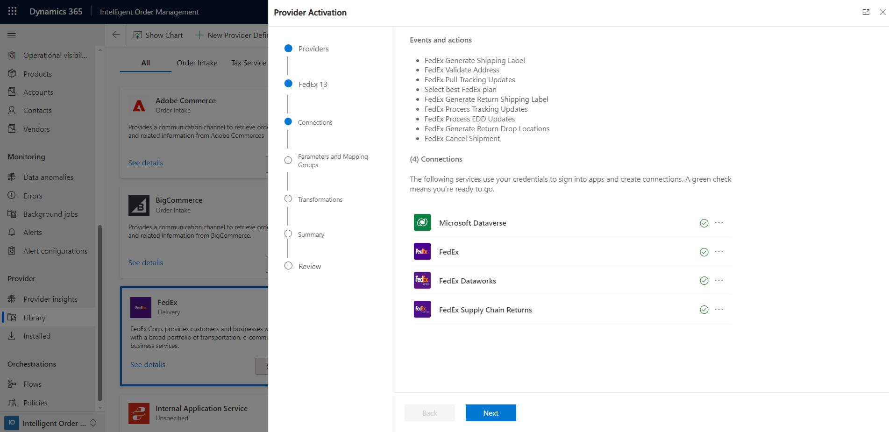

# Set up FedEx provider

[!include [banner](includes/banner.md)]

This article provides information about how to set up the FedEx provider in Microsoft Dynamics 365 Intelligent Order Management.

FedEx Corporation, formerly Federal Express Corporation and later FDX Corporation, is an American multinational conglomerate holding company focused on transportation, e-commerce and business services based in Memphis, Tennessee.The name **"FedEx"** is a syllabic abbreviation of the name of the company's original air division, Federal Express, which was used from 1973 until 2000. As part of this collaboration, Dynamics 365 Intelligent Order Management will integrate with FedEx services as an out of the box provider model. For more information about FedEx, see the [FedEx website](https://www.fedex.com/en-us/about.html). 

## Prerequisites 

FedEx has 3 areas of operations as below.  Customer needs to have their credentials available across these services with FedEx to be able to leverage the capabilities through Dynamics 365 Intelligent Order Management.

1. **FedEx APIF:** This area focuses on FedEx logistics that help brands access new information and capabilities to better fulfill, ship, and service customer orders. Deliver modern, high-value experiences directly to customers. To be able to register and integrate with the APIs for it, please follow below steps:
   a. Create a FedEx developer portal sign up by following the steps [here](https://developer.fedex.com/api/en-ca/get-started.html).
   b. Copy your project **API key**, **Secret** and **Shipping account** from the developer portal for setting up the connection and future transactions.
   
2. **FedEx Dataworks:** This area of FedEx focuses on Intelligence and predictability aspects of logistics like 2-Day delivery, Expected Delivery Delay predictions. The onboarding to these APIs is manual today and the brand needs to connect with FedEx to get the credentials.
3. **FedEx Return Tech:** Enable easy returns from the merchant website with a branded, seamless customer return process including an option for a printer-less QR code experience and the ability to choose from approximately 60,000 convenient drop off locations.
Follow below steps:

    a. Register at [Developer portal](https://developer-sandbox.supplychain.fedex.com/sandbox/) for sandbox environment. 
    b. Register [here](https://fulfillment.fedex.com/) for a production environment.
    c. Once registered, create an **API Connect** account here to be able to select the Return APIs to use and get approval at [FedEx Supply Chain Developer       Production](https://dev.supplychain.fedex.com/) 
    d. Subsequent steps will be enabled by the FedEx Onboarding team.
    e. A **Retailer Commerce ID** will be generated. Keep that note for future transactions.
    
## Setup FedEx connections

1. Go to Intelligent Order Management application.
1. Go to **Providers** and click on **Library**.
1. Select **FedEx** and click on **Activate Providers**.
1. This will open up a wizard for **Terms and Conditions**. Check on **FedEx**, click **Accept** button.
1. Review the events and actions.
1. Go to **Connections** section and review the **Microsoft Dataverse** connection that should have connected automatically.
1. Click on **Create** beside **FedEx** connection. Enter the **Connection name**, choose the environment **Sandbox** or **Production**, **Client Id** and **Client Secret**.
1. Click on **Create** button.
1. Repeat step (f), (g),(h) for **FedEx Dataworks**.
1. Repeat step (f), (g) for **FedEx Supply Chain Returns**. Also for this connection, you need to enter **Client Application Name**, **Client Application Username** and **Client Application password**. 
1. Click on **Create** button.
1. Once all connections are green, click on **Next** on the wizard.

    

1. If you're using the webhook from Dataworks, then enter the **EDD Webhook CallbackSignatureKey** (This is basically the webhook name that was registered to consume Estimated Delivery delay updates from FedEx.) and **Retail Commerce ID** (generated while registering to FedEx Returns Tech).
1. Click on **Next**.
1. Review the Setup.
1. Click on **Next**. Review the Connections and click on **Activate**.
1. The final screen will arrive and will show **Inactive** status for a while after which it will show **Active**.

## Out of the box provider actions

*Provider actions* are associated with a provider and determine the actions that are available to you when you create an orchestration flow. *Transformations* are essential for any provider that retrieves or sends data from Intelligent Order Management to an external service.

| Action | Description |
| ---------- | ------- |
| **FedEx Validate Address** | This provider action validates with FedEx on the correctness of shipping address. |
| **Select FedEx TSS Plan** | This provider action optimizes the best plan for fulfillment based on available inventory. |
| **FedEx Generate Shipping Label** | This provider action generates the shipping label from FedEx for forward shipments. |
| **FedEx Cancel Shipment** | This provider action cancels a shipment until the time it's shipped. |
| **FedEx Generate Return Shipping Label** | This provider action generates the FedEx return label for a customer-initiated return. |
| **FedEx Generate Return Drop Locations** | This provider action fetches the available drop off locations for a particular zip code. |
