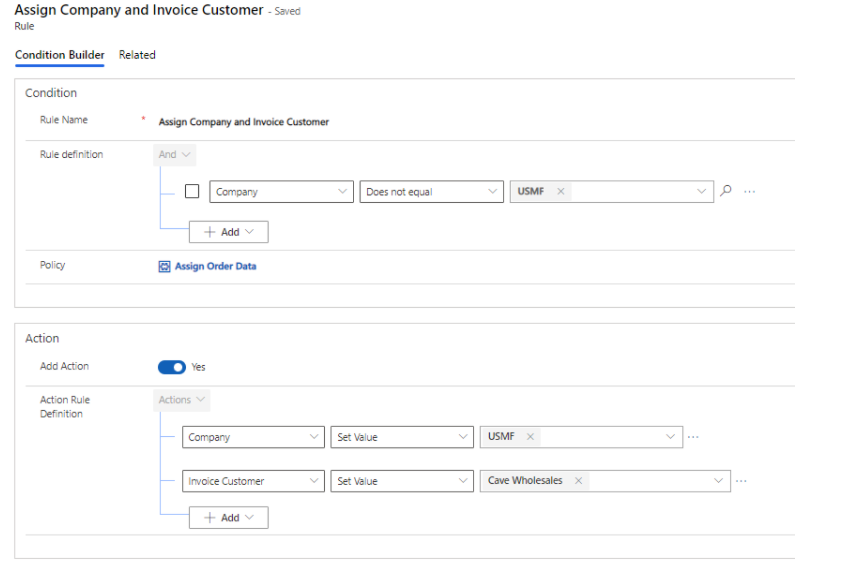
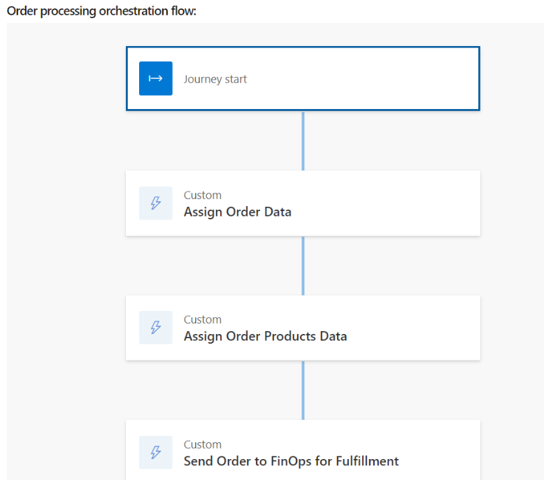

# Set up Dynamics 365 Finance + Operations provider

[!include [banner](includes/banner.md)]

This topic provides information about how to set up the Microsoft Dynamics 365 Finance + Operations (on-premises) provider in Microsoft Dynamics 365 Intelligent Order Management.

Finance + Operations helps businesses to manage their global financial systems, operational business processes, and streamlined supply chains to empower business decision makers to make fast, informed decisions. The Dynamics 365 Finance and Operations provider enables Intelligent Order Management to write or consume orders from Finance + Operations and also performs additional supply chain actions.  

For more information about Finance + Operations, see the [Dynamics 365 Finance](https://dynamics.microsoft.com/en-us/finance/overview/) website. 

## Prerequisites 

- You must have dual-write set up in your Finance + Operations instance. For information on setting up dual-write, see [Guidance for dual-write setup](/dynamics365/fin-ops-core/dev-itpro/data-entities/dual-write/connection-setup).
- Intelligent Order Management should be installed in the same dataverse instance as that of Finance + Operations.
- Mappings associated with dual-write should be enabled. 

  To enable mappings associated with dual-write, follow these steps.

  1. In Finance + Operations, go to **Workspaces \> Data management \> Dual-write**.
  1. Set the dual-write mappings to enable synchronization from Intelligent Order Management to Finance + Operations. IOM order mapping filters must be introduced to delay order synchronization to Finance + Operations when an order is not ready to sync.
      1. On the dual-write page, select **CDS sales order headers (saleorders)**.
      1. On the **CDS sales order headers (saleorders)** page, to edit the query select the funnel symbol next to **Microsoft Dataverse.order**.
      1. In the **Edit query** dialog box, enter the query string `msdyn_ordertype eq 192350000 and _msdyn_company_value ne null and msdyn_isreadytosync eq true and statuscode ne 100003`, and then select **Accept**. 
      1. On the dual-write page, select **CDS sales order lines (saleorderdetails)**.
      1. On the **CDS sales order lines (saleorderdetails)** page, to edit the query select the funnel symbol next to **Microsoft Dataverse.order**.
      1. In the **Edit query** dialog box, enter the query string `msdyn_company_value ne null and _msdyn_shippingsite_value ne null and _msdyn_shippingwarehouse_value ne null and msdyn_isreadytosync eq true and msdyn_statuscode ne 192350001`, and then select **Accept**.   
      1. For both **CDS sales order headers (saleorders)** and **CDS sales order lines (saleorderdetails)**, edit the **msdyn_isreadytosync** entity fields with the following values:
          - **Sync direction**: "Finance and Operation apps to Dataverse"
          - **Transform type**: "Default"   
          - **Default value**: "true" 
1. To synchronize an order from Intelligent Order Management to Finance + Operations, some key parameters must be sent in an order: 
    - **Sales Order** policy parameters:
        - Company
        - Invoice Customer
    - **Sales Order Product** policy parameters:
        - Company
        - Shipping Site
        - Shipping Warehouse
   
   These parameter values can be passed through policy rule definitions in Intelligent Order Management, as shown in the following example for a sales order policy:
   
   
    
   For more information, see [Policies and rules](policies-rules.md).
   
 > [!NOTE]
 > This setup will enable order synchronization from Intelligent Order Management to Finance + Operations in both directions. 
  
## Set up the provider

To set up the provider, follow these steps: 

1.  In Intelligent Order Management, go to **Providers > Catalog**.
1.  Select **Add Provider** on the **Microsoft Finance and Operations apps** tile.
1.  Select **Create** on the **Terms and Conditions** page.
1.  There is one connection that you need to set up in the **Connections** section.
    - Microsoft Finance and Operations Dataverse (current environment) Connection:
       1. Add the Microsoft Dataverse connection.
       1. Select **Save**.
       1. Select **Activate** to activate the connection.
       1. Select **Save and close**.
1. Select **Save**.
1. Select **Activate** to activate the provider.
1. Select **Save and close**.
1. Go to **Providers \> Installed** and validate that the provider you set up is listed with the status **Activated**.

> [!NOTE]
> To successfully synchronize an order from Finance + Operations to Intelligent Order Management, first check that the order is confirmed in Finance + Operation. Only orders confirmed in Finance + Operation can be synced to Intelligent Order Management.

In order to send an order to Finance + Operations from Intelligent Order Management, you must call the Finance + Operations provider action in the order orchestration flow, whether it is sent to fulfillment or accounting.

The following illustration shows an example of an order processing orchestration flow with a custom **Send Order to FinOps for Fulfillment** action.

