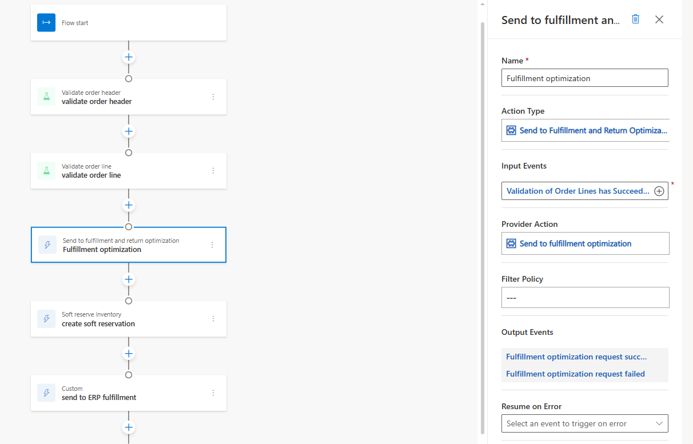

---

title: Set up the Fulfillment and Returns Optimization provider
description: This article describes how to set up the Fulfillment and Returns Optimization provider in Microsoft Dynamics 365 Intelligent Order Management.
ms.date: 04/12/2024
ms.custom: 
  - bap-template
ms.topic: conceptual
author: anvenkat
ms.author: anvenkat

---

# Set up the Fulfillment and Returns Optimization provider

[!include [banner](includes/banner.md)]

This article describes how to set up the Fulfillment and Returns Optimization provider in Microsoft Dynamics 365 Intelligent Order Management. For more information and prerequisities, see [Fulfillment and Returns Optimization provider](fulfillment-returns-optimization.md).

## Add the Fulfillment and Returns Optimization provider

To add the Fulfillment and Returns Optimization provider, follow these steps.

1. In Intelligent Order Management, go to **Providers \> Library**.
1. Select the tile, and then select **Activate Provider** in the upper-right corner of the page.
1. In the dialog box that appears on the left, accept the terms and conditions.
1. Leave the mapping group set to **Default mapping group**.
1. For **Transformations**, select **Next**.
1. Select **Edit** to add **Dataverse connection for IOM**.
1. Sign in to Dataverse by using your credentials. You should have previously created a Dataverse connection in Power Automate by following the instructions in [Create connections](setup.md#create-connections).
1. Go to the [Power Automate portal](https://flow.microsoft.com/), and copy the URL by following the instructions in [Set up platform connection references](setup.md#set-up-platform-connection-references).
1. Select **Save**, and then select **Next**.
1. Select **Activate**.

## Configure a provider action

Customers typically add the **Send to Fulfillment and Returns Optimization** provider action after an order is validated. When it has been added to an orchestration flow, the properties on the **Send to Fulfillment and Returns Optimization** tile should have the following values:

- **Name:** Send to fulfillment and returns optimization
- **Input Events:** Validation of Order Lines has Succeeded
- **Provider Action:** Send to fulfillment optimization
- **Output Event:** Fulfillment optimization request succeeded, Fulfillment optimization request failed
- **Action Description:** This provider action sends the order through fulfillment optimization and outputs a fulfillment plan and creates fulfillment order

## Sample orchestration flow with the provider

## Additional resources

[Intelligent Fulfillment Optimization](ifo.md)

[Intelligent Fulfillment Optimization architecture](ifo-arch.md)

[Orchestration flows](orchestration-flows.md)

