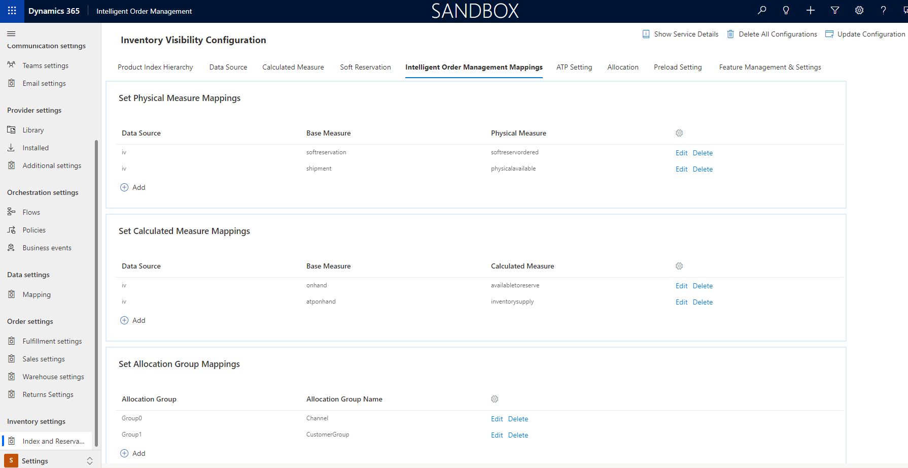
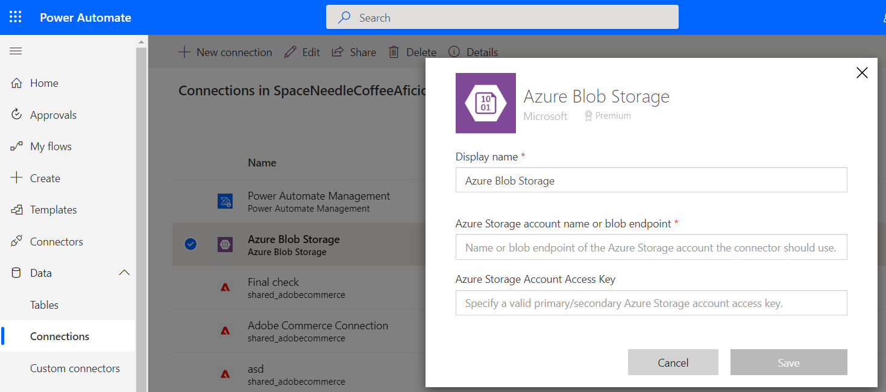

# Set up Inventory Visibility provider (preview)

[!include [banner](includes/banner.md)]

This topic describes how to set up the Inventory Visibility provider in Microsoft Dynamics 365 Intelligent Order Management.

The Inventory Visibility add-in (also referred to as the Inventory Visibility service) provides an independent and highly scalable microservice that enables real-time on-hand inventory change postings and visibility tracking across all your data sources and channels.

For more information about the Inventory Visibility service, see [Inventory Visibility Add In](/dynamics365/supply-chain/inventory/inventory-visibility).

## Prerequisites

The Inventory Visibility add-in is a first-party, out-of-the-box service that is available as part of Intelligent Order Management. To add this provider so that it can be used in orchestration, you must validate and update the following configurations after you install the add-in.

> [!NOTE]
> If you are a Microsoft Dynamics 365 Supply Chain Management customer and want to use the Inventory Visibility add-in, see [Inventory Visibility tips](/dynamics365/supply-chain/inventory/inventory-visibility-tips).

1. Go to **Inventory Visibility \> Index And Reservations** site map area.
1. Confirm that the following tabs appear on the page:
    - Product Index Hierarchy
    - Data Source
    - Calculated Measure
    - Soft Reservation
    - Soft Reservation Hierarchy
    - Intelligent Order Management Mappings
    - ATP Setting
    - Allocation
    - Feature Management
  
    

1. On the **Product Index Hierarchy** tab, confirm that the following elements appear:
    - A grid that has the title **Set Product Index Hierarchy**
    - A **New Index Set** button
    - A grid that has the following columns:
        - Set Number
        - Dimension
        - Hierarchy
        - Settings Button Image
1. On the **Data Source** tab, confirm that the following elements appear:
    - **Set Data Source** title
    - **New Data Source** button
1. Confirm that the following controls appear:
    - Datasource - IV
    - Datasource - FNO
    - Datasource - IOM
    - Datasource - SAP
    - Datasource - POS
1. Expand the **DataSource - IOM** control, and confirm that the following elements appear:
    - Under **Dimension Mappings**:
        - **Add** button
    - Under **Physical Measures**:
        - Measure Name
        - Modified On
        - Sample Data
1. On the **Calculated Measure** tab, confirm that the following elements appear:
    - **Set Calculated Measures** tab
    - **New Calculated Measure** button
1. Go to **Feature Management**, and enable the **OnHandReservation** feature.
1. Go to **Soft Reservation Hierarchy**, and confirm that the grid has the following elements:
    - **Dimensions** column
    - **Hierarchy** column
    - **Settings** button
1. Go to **Soft Reservation Mapping**, and confirm that the grid has the following elements:
    - **Physical Measure Data Source** column
    - **Physical Measure** column
    - **Available For Reservation Data Source** column
    - **Available For Reservation Calculated Measure** column
    - **Settings** button
1. Go to **Intelligent Order Management Mappings**, and confirm the grid has the following elements:
    1. **Set Physical Measure Mapping** : This section will allow you to map any of of your **Datasource** **Physical measures** mapping to a standard **Physical measure** in IOM.
        - **Datasource** column: refers to the source system.
        - **Base Measure** column : refers to the IOM standard measure.
        - **Physical measure** column : refers to the physical measure used in the source system.
    2. **Set Calculated measure Mappings**: This section will allow you to map any of of your **Datasource** **Calculated measures** mapping to a standard **Calculated measure** in IOM.
        - **Datasource** column: refers to the source system.
        - **Base Measure** column : refers to the IOM standard measure.
        - **Calculated measure** column : refers to the calculated measure used in the source system.   
    3. **Set Allocation Group Mappings** : This section will allow you to map your defined allocation groups to a standard set of allocation groups in IOM.
        - **Allocation Group** column: refers the group. this could range from group 0 to group 7.
        - **Allocation Group Name** : This section will allow you to map the group defined to a standard allocation group in IOM.



> ![NOTE] 
> Currently, Intelligent Order Management supports allocation groups of up to two.
  
After you've completed the preceding validation, the settings configure or reuse the physical and calculated measures across your data sources.

## Set up the Inventory Visibility provider

> [!NOTE]
> - The Inventory Visibility provider can be used to connect both to the inventory service that is available as part of Intelligent Order Management and to a Dynamics 365 Finance + Operations Inventory Visibility instance to soft reserve or update inventory upon shipment or receipt at returns.
> - The upload capability that uses Azure Blob Storage is exclusive to Intelligent Order Management and can be used only to upload an instance of the Intelligent Order Management Inventory service.

To set up the provider, follow these steps.

1. In Intelligent Order Management, go to **Providers \> Library**.
2. On the **Dynamics 365 Inventory Visibility** tile, click on **Select**.
3. On the top right, select **Activate Providers**
4. On the **Terms and Conditions** page, check the box and click on **Accept**.
5. In the **Connections** section, you must set up two connections:
    - Inventory Visibility Dataverse (current environment) connection
    - Inventory Visibility Blob Storage connection  
6. To set up the Inventory Visibility Blob Storage connection, follow these steps:
    1. Select the Inventory Visibility Blob Storage connection.
    1. Select **Create**. This will take you to power automate connections.
    1. Select **Add New Connection**. 
    1. Search for **Azure Blob Storage**, and then select it.
    1. Select **Create**. 
    1. Enter values for **Display name** and **Azure Storage account name or blob endpoint**.
    1. Select **Save**.

    

7. To set up the Inventory Visibility Dataverse (current environment) connection, select **Create**. This should automatically connect based on your system connections setup.
8. Select **Next**.
9. In the **Parameters** section, set the following mandatory parameters:
    1. **Inventory Visibility Error File Drop Location** – Specify the path of the location where the inventory error log should be saved if you are using inventory upload through blob storage.
    1. **Inventory Visibility File Drop Location** – Specify the path in blob storage where the Inventory Visibility file should be saved so that it can be read by and uploaded to the Inventory Visibility service.
    1. **Inventory Visibility Organization ID** – Specify the Intelligent Order Management organization ID.
10. Review the **Transformations** and then select **Next**.
11. Review the **Connections** , and then select **Activate**.
12. Select **Next**, and then select **Review and Finish**.

### Inventory Visibility JSON file example

The following code is an example of what an uploaded Inventory Visibility JSON file would look like, where the **feedtype** value is set to **overwrite** for a one-time update. The **feedtype** value can also be set to **incremental**, which adds quantities to existing Inventory Visibility data.

```JSON
        {
	        "messagetype": "inventoryonhand",
	        "feedtype": "overwrite",
	        "source": "Flexe warehouse system",
	        "customdimensions": false,
	        "onhand": [
		    {
			"productid": "prod301",
			"quantities": {
				"pos": {
					"inbound": 25
			           }
                           }
			},
			"dimensions": {
				"locationid": "414"
			              }
		    {
			"productid": "prod302",
			"quantities": {
				"pos": {
					"inbound": 50
				       }
                           }
			  },
			"dimensions": {
				"locationid": "414"
			              }
		]
      }
``` 

## Out-of-box capabilities

*Provider actions* are associated with a provider and determine the actions that are available to you when you create an orchestration flow. *Transformations* are essential for any provider that retrieves or sends data from Intelligent Order Management to an external service.

| Capability | Details |
| ---------- | ------- |
| Provider action | **Bulk or Delta Inventory Upload:** Part of inventory orchestration |
| Provider action | **Inventory Update on Receipt:** Part of order orchestration |
| Provider action | **Inventory Update on Shipment:** Part of order orchestration |
| Provider action | **Soft Reserve Inventory:** Part of order orchestration |
| Transformation | **Dataverse Inventory Onhand Data to Inventory Visibility Onhand Changes** |

## Additional resources

[Inventory Visibility prerequisites](/dynamics365/supply-chain/inventory/inventory-visibility-setup#inventory-visibility-prerequisites)
