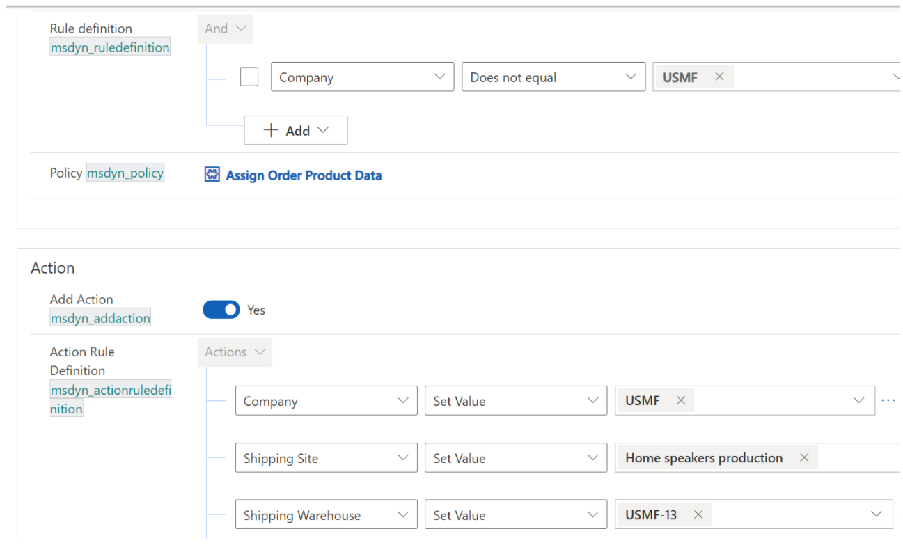
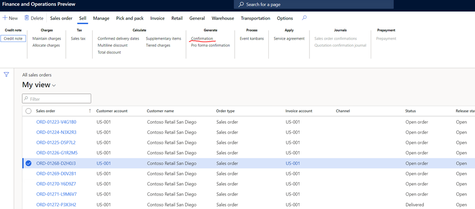

# Set up Dynamics 365 Finance + Operations provider

[!include [banner](includes/banner.md)]

This topic provides information about how to set up the Microsoft Dynamics 365 Finance + Operations (on-premises) provider in Microsoft Dynamics 365 Intelligent Order Management.

Finance + Operations helps businesses to manage their global financial systems, operational business processes, and streamlined supply chains to empower business decision makers to make fast, informed decisions. The Dynamics 365 Finance and Operations provider enables Intelligent Order Management to write or consume orders from Finance + Operations and also performs additional supply chain actions.  

For more information about Finance + Operations, see the [Dynamics 365 Finance](https://dynamics.microsoft.com/en-us/finance/overview/) website. 

## Prerequisites 

- You must have dual-write set up in your Finance + Operations instance. For information on seting up dual-write, see [Guidance for dual-write setup](/dynamics365/fin-ops-core/dev-itpro/data-entities/dual-write/connection-setup).
- Intelligent Order Management should be installed in the same dataverse instance as that of Finance + Operations.
- Mappings associated with dual-write should be enabled. 

  To enable mappings associated with dual-write, follow these steps.

  1. In Finance + Operations, go to **Workspaces \> Data management \> Dual-write**.
  1. Set the dual-write mappings to enable synchronization from Intelligent Order Management to Finance + Operations. IOM order mapping filters must be introduced to delay order synchronization to Finance + Operations when an order is not ready to sync.
      1. On the dual-write page, select **CDS sales order headers (saleorders)**.
      1. On the **CDS sales order headers (saleorders)** page, to edit the query select the funnel symbol next to **Microsoft Dataverse.order**.
      1. In the **Edit query** dialog box, enter the query string `msdyn_ordertype eq 192350000 and _msdyn_company_value ne null and msdyn_isreadytosync eq true and statuscode ne 100003`, and then select **Accept**. 
      1. On the dual-write page, select **CDS sales order lines (saleorderdetails)**.
      1. On the **CDS sales order lines (saleorderdetails)** page, to edit the query select the funnel symbol next to **Microsoft Dataverse.order**.
      1. In the **Edit query** dialog box, enter the query string `msdyn_company_value ne null and _msdyn_shippingsite_value ne null and _msdyn_shippingwarehouse_value ne null and msdyn_isreadytosync eq true and msdyn_statuscode ne 192350001`, and then select **Accept**.   
      1. For both **CDS sales order headers (saleorders)** and **CDS sales order lines (saleorderdetails)**, edit the **msdyn_isreadytosync** entity fields with the following values:
          - **Sync direction**: "Finance and Operation apps to Dataverse"
          - **Transform type**: "Default"   
          - **Default value**: "true" 
1. In order to synchronize an order from Intelligent Order Management to Finance + Operations, there are some key parameters that need to be sent in an order. 

   These are **Company** and **Invoice Customer** at Sales Order and **Company**, **Shipping Site**, **Shipping Warehouse** at Sales Order Product.
   
   These values can be passed through a policy definition in IOM. Here is a sample example:
   
   
    
   
   
 
 > [!NOTE]
 > This setup will enable order synchronization from Intelligent Order Management to Finance + Operations in both directions. 
  

## Set up the provider

To set up the provider, follow these steps: 

1.  In Intelligent Order Management, go to **Providers > Catalog**.

2.  Select **Add Provider** on the **Microsoft Finance and Operations apps** tile.

3.  Select **Create** on the **Terms and Conditions** page.

4.  There is one connection that you need to set up in the **Connections** section.

    1. Microsoft Finance and Operations Dataverse (current environment) Connection;

       1. Add the Microsoft Dataverse connection.

       1. Select **Save**.

       1. Select **Activate** to activate the connection.

       1. Select **Save and close**.

5. Select **Save**.

6. Select **Activate** to activate the provider.

7. Select **Save and close**.

8. Go to **Providers > Installed** and validate that the provider you set up is listed with the status **Activated**.

**Note:** 

1. In order to sync an order from D365 Finance and Operations to D365 Intelligent Order, please ensure that the order is confirmed in D365 FinOps. Only then the order will be synced to D365 Intelligent Order Management.

2. In order to send order to FinOps from IOM, we need to call the FinOps provider action in order orchestration flow, either send for fulfillment or accounting.

   Here is a sample example of an orchestration flow:

   

