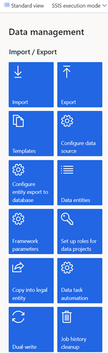
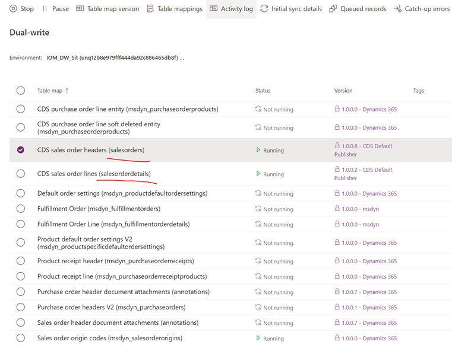
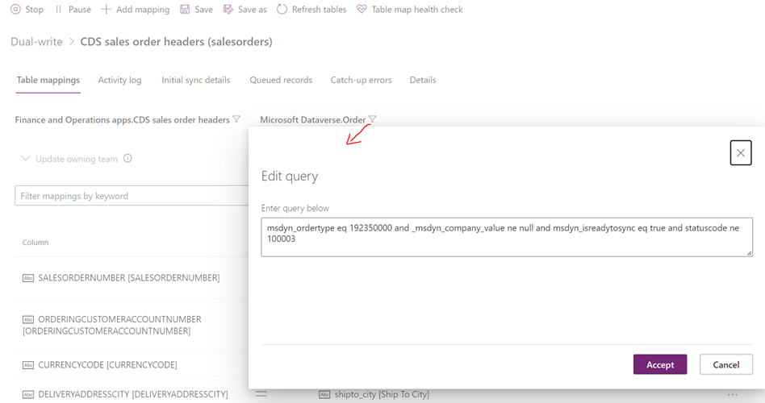
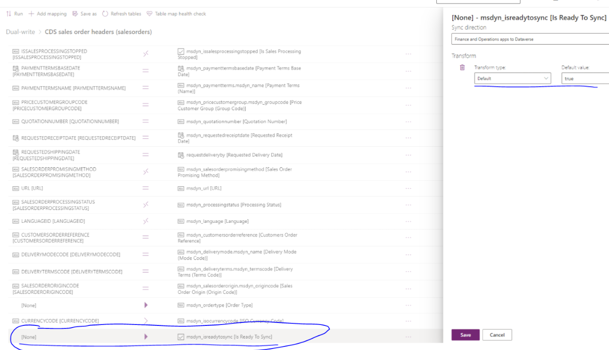

# Set up Dynamics 365 Finance and Operations provider

[!include [banner](includes/banner.md)]

This topic provides information about how to set up the D365 Finance and Operations provider in Dynamics 365 Intelligent Order Management.

D365 Finance and Operations support businesses to manage their global financial systems, operational business processes, and streamlined supply chains to empower people to make fast, informed decisions The D365 FinOps provider enables Intelligent Order Management to write or consume orders from D365 FinOps and performs additional supply chain actions.  

For more information about D365 FinOps, see the [D365 FinOps](https://dynamics.microsoft.com/en-us/finance/overview/) website. 

## Prerequisites 

1. You need to have Dual Write setup in your D365 F&O instance. Steps to setup dual write can be found [here](https://docs.microsoft.com/en-us/dynamics365/fin-ops-core/dev-itpro/data-entities/dual-write/connection-setup).
2. D365 Intelligent Order Management should be installed in the same dataverse instance as that of D365 Finance and Operations.
3. Mappings associated with Dual Write should be enabled. To make that work do the following:
   
   a. Goto Workspaces -> Data management - > Dual-write in D365 Finance and Operations.
   
   
   
   b. Set the Dual write mappings to enable sync from D365 Intelligent Order Management to D365 Finance and Operations.
   
   IOM order mapping filters introduced to delay order sync to FinOps when the order is not ready to sync.
   CDS sales order headers - msdyn_ordertype eq 192350000 and _msdyn_company_value ne null and msdyn_isreadytosync eq true and statuscode ne 100003
   CDS sales order line - _msdyn_company_value ne null and _msdyn_shippingsite_value ne null and _msdyn_shippingwarehouse_value ne null and msdyn_isreadytosync eq true and          msdyn_statuscode ne 192350001
   
   
   
   
   
   c. Mapping fields for both order header and line entities needs to be added as part of this step.
   
    
   
4. In order to sync an order from D365 IOM to D365 F&O, there are some key parameters that need to be sent in an order. 

   These are **Company** and **Invoice Customer** at Sales Order and **Company**, **Shipping Site**, **Shipping Warehouse** at Sales Order Product.
   
   These values can be passed through a policy definition in IOM. Here is a sample example:
   
   
    
   
   
 
 **Note:** This setup will enable order sync from D365 Intelligent Order Management to D365 Finance and Operations and vice versa as well. 
  

## Set up the provider
To set up the provider, follow these steps: 

1.  In Intelligent Order Management, go to **Providers > Catalog**.

2.  Select **Add Provider** on the **Microsoft Finance and Operations apps** tile.

3.  Select **Create** on the **Terms and Conditions** page.

4.  There is one connection that you need to set up in the **Connections** section.

    1. Microsoft Finance and Operations Dataverse (current environment) Connection;

       1. Add the Microsoft Dataverse connection.

       1. Select **Save**.

       1. Select **Activate** to activate the connection.

       1. Select **Save and close**.

5. Select **Save**.

6. Select **Activate** to activate the provider.

7. Select **Save and close**.

8. Go to **Providers > Installed** and validate that the provider you set up is listed with the status **Activated**.

**Note:** 

1. In order to sync an order from D365 Finance and Operations to D365 Intelligent Order, please ensure that the order is confirmed in D365 FinOps. Only then the order will be synced to D365 Intelligent Order Management.

2. In order to send order to FinOps from IOM, we need to call the FinOps provider action in order orchestration flow, either send for fulfillment or accounting.

   Here is a sample example of an orchestration flow:

   

