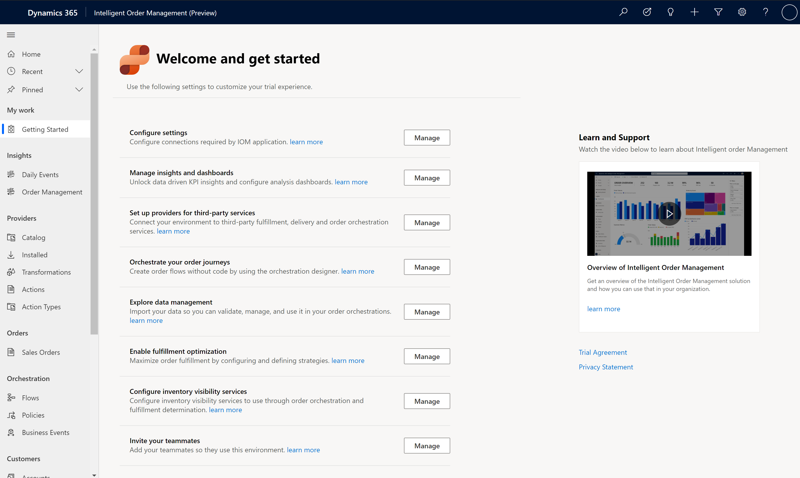
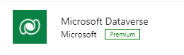

# Set up an environment

[!include [banner](includes/banner.md)]

To provision a trial environment, see [Deployment](/power-platform/admin/trial-environments). After you provision your environment, the **Welcome and get started** page is displayed. The trial environment is preconfigured and you can explore the app using the demo data that's provided.

## Configuration

On the **Welcome and get started** page, you can access the following features.

- **Configure settings**: Select **Manage** to create and configure required connections. For detailed instructions, refer to the [create connections](setup.md#create-connections) section below.

- **Manage insights and dashboards**: Select **Manage** to go to the **Daily Events** dashboard, where you can learn more about the configuration for reporting and Power BI Integration.

- **Set up providers for third-party services**: Select **Manage** to go to the provider **Catalog**, where you can configure providers that you want to use to receive orders or communicate to external systems. To learn about providers, see [Work with providers](work-providers.md).

- **Orchestrate your order journeys**: Select **Manage** to go to the pages where you can create and manage order orchestration flows.

- **Explore data management**: Select **Manage** to go to the administration pages to manage data import and export.

- **Enable fulfillment optimization**: Select **Manage** to go to configure the fulfillment optimization service with Intelligent Order Management.

- **Configure inventory visibility services**: Select **Manage** to go to the pages where you can configure the inventory service to be used with Intelligent Order Management.

- **Invite your teammates**: Select **Manage** to go to the page where you can invite users to your environment.

## Create connections

To configure Intelligent Order Management, you first need to create a Dataverse connection, a Power Automate Management connection, and an Intelligent Order Management Data Transformer connection. 

1. Go to the [Power Automate portal](https://us.flow.microsoft.com/) and make sure you are in the correct Intelligent Order Management environment. To check which environment you are in, select **Environments** in the top-right corner of the Power Automate portal.
1. Go to **Data > Connections**.

### Create Dataverse connection

1. On the **Data > Connections** page, select **New connection**.
2. In the search box in the top-right corner, enter **Dataverse**.
3. Select **+** next to **Microsoft Dataverse**.

4. Select **Create**. When prompted to sign in, use the same credentials you used to sign in to Intelligent Order Management.

### Create Power Automate connection

1. On the **Data > Connections** page, select **New connection**.
2. In the search box in the top-right corner, enter **Power Automate Management**.
3. Select **+** next to **Power Automate Management**. When prompted to sign in, use the same credentials you used to sign in to Intelligent Order Management.

### Create IOM Data Transformer connection

1. On the **Data > Connections** page, select **New connection**.
2. In the search box in the top-right corner, enter **IOM Data Transformer**.
3. Select **+** next to **IOM Data Transformer**. When prompted to sign in, use the same credentials you used to sign in to Intelligent Order Management.

## Set up platform connection references

After you create your connections, you need to configure them.

1. Go to the **Welcome and get started** page in Intelligent Order Management.
2. Select **Configure settings**.
3. For each connection reference, do the following:
   1. Select the connection reference.
   1. To retrieve the connection URL, go to the [Power Automate portal](https://us.flow.microsoft.com/). Select the corresponding connection, and then copy the URL for the page. For example, if you are setting up the Intelligent Order Management Data Transformer connection reference, Select the **IOM Data Transformer** connection on the **Connections** page in Power Automate, and copy the URL from your browser’s address bar.
   1. Go back to the corresponding connection reference page in Intelligent Order Management and paste the copied URL in the **Connection URL** field.

> [!NOTE]
> There are three platform Dataverse connection references. You can use the same Dataverse connection for all three. 

4. Once you've configured all of the platform connection references, select **Activate System** in Intelligent Order Management to turn on the related platform Power Automate flows. This may take a while. 

## Additional resources
[Work with providers](work-providers.md)
