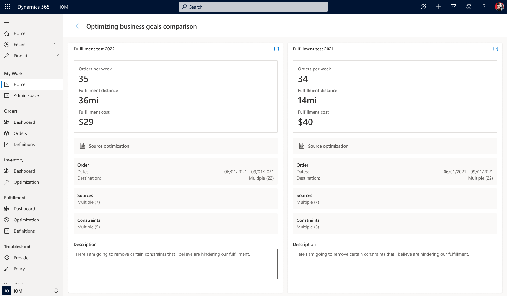
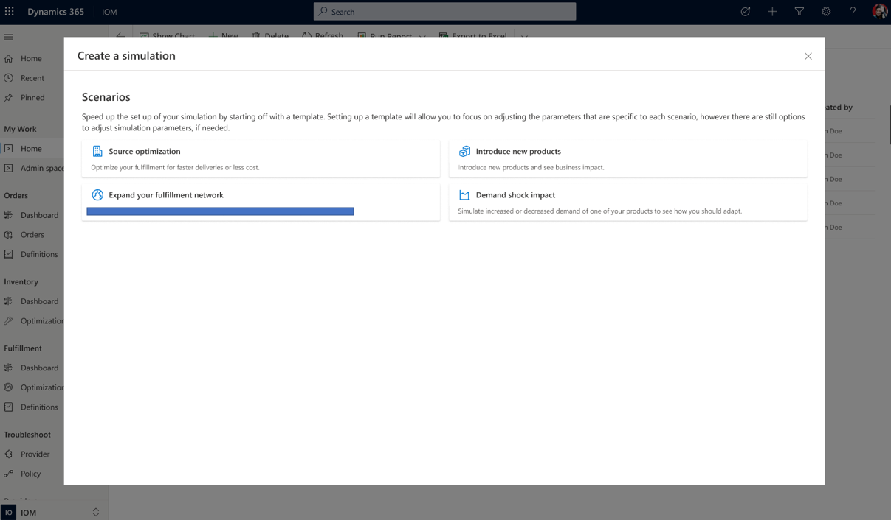
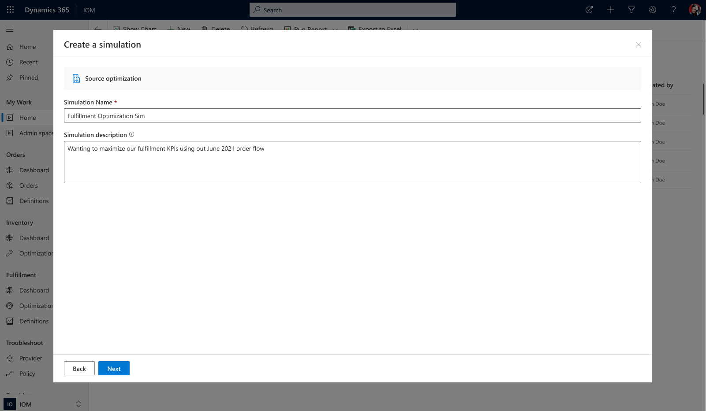
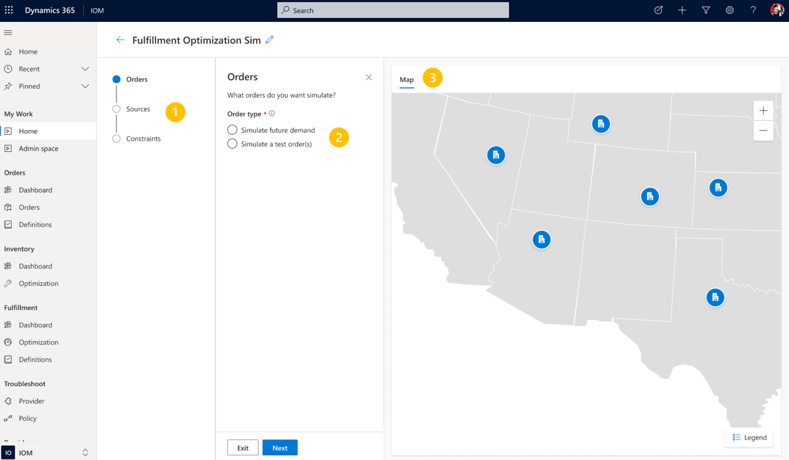
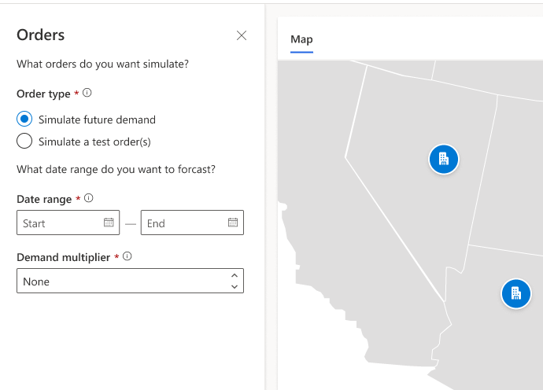
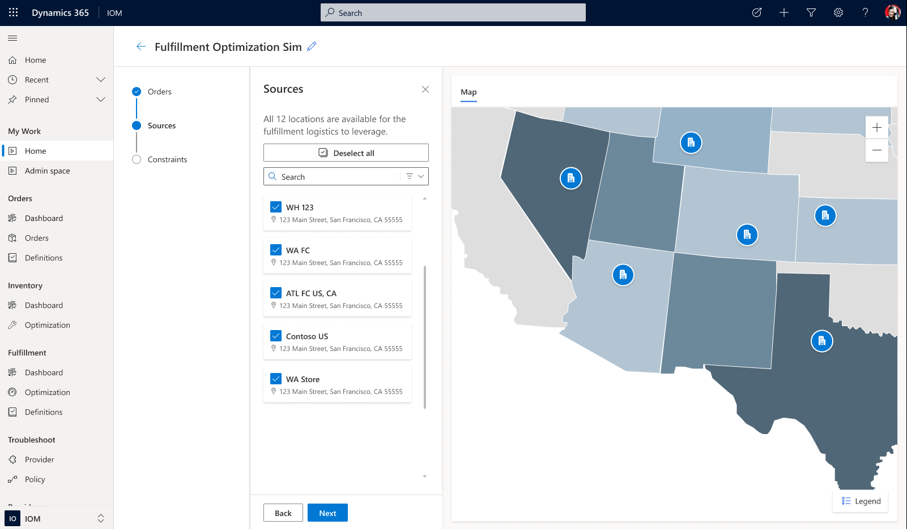
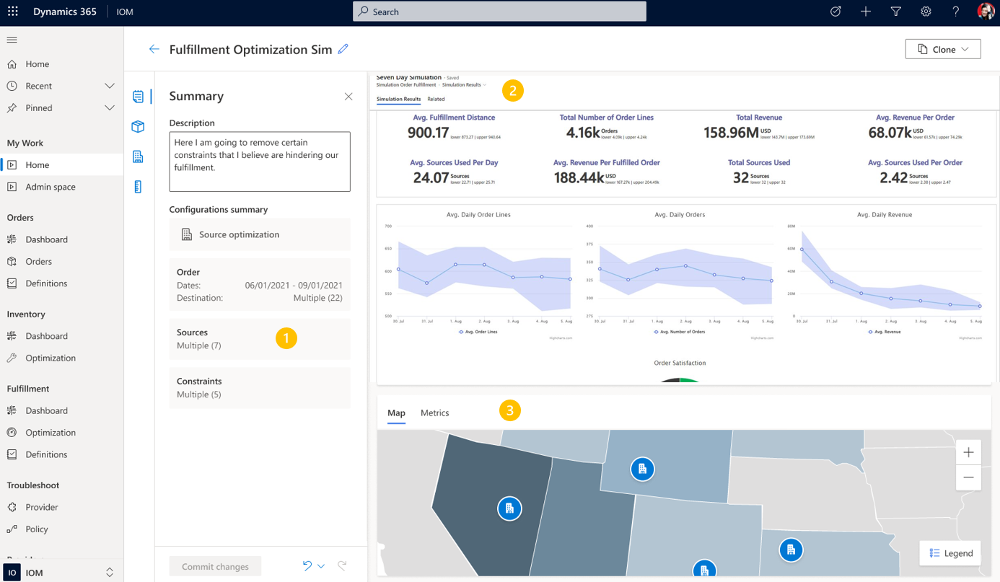

# Simulations feature

[!include [banner](includes/banner.md)]

This topic provides an overview of the AI simulations feature in Microsoft Dynamics 365 Intelligent Order Management.

> [!NOTE]
> The AI simulations feature is currently in development, with a planned private preview in 2023. If you are interested in previewing this feature, add your contact information to the [Dynamics 365 IOM Simulations interest form](https://forms.office.com/Pages/ResponsePage.aspx?id=v4j5cvGGr0GRqy180BHbR7PfTHWf5-FKvJrqC3rlH_NUMENXVVdFWlNKWEtDR082NEFVVE5VRjVZTi4u).

Businesses using order management systems often struggle with visibility into the automated fulfillment decisions of those systems, as well as having some predictability of outcomes over time. Additionally, A/B testing the outcomes of a fulfillment system, or attempting to run experiements to discover better strategies, have to be performed on real-life orders and customers, risking impact on customer sastisfaction, revenue, and costs.

The new simulations feature for Intelligent Order Management is a no-code, business user-friendly tool that allows you to run experiments on your data, not your customers. IOM Simulations uses your own data and repeatedly [samples that data](https://en.wikipedia.org/wiki/Monte_Carlo_method) over and over again based on parameters that you set for a given scenario, and provides estimated results from those scenarios to help you deploy new strategies with more confidence. Knowing the expected values of swapping out fulfillment centers or adjusting the allowable distance for deliveries, among other experiments, will help you make data-informed decisions that can dramatially improve your business results.

> [!NOTE]
> All screenshots in this article are from a preproduction version of the simulation feature, and may not demonstrate how the final product will appear.

## Access simulations

You will be able access Simulations in the left menu of the IOM application, just like you would access any other features of IOM. On the Simulations landing page will be a list of all previous simulations you have run. You can open any previous simulation to see settings and results.

You can also compare the results of previous simulations side by side:

## Creating a simulation

From the Simulations landing page, you can create a new simulation from the top menu. This will lead you to a wizard that will walk you step-by-step through setting up your simulations. The first screen will contain several pre-defined scenario templates that you can start with:

1. **Source optimization**: Want to see what would be the impact to your costs, delivery times, and inventory if you included or excluded different fulfillment sources within a service area? Source optimization simulations allow you to swap sources in and out and measure impact to your fulfillment network. 
2. **Demand shock impact**: What would be the impact on your current order management network if demand spiked by 2x or 3x in the next few months? How does that change your restocking cadence? How much would it drive up your costs to mainatain delivery times? Demand shock impact simulations will let you simulate various order volumes in the future and see the impact on your distribution centers and overall network. 
3. **Expand your fulfillment network**: Business expansion is a highly strategic and impactful decision that needs to be data-informed and future-proof. Expanding into a new geo, or simply opening a new distribution center or 3PL in a current service area, can have dramatic impact on your inventory decisions, your delivery times, and costs. Simulating the impact of business expansion across your order management network will allow you to make decisions with more confidence.  
4. **Introduce new products**: New product expansion can have cannibalization effects on your current product lines, and cause a ripple effect across your order management network as buying patterns change, impacting your carefully planned inventory operations and your fulfillment and delivery plans. Simulating the impact of new product introduction will give you a future view of the expected impact of this type of expansion. 

For the first version of Simulations, we will have available the **source optimization** scenario, with the others to follow in upcoming releases. Clicking on the "source optimization" scenario will start the setup wizard:

### Name your simulation

Name your simulation something you will recognize easily at a glance, such as "max distance and source update for los angeles". The description field can be used as a "note", to add more details to help you remember the motivation or goals behind the simulation (or for others to understand the simulation at a glance). 

### Order types

1. Indicator that displays the steps in the wizard, and how you're progressing
2. Setting panel where you conifgure the settings of the simulation. For this step, you are selecting from two order types: 
    1. Simulate future demand: choose a period of time in the future (ex: upcoming holiday season) and have IOM simulate what the demand will look like for that period
    2. Simulate a test order: create a test order or choose a previously created test order and simulate how IOM will fulfill that order
3. Map view of your order management network, which can be configured on the next step of the wizard 

For example, if you select "simulate future demand", two settings will be displayed:

You can select a date range (ex: 11/15/22 to 12/31/22), and you can also select a "demand multiplier". If you think for example, your business has grown and you will do 2x the demand you had in previous years, you can set the multiplier to 2. Or if you're just curious how your network would handle 4x the demand, you can set the multiplier to 4, or any number you want.

### Fulfillment sources

On the next step, IOM will display the available fulfillment sources in both a list and map view, based on your settings from the previous step. On this screen, you can select or deselect any sources to include / exclude from the fulfillment plan.

### Constraints

When you're done selecting sources, the next step will allow you to select constraints, such as location or source priority, maximum number of fulfillment sources, maximum distance between source to destination, and split order allowance. These are the same constraints available to the rest of IOM (look for "Business constraints" on [this help page](ifo.md)). 

### View results

Your Simulation is done! The results page will show business critical KPIs and trends associated with the simulation you ran. You will notice the numbers are presented with "lower and upper bounds". This is because the results are based on a single simulation, run over and over again to produce a wide range of potential results. This "Monte Carlo method" will often provide an accurate approximation of an actual future result (expected result). The "main" number on the KPIs is the expected result, and the uppper and lower bounds provide the min and max numbers from all the potential results. 

On the results page, you will find several areas.

1. Navigation back to your previous settings screens. You can go back to any previous setting and update it to iterate on the simulation you just ran. As an example, you experimented with 15 miles max distance, and want to use all the exact same settings to see what happens if you changed it to 20 miles. You can run this experiment without having to start over with a new simulation. Clicking on the "commit changes" button on the bottom of the screen will run the simulation again, and the results page will show deltas from the previous simulation.
2. Configuration summary will show all the settings for the current simulation.
3. Main KPI area will show all the business critical KPIs for your simulation.
4. Map / metrics view: will show on a map the fulfillment sources for this simulation. Toggling to metrics view will show you sources in a table format, which includes inventory counts, which source was selected to fulfill which products, distance, and more.

### Additional information

IOM Simulations will reinvent the way to think about order management systems. No longer will you push orders through a system and just wait for results that show the impact on your customers. You can now simulate a wide variety of scenarios to bring some predictability to your fulfillments, and can optimize the system yourself by uncovering efficiencies with experimentation. But much better than simple A/B testing, these experiments are performed on your data and results are simulated, without having impact on your real customers. IOM Simulations puts the power of AI in your pocket so you can take ownership for improving your business.

