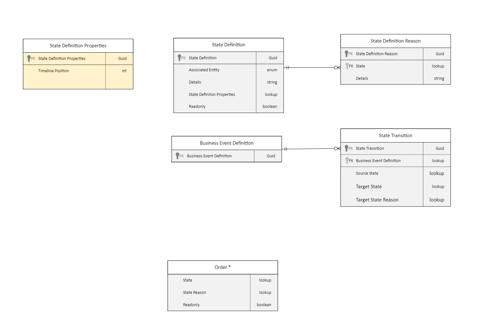

# State framework architecture

This topic describes the state framework architecture in Microsoft Dynamics 365 Intelligent Order Management.

State framework architecture is a new concept introduced to Dynamics 365 Intelligent Order Management in the October 2022 release. The state framework is a way of validating business process rules by checking at runtime if the current state of an entity is allowed to move to another state. For example, from **New \> In Progress** would be a successful transition if defined, but **Completed \> In Progress** would throw an error.

Users can add their own state, state reason, and transitions, but aren't allowed to customize out-of-the-box definitions.

## State framework data model

The state framework data model introduces some updates and new additions to the current data model.

### Updates to the data model

#### Entity State/State Reason columns

The state framework introduces two new columns to the entities that are part of Intelligent Order Management. These columns were added to support localizable **State** and **State Reason** status fields. It also introduces a new **ReadOnly** field that indicate that a record shouldn't be editable in the user interface (UI).

|**Field**|**Description**|
|:-|:-|
|**State**|What state the entity is in, as defined by the **State Definition** table.|
|**State Reason**|A detailed description of why the entity is in the current state.|
|**ReadOnly**|Set to **True** to indicate that the record shouldn't be editable in the UI, otherwise set to **False**.|

### New additions to the data model

#### State Definition table

The **State Definition** table enables the creation a set of states that are allowable on each entity. These states have associated properties that contain metadata to indicate the different behaviors of each state.

> [!NOTE]
> States are used to determine valid transitions as part of the orchestration journey.

|**Field**|**Description**|
|:-|:-|
|**State Definition**|ID (GUID) for the state.|
|**Associated Entity**|Which entity the state belongs to.|
|**Details**|Name of the state.|
|**State Definition Properties**|A lookup to associated metadata.|
|**Readonly**|Setting this state to **True** marks the entity as read only.|

### State Reason Definition

The **State Reason Definition** table is for providing extra details for why something is in that State, but may not be part of indicating a valid state transition. For example, something can have a state of **On Hold**, but have a state reason of **Backorder** or **Preorder**.

|**Field**|**Description**|
|:-|:-|
|**State Definition Reason**|ID (GUID) for this State Reason.|
|**State**|Which state the state reason is associated with.|
|**Details**|Name/description of the state reason.|

### State Definition Properties

The **State Definition Properties** table contains extra metadata for each of the states.

|**Field**|**Description**|
|:-|:-|
|**State Definition Properties**|ID (GUID) for this property.|
|**Timeline Position**|What order to display this state in the UI on the **Progress Bar Timeline** (introduced in the Oct 2022 release).|

### State Transition

The **State Transition** table contains a list of state transitions that will occur when a business event is raised. The business event will only set the state if the current state is in an allowable state.

|**Field**|**Description**|
|:-|:-|
|**State Transition**|ID (GUID) of this state transition.|
|**Business Event Definition**|Lookup to the **Business Event Definition** table to determine which **Business Event** the record belongs to.|
|**Source State**|The allowable source state to transition from.|
|**Target State**|Target state to set if coming from an allowable source state.|
|**Target State Reason**|Target state reason to set if coming from an allowable source state.|

The following example table shows how data in this table would look:

|**Business Event**|**Source**|**Target State**|**Target State Reason**|
|:-|:-|:-|:-|
|**On Hand Check Success**|In Progress|Fulfillment in Process|Inventory Check Successful|
|**On Hand Check Success**|On Hold|Fulfillment in Process|Inventory Check Successful|
|**On Hand Check Failed**|In Progress|On Hold|Backorder Hold|

## Scenarios

### No transition exists for the business event

If no record is found in the **State Transition** table for the business event being raised, the validation will automatically succeed, but no **State** or **State Reason** values will be set.

### Add a new state and transition

To add a new state and transition, follow these steps.

1. Add a new **State Definition**.
1. Add a new **State Reason Definition** (if needed).
1. Add a new **State Transition**, and then do the following:
   1. Associate it to a new business event.
   1. Set the **Source** to what is allowed, one row per allowable source.
   1. Set the **State** to what the state should be set to when this event is raised.
   1. Set the **State Reason** to what you want it to be when the event is raised.
1. Add any properties (**ReadOnly** or **Timeline**), if needed. 
