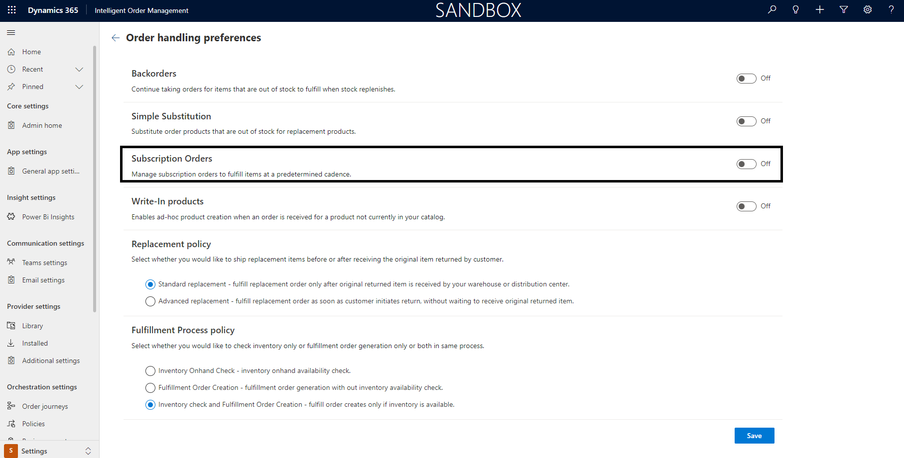
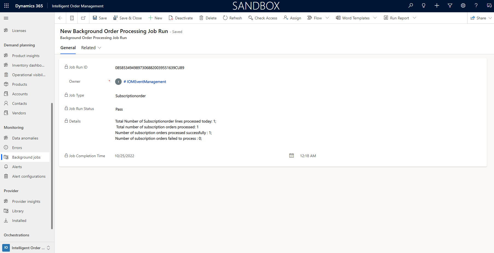

# Subscription order management

This article describes subscription order management in Microsoft Dynamics 365 Intelligent Order Management.

Intelligent Order Management has the capability to handle subscription orders, giving customers the flexibility to have their orders fulfilled on a regular basis. The order frequency can be specifed at the product level.

With appropiate subscription order management, retailers can get the following benefits:

- Increased customer loyalty with a strong customer base.
- Predictable recurring revenue.
- Better cash flow management

## Prerequisite settings

To configure the prerequisite settings, follow these steps.

1. In the left navigation pane, select **Settings**, and then select **General app settings**.
1. Select **Order handling preferences**, and then select **Manage**.
1. Set **Subscription Orders** to **On**.
        
   

## Specify the subscription frequency 

To specify the subscription frequency at the product level, follow these steps.

1. In the left navigation pane, select **Demand Planning**, and then select **Products**.
1. Select the product for which you want to specify the subscription frequency.
1. Select **Allowed Subscription Frequency** and then select **Monthly**, **Quarterly**, or **Yearly**, or **Select All**. The subscription order product will then be validated for the eligible fulfillment frequency.
1. Select **Save**, or **Save & Close**.

## How subscription order management works

A subscription order can be created in an e-commerce application, or through a customer service representative in Intelligent Order Management. In either case, this would create a subscription order under **Orders**. A subscription order defines a product that the customer has opted to be fulfilled as a subscription.

It includes few specific fields that signify this contract as below:

| Field name | Description |
| ---- | ----------- |
| **Fulfillment Frequency** | This field contains the product frequency that was setup in **Products**, and is the driver for subscription fulfillment jobs.|
| **Current Subscription** | This field contains the current recurrence of the subscription. It is an integer that reflects the current subscription number.|
| **Subscription Start Date** | The start date for the subscription. |
| **Subscription End Date** | The end date for the subscription, if an end date was specified by the customer. |
| **Last Ordered Date** | This field is autopopulated and contains the date that the last order was created. |

> [!NOTE]
> Currently, one product per subscription is supported. Multiple product subscription support will be available in later releases.

Once a subscription order is created in Intelligent Order Management, based on the product frequency opted by customer, a background job automatically picks up the orders and generates sales orders from the subscription. The sales order then follows the order orchestration and generates fulfillments accordingly.

A job log is available to show a list of job runs, their statuses, and the number of records that have been successfully processed and moved to fulfillment. To access the job log, in the left navigation pane, select **Monitoring /> Background Jobs**. The **Active Background Order Processing Job Runs** appears, as shown in the following example image.

If a background job fails, you have the option to run it manually by selecting the **Run** option in the upper menu bar. Then select **Subscription-Order Job** to start a new instance of the background job. To see the details of the background job run, select the job line.

